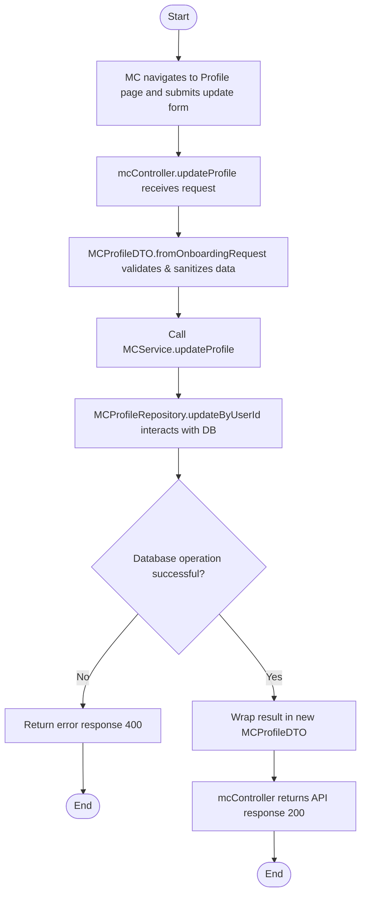

# Accurate Backend-Aligned Activity Diagrams

Based on a detailed analysis of the backend code structure (`src/controllers`, `src/services`, `src/repositories`, `src/dtos`), here are the execution flows that represent the real implemented logic.

*Note: Some logic described in previous theoretical Use Case documents (like UC37 or a separate global status update API in UC23) does not exist in the backend API and is therefore adjusted or marked as unimplemented, adhering strictly to the real codebase.*

---

## UC19 - Update MC Profile

**API Endpoint:** `PUT /api/v1/mc/profile`

**Structured Workflow:**
Start
↓
MC navigates to Profile page and submits update form
↓
`mcController.updateProfile()` receives request
↓
`MCProfileDTO.fromOnboardingRequest()` validates & sanitizes request data
↓
Call `MCService.updateProfile()`
↓
`MCProfileRepository.updateByUserId()` interacts with database
↓
Decision: Database operation successful?
  No → Return error response (400) → End
  Yes → Return `profile` data to Service
↓
`mcController` wraps result in `new MCProfileDTO(profile)`
↓
`mcController` returns API response (200)
↓
End

**Mermaid Diagram (for visualization):**

---

## UC20 - Upload Media

*Backend Analysis: There is no dedicated `uploadMedia` controller logic in the codebase. As defined by `MCProfileDTO`, the frontend handles uploading to Cloud Storage and sends the resulting URLs via the `updateProfile` API.*

**API Endpoint:** `PUT /api/v1/mc/profile`

**Structured Workflow:**
Start
↓
MC uploads file to Cloud Storage (handled by Client)
↓
Client submits Profile Update with media URLs (`media` array)
↓
`mcController.updateProfile()` receives request
↓
`MCProfileDTO.fromOnboardingRequest()` parses URLs mapping `media` to `showreels`
↓
Call `MCService.updateProfile()`
↓
`MCProfileRepository.updateByUserId()` interacts with database
↓
Decision: Database operation successful?
  No → Return error response (400) → End
  Yes → Return updated `profile` data to Service
↓
Service transforms result to DTO
↓
`mcController` returns API response (200)
↓
End

---

## UC21 - View Schedule

**API Endpoint:** `GET /api/v1/mc/calendar`

**Structured Workflow:**
Start
↓
MC navigates to Calendar page
↓
`mcController.getCalendar()` receives request
↓
Call `MCService.getCalendar()`
↓
Call `AvailabilityService.getAvailability()`
↓
`MCProfileRepository.findByIdentifier()` searches for MC identity
↓
Decision: MC profile found/exists?
  No → Return error "MC profile not found" → End
  Yes → Parallel Call: `ScheduleRepository.findByMCId()` and `BookingRepository.findCalendarByMCId()`
↓
Decision: Database queries successful?
  No → Return system error (400) → End
  Yes → Service merges and maps `scheduleEntries` and `bookings` into unified list
↓
Service sorts and transforms result to Calendar items
↓
`mcController` returns API response (200)
↓
End

---

## UC22 - Update Busy Schedule

**API Endpoint:** `POST /api/v1/mc/calendar/blockout`

**Structured Workflow:**
Start
↓
MC selects date/time and clicks Block Date
↓
`mcController.blockDate()` receives request
↓
Call `MCService.blockDate()`
↓
`ScheduleRepository.create()` assigns status "Busy" and interacts with database
↓
Decision: Database operation successful?
  No → Return error response (400) → End
  Yes → Return new schedule entry
↓
`mcController` returns API response (201)
↓
End

---

## UC23 - Set Availability Status

*Backend Analysis: Toggling a global MC status is NOT implemented in the current code (no `status` update handled in `MCProfileDTO.fromOnboardingRequest`). However, slot-level availability is supported under `/api/v1/availability`.*

**API Endpoint:** `POST /api/v1/availability` (Using `availabilityController`)

**Structured Workflow:**
Start
↓
MC sets availability status for a schedule slot
↓
`availabilityController.createAvailability()` receives request
↓
Call `AvailabilityService.createAvailability()`
↓
`MCProfileRepository.findByIdentifier()` verifies MC identity
↓
Decision: MC profile found?
  No → Return error "MC profile not found" → End
  Yes → Apply logic: `isAvailable === false` maps to `status: "Busy"`
↓
`ScheduleRepository.create()` interacts with database
↓
Decision: Database operation successful?
  No → Return error response (400) → End
  Yes → Return new availability slot
↓
`availabilityController` returns API response (201)
↓
End

---

## UC32 - View Users Lists

**API Endpoint:** `GET /api/v1/admin/users`

**Structured Workflow:**
Start
↓
Admin navigates to Users list page
↓
`adminController.getAllUsers()` receives request
↓
`User` model calls `find()` and interacts with database
↓
Decision: Database operation successful?
  No → Return error response (400) → End
  Yes → Return users data
↓
`adminController` returns API response (200)
↓
End

---

## UC33 & UC34 - Lock/Unlock Account & Verify MC

**API Endpoint:** `PATCH /api/v1/admin/users/:id`

**Structured Workflow:**
Start
↓
Admin toggles User Status (Lock/Unlock) or Verification flag
↓
`adminController.updateUserStatus()` receives request containing `isActive`, `isVerified`
↓
`User` model calls `findByIdAndUpdate()`
↓
Decision: Database operation successful?
  No → Return error response (400) → End
  Yes → Check user existence
↓
Decision: Is User found?
  No → Return "User not found" (404) → End
  Yes → Continue
↓
`adminController` returns API response containing updated `user` (200)
↓
End

---

## UC36 - View All Bookings

**API Endpoint:** `GET /api/v1/admin/bookings`

**Structured Workflow:**
Start
↓
Admin navigates to Bookings dashboard
↓
`adminController.getAllBookings()` receives request
↓
`Booking` model calls `find().populate('mc', 'client')`
↓
Decision: Database operation successful?
  No → Return error response (400) → End
  Yes → Return populated bookings
↓
`adminController` returns API response (200)
↓
End

---

## UC37 - Resolve Disputes

*Backend Analysis: Analysis of the `src/controllers/adminController.js` and `src/routes/adminRoutes.js` indicates that no dispute or ticket management logic has been implemented in the backend yet. Therefore, an execution path up to database operations cannot be generated.*

**Status:** Implementation Missing in Backend Code.
