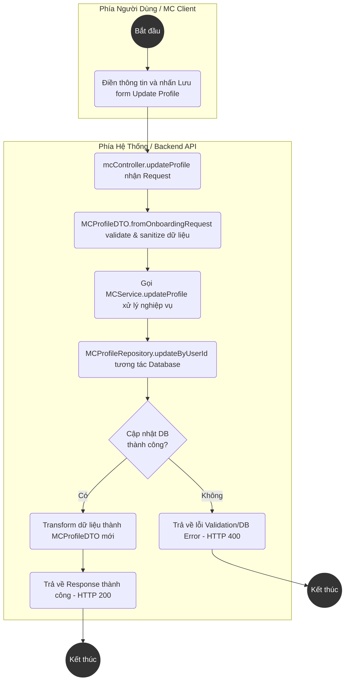
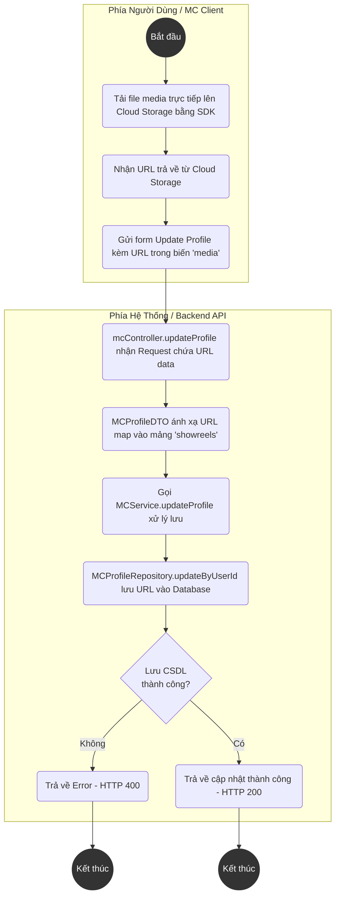
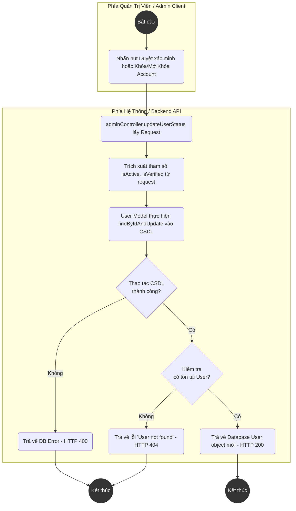

# Biểu Đồ Hoạt Động Cấu Trúc Trắc Dọc (Activity Diagrams with Swimlanes)

Dựa trên cấu trúc Backend Node.js thực tế của hệ thống (`controllers`, `services`, `repositories`, `models`), dưới đây là các biểu đồ Activity Diagram được phân luồng (swimlane) rõ ràng giữa **Phía Người Dùng (Client / Guest / MC / Admin)** và **Phía Hệ Thống (System / Backend API)**. 

---

## UC19 - Update MC Profile (Cập nhật hồ sơ MC)

**API Endpoint:** `PUT /api/v1/mc/profile`



---

## UC20 - Upload Media (Tải lên Media/Showreel)

*Lưu ý: Luồng Upload Media thực tế được Client xử lý đưa lên Cloud Storage trước, sau đó gửi URL về Backend thông qua API update Profile.*

**API Endpoint:** `PUT /api/v1/mc/profile`



---

## UC21 - View Schedule (Xem lịch trình cá nhân)

**API Endpoint:** `GET /api/v1/mc/calendar`

```mermaid
flowchart TD
    style Start fill:#333,stroke:#333,stroke-width:2px,color:#fff
    style End1 fill:#333,stroke:#333,stroke-width:2px,color:#fff
    style End2 fill:#333,stroke:#333,stroke-width:2px,color:#fff

    subgraph Client [Phía Người Dùng / MC Client]
        Start((Bắt đầu)) --> U1(Truy cập trang Calendar / Dashboard)
    end

    subgraph System [Phía Hệ Thống / Backend API]
        S1(mcController.getCalendar xử lý Request)
        S2(Gọi MCService.getCalendar -> AvailabilityService.getAvailability)
        S3(MCProfileRepository.findByIdentifier xác nhận MC)
        S4{Profile MC<br/>tồn tại?}
        S5(Trả về lỗi "MC profile not found" - HTTP 400)
        S6(Song song: Query ScheduleRepository & BookingRepository)
        S7{Truy vấn DB<br/>thành công?}
        S8(Báo lỗi hệ thống - HTTP 400)
        S9(Merge / Tính toán / Phân loại Schedule & Booking)
        S10(Sắp xếp theo ngày và trả về mảng Calendar Data - HTTP 200)
    end

    U1 --> S1
    S1 --> S2
    S2 --> S3
    S3 --> S4
    S4 -- Không --> S5
    S4 -- Có --> S6
    S6 --> S7
    S7 -- Không --> S8
    S7 -- Có --> S9
    S9 --> S10

    S5 --> End1((Kết thúc))
    S8 --> End1
    S10 --> End2((Kết thúc))
```

---

## UC22 - Update Busy Schedule (Đăng ký lịch bận)

**API Endpoint:** `POST /api/v1/mc/calendar/blockout`

```mermaid
flowchart TD
    style Start fill:#333,stroke:#333,stroke-width:2px,color:#fff
    style End1 fill:#333,stroke:#333,stroke-width:2px,color:#fff
    style End2 fill:#333,stroke:#333,stroke-width:2px,color:#fff

    subgraph Client [Phía Người Dùng / MC Client]
        Start((Bắt đầu)) --> U1(Chọn ngày/giờ trên giao diện và nhấn Block Date)
    end

    subgraph System [Phía Hệ Thống / Backend API]
        S1(mcController.blockDate xử lý Request)
        S2(MCService.blockDate nhận dữ liệu)
        S3(ScheduleRepository.create lưu với trạng thái "Busy")
        S4{Quá trình lưu DB<br/>thành công?}
        S5(Trả về lỗi Validation / DB Error - HTTP 400)
        S6(Trả về bản ghi Schedule mới - HTTP 201 Created)
    end

    U1 --> S1
    S1 --> S2
    S2 --> S3
    S3 --> S4
    S4 -- Không --> S5
    S4 -- Có --> S6

    S5 --> End1((Kết thúc))
    S6 --> End2((Kết thúc))
```

---

## UC23 - Set Availability Status (Xác lập trạng thái khả dụng cho Slot)

**API Endpoint:** `POST /api/v1/availability`

```mermaid
flowchart TD
    style Start fill:#333,stroke:#333,stroke-width:2px,color:#fff
    style End1 fill:#333,stroke:#333,stroke-width:2px,color:#fff
    style End2 fill:#333,stroke:#333,stroke-width:2px,color:#fff

    subgraph Client [Phía Người Dùng / MC Client]
        Start((Bắt đầu)) --> U1(Tạo slot trạng thái trống/bận trên UI)
    end

    subgraph System [Phía Hệ Thống / Backend API]
        S1(availabilityController.createAvailability nhận Request)
        S2(AvailabilityService.createAvailability tiếp nhận)
        S3(MCProfileRepository kiểm tra sự tồn tại của MC)
        S4{Profile MC<br/>tồn tại?}
        S5(Trả về lỗi Profile Not Found - HTTP 400)
        S6(Gán status "Busy" hoặc "Available" theo dữ liệu)
        S7(ScheduleRepository.create lưu thông tin vào CSDL)
        S8{Lưu DB<br/>thành công?}
        S9(Trả về lỗi thao tác DB - HTTP 400)
        S10(Trả về Availability slot mới tạo - HTTP 201)
    end

    U1 --> S1
    S1 --> S2
    S2 --> S3
    S3 --> S4
    S4 -- Không --> S5
    S4 -- Có --> S6
    S6 --> S7
    S7 --> S8
    S8 -- Không --> S9
    S8 -- Có --> S10

    S5 --> End1((Kết thúc))
    S9 --> End1
    S10 --> End2((Kết thúc))
```

---

## UC32 - View Users Lists (Xem danh sách người dùng)

**API Endpoint:** `GET /api/v1/admin/users`

```mermaid
flowchart TD
    style Start fill:#333,stroke:#333,stroke-width:2px,color:#fff
    style End1 fill:#333,stroke:#333,stroke-width:2px,color:#fff
    style End2 fill:#333,stroke:#333,stroke-width:2px,color:#fff

    subgraph Admin [Phía Quản Trị Viên / Admin Client]
        Start((Bắt đầu)) --> U1(Truy cập trang Quản lý Người dùng)
    end

    subgraph System [Phía Hệ Thống / Backend API]
        S1(adminController.getAllUsers nhận Request)
        S2(User Model query '.find()' vào Database)
        S3{Truy xuất xử lý<br/>thành công?}
        S4(Trình báo Error / System Fail - HTTP 400)
        S5(Trả mảng Users Array Data - HTTP 200)
    end

    U1 --> S1
    S1 --> S2
    S2 --> S3
    S3 -- Không --> S4
    S3 -- Có --> S5

    S4 --> End1((Kết thúc))
    S5 --> End2((Kết thúc))
```

---

## UC33 & UC34 - Lock/Unlock Account & Verify MC

*Cả Khóa/Mở tài khoản và Xác minh tài khoản MC đều sử dụng chung một flow API cập nhật status User ở Backend.*

**API Endpoint:** `PATCH /api/v1/admin/users/:id`



---

## UC36 - View All Bookings (Xem tất cả các phiên đặt lịch)

**API Endpoint:** `GET /api/v1/admin/bookings`

```mermaid
flowchart TD
    style Start fill:#333,stroke:#333,stroke-width:2px,color:#fff
    style End1 fill:#333,stroke:#333,stroke-width:2px,color:#fff
    style End2 fill:#333,stroke:#333,stroke-width:2px,color:#fff

    subgraph Admin [Phía Quản Trị Viên / Admin Client]
        Start((Bắt đầu)) --> U1(Truy cập trang Quản lý Đặt Lịch)
    end

    subgraph System [Phía Hệ Thống / Backend API]
        S1(adminController.getAllBookings xử lý Request)
        S2(Booking Model query '.find().populate('mc').populate('client')')
        S3{Truy vấn DB<br/>thành công?}
        S4(Trình báo Server Error - HTTP 400)
        S5(Trả về Danh sách Bookings đã populate - HTTP 200)
    end

    U1 --> S1
    S1 --> S2
    S2 --> S3
    S3 -- Không --> S4
    S3 -- Có --> S5

    S4 --> End1((Kết thúc))
    S5 --> End2((Kết thúc))
```

---

**Note về UC37 (Resolve Disputes / Giải quyết tranh chấp):** 
Tính năng giải quyết tranh chấp (ticketing, disputes API) hiện chưa được phát triển trong source code backend (`adminController.js`, `adminRoutes.js`), do đó luồng xử lý thực tế chưa thể thiết lập Diagram chuẩn.
