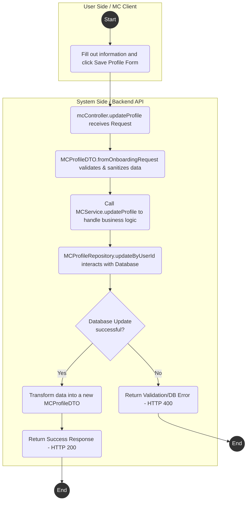
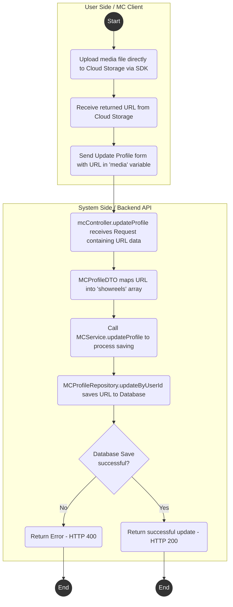
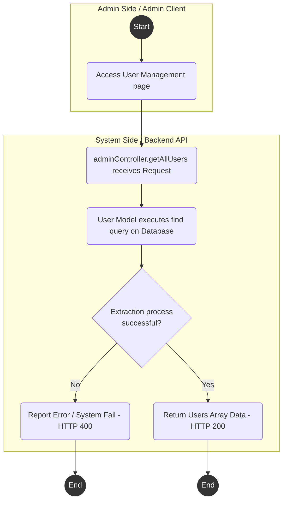
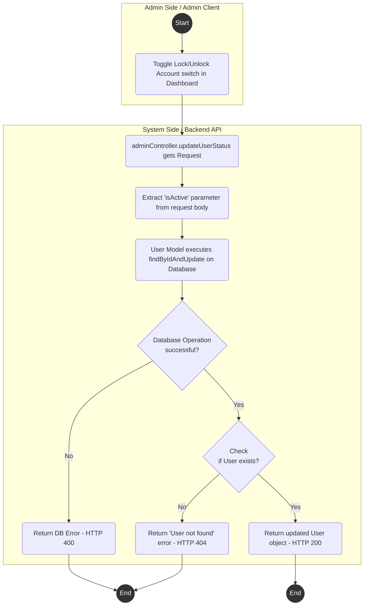
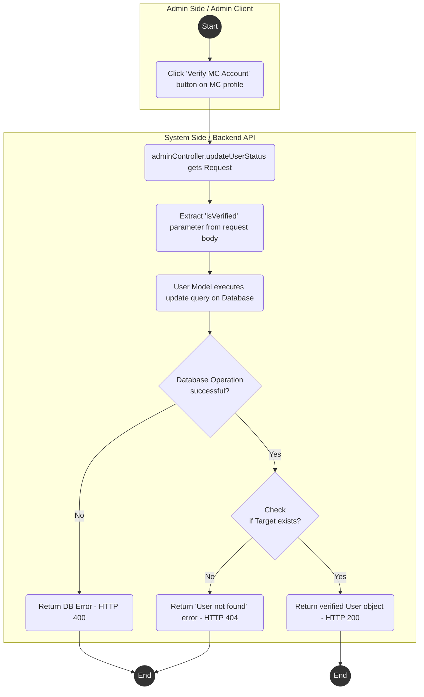
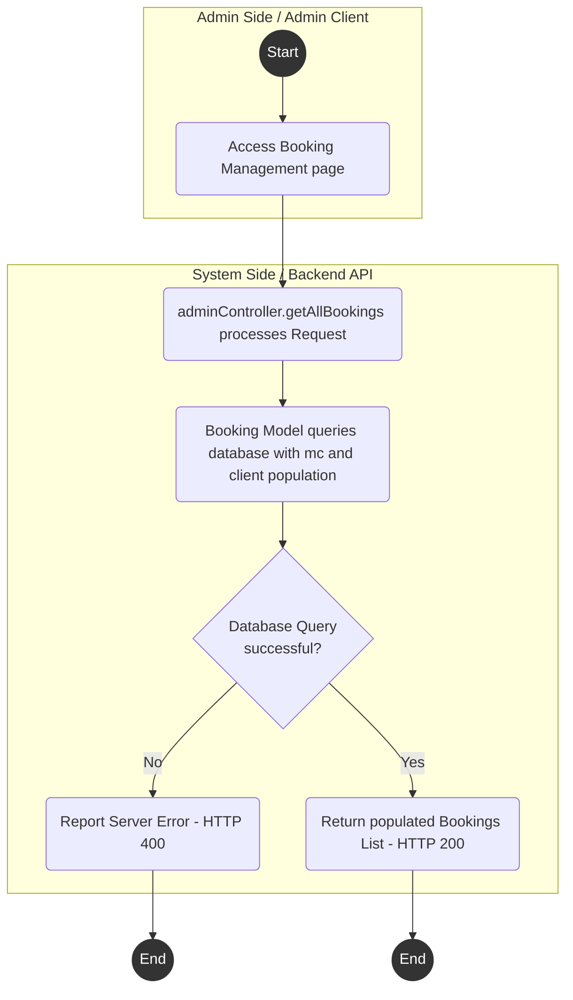
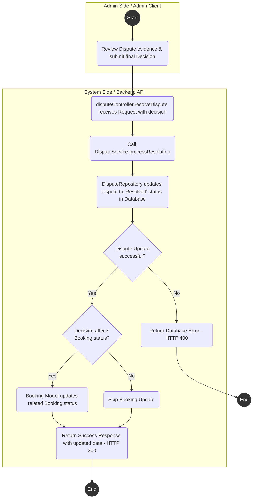
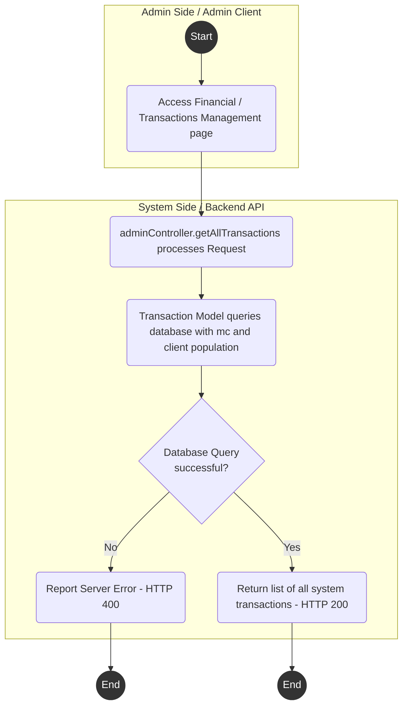

# Vertical Structure Activity Diagrams (with Swimlanes)

Based on the actual Backend Node.js structure of the system (`controllers`, `services`, `repositories`, `models`), below are the Activity Diagrams with clear swimlanes between the **User Side (Client / Guest / MC / Admin)** and the **System Side (System / Backend API)**. 

---

## UC19 - Update MC Profile

**API Endpoint:** `PUT /api/v1/mc/profile`



---

## UC20 - Upload Media (Showreels)

*Note: The actual Media Upload flow is handled by the Client uploading directly to Cloud Storage first, then sending the URL to the Backend via the update Profile API.*

**API Endpoint:** `PUT /api/v1/mc/profile`



---

## UC21 - View Schedule (Personal Working Schedule)

**API Endpoint:** `GET /api/v1/mc/calendar`

```mermaid
flowchart TD
    style Start fill:#333,stroke:#333,stroke-width:2px,color:#fff
    style End1 fill:#333,stroke:#333,stroke-width:2px,color:#fff
    style End2 fill:#333,stroke:#333,stroke-width:2px,color:#fff

    subgraph Client [User Side / MC Client]
        Start((Start)) --> U1(Access Calendar / Dashboard page)
    end

    subgraph System [System Side / Backend API]
        S1(mcController.getCalendar processes Request)
        S2(Call MCService.getCalendar -> AvailabilityService.getAvailability)
        S3(MCProfileRepository.findByIdentifier verifies MC)
        S4{Does MC Profile<br/>exist?}
        S5(Return error "MC profile not found" - HTTP 400)
        S6(Parallel: Query ScheduleRepository & BookingRepository)
        S7{Database Query<br/>successful?}
        S8(Report system error - HTTP 400)
        S9(Merge / Calculate / Categorize Schedule & Booking)
        S10(Sort by date and return Calendar Data array - HTTP 200)
    end

    U1 --> S1
    S1 --> S2
    S2 --> S3
    S3 --> S4
    S4 -- No --> S5
    S4 -- Yes --> S6
    S6 --> S7
    S7 -- No --> S8
    S7 -- Yes --> S9
    S9 --> S10

    S5 --> End1((End))
    S8 --> End1
    S10 --> End2((End))
```

---

## UC22 - Update Busy Schedule

**API Endpoint:** `POST /api/v1/mc/calendar/blockout`

```mermaid
flowchart TD
    style Start fill:#333,stroke:#333,stroke-width:2px,color:#fff
    style End1 fill:#333,stroke:#333,stroke-width:2px,color:#fff
    style End2 fill:#333,stroke:#333,stroke-width:2px,color:#fff

    subgraph Client [User Side / MC Client]
        Start((Start)) --> U1(Select date/time on interface and click Block Date)
    end

    subgraph System [System Side / Backend API]
        S1(mcController.blockDate processes Request)
        S2(MCService.blockDate receives data)
        S3(ScheduleRepository.create saves with "Busy" status)
        S4{Database Save<br/>successful?}
        S5(Return Validation / DB Error - HTTP 400)
        S6(Return new Schedule record - HTTP 201 Created)
    end

    U1 --> S1
    S1 --> S2
    S2 --> S3
    S3 --> S4
    S4 -- No --> S5
    S4 -- Yes --> S6

    S5 --> End1((End))
    S6 --> End2((End))
```

---

## UC23 - Set Availability Status

**API Endpoint:** `POST /api/v1/availability`

```mermaid
flowchart TD
    style Start fill:#333,stroke:#333,stroke-width:2px,color:#fff
    style End1 fill:#333,stroke:#333,stroke-width:2px,color:#fff
    style End2 fill:#333,stroke:#333,stroke-width:2px,color:#fff

    subgraph Client [User Side / MC Client]
        Start((Start)) --> U1(Create available/busy status slot on UI)
    end

    subgraph System [System Side / Backend API]
        S1(availabilityController.createAvailability receives Request)
        S2(AvailabilityService.createAvailability handles it)
        S3(MCProfileRepository checks for MC existence)
        S4{Does MC Profile<br/>exist?}
        S5(Return Profile Not Found error - HTTP 400)
        S6(Assign "Busy" or "Available" status based on data)
        S7(ScheduleRepository.create saves information to Database)
        S8{Database Save<br/>successful?}
        S9(Return DB operation error - HTTP 400)
        S10(Return newly created Availability slot - HTTP 201)
    end

    U1 --> S1
    S1 --> S2
    S2 --> S3
    S3 --> S4
    S4 -- No --> S5
    S4 -- Yes --> S6
    S6 --> S7
    S7 --> S8
    S8 -- No --> S9
    S8 -- Yes --> S10

    S5 --> End1((End))
    S9 --> End1
    S10 --> End2((End))
```

---

## UC32 - View Users Lists

**API Endpoint:** `GET /api/v1/admin/users`



---

## UC33 - Lock/Unlock Account

**API Endpoint:** `PATCH /api/v1/admin/users/:id`



---

## UC34 - Verify MC

**API Endpoint:** `PATCH /api/v1/admin/users/:id`



---

## UC36 - View All Bookings

**API Endpoint:** `GET /api/v1/admin/bookings`



---

## UC37 - Resolve Disputes

*Description: (Theoretical Design) Admin evaluates communication logs/evidence and dictates resolution decisions. This process finalizes the dispute and cascades the outcome to the booking status.*

**API Endpoint:** `POST /api/v1/admin/disputes/:id/resolve` (Theoretical)



---

## UC38 - View All Transactions

**API Endpoint:** `GET /api/v1/admin/transactions`


