## Detailed Design Analysis based on System Architecture

This is the detailed design and system communication structure for the MC Hub system, built based on the actual source code of the `src/controllers`, `src/services`, `src/dtos`, `src/repositories`, `src/models` directories of the Node.js Backend.

### General Convention for System High-Level Design for all Use Cases

The backend architecture of all Use Cases adheres to the following model:

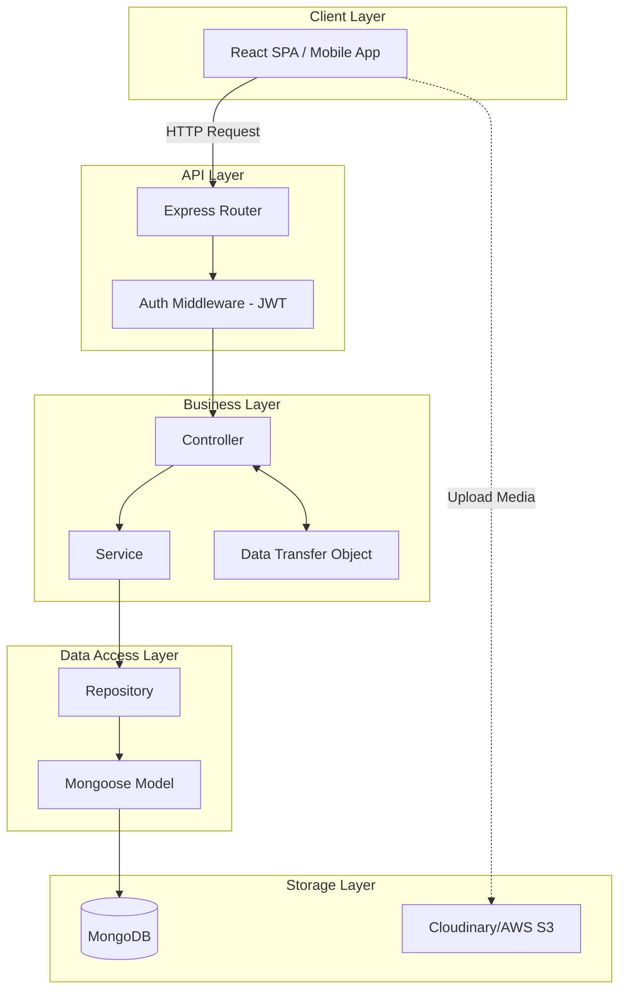

---

## UC19 - Update MC Profile

**Use Case Description:** MC updates professional profile (operating regions, experience, rates, event types, etc.)
**Actor:** MC

### State Diagram
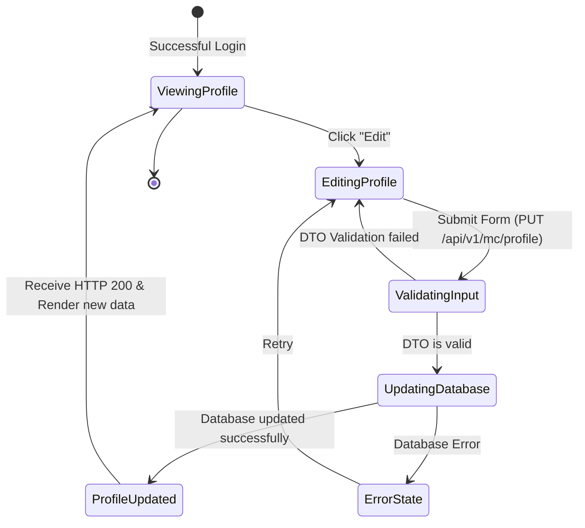

### Sequence / Interaction Diagram
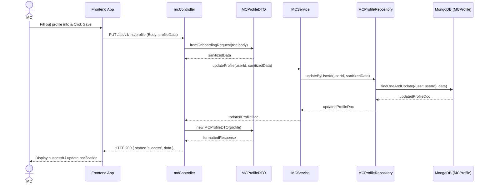

### Integrated Communication Diagram
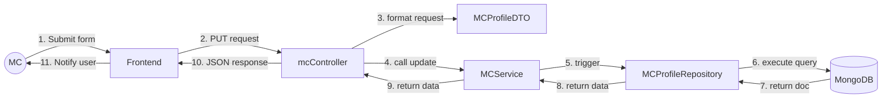

### Detail Design
- **API Endpoint:** `PUT /api/v1/mc/profile`
- **Request Body (Example):** `{ eventsType: ["Wedding"], experience: 5, rates: {min: 100, max: 500} }`
- **Controller:** `mcController.updateProfile`
- **DTO Validation:** `MCProfileDTO.fromOnboardingRequest` maps input variables (e.g., converts `niche` -> `eventTypes`).
- **Database Model:** `MCProfile` (mongoose schema) linked with `User` Model via `user` ref ObjectId.

---

## UC20 - Upload Media

**Use Case Description:** MC uploads files (photos/video showreels) via Frontend directly to Storage Cloud, sending URL back to DB.
**Actor:** MC

### State Diagram
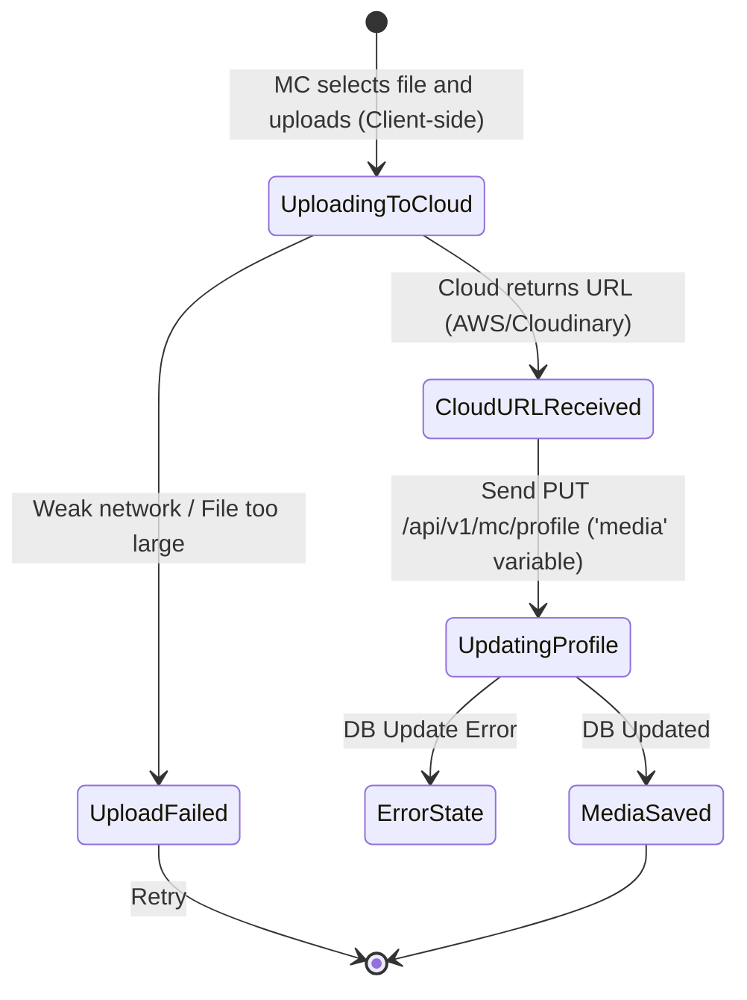

### Sequence / Interaction Diagram
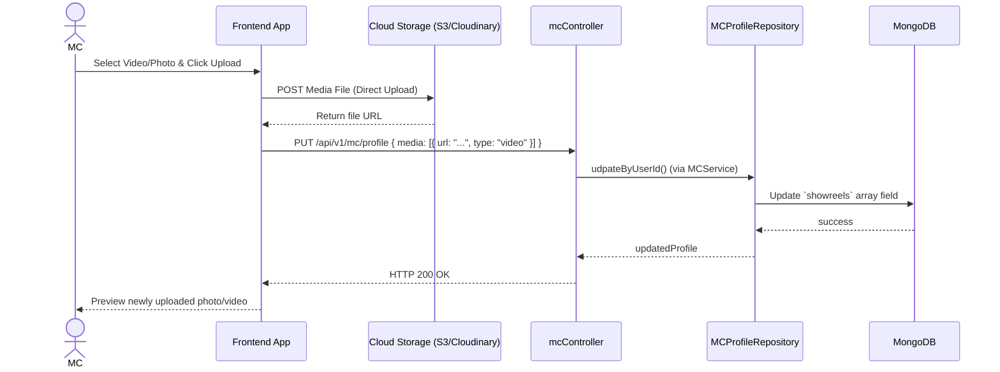

### Detail Design
- There is no dedicated backend controller to handle form-data file upload (Multer is not used at the profile layer).
- **Database Field:** Saved into `showreels: [ { url: String, type: Enum['image','video'] } ]` variable in `MCProfile`.

---

## UC21 - View Schedule

**Use Case Description:** Function to display the working schedule, consolidating manually blocked schedules and successfully booked Bookings by clients.
**Actor:** MC

### State Diagram
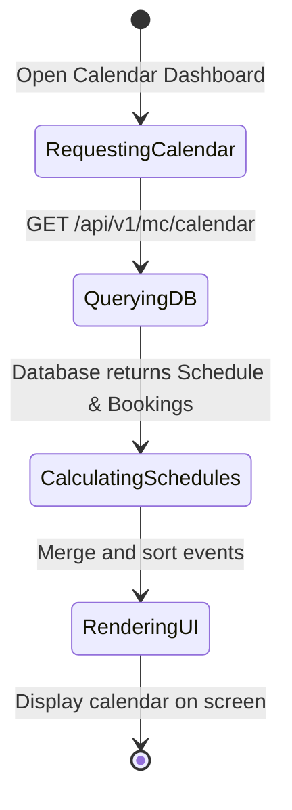

### Sequence / Interaction Diagram
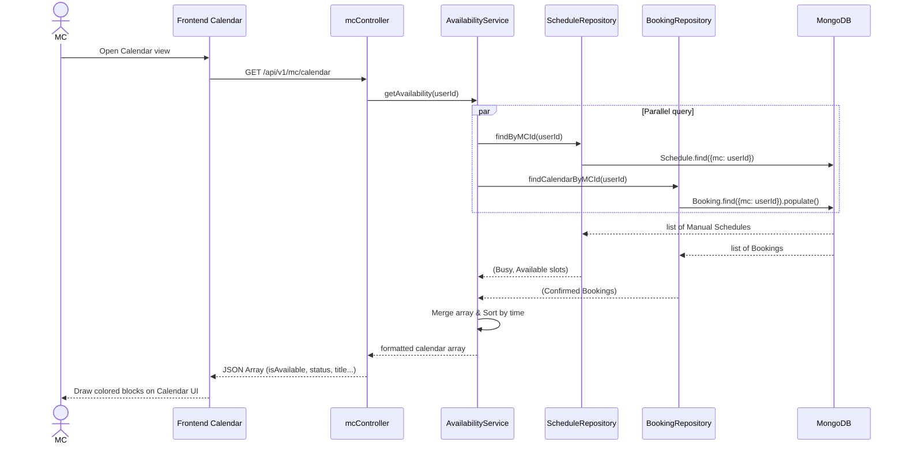

### Detail Design
- **Controller:** `mcController.getCalendar`
- Statistics for the Schedule are combined from 2 independent Models: `Schedule` (schedules manually locked by MC as busy) and `Booking` (Actual contracts taking place). Mapped by `AvailabilityService`.

---

## UC22 & UC23 - Update Busy Schedule / Set Availability Status

**Use Case Description:** MC locks schedule (marks busy) for a specific time period (via UC22) or marks Slot as Available (UC23).
**Actor:** MC

*Backend shares the `Schedule` Table to mark status as "Busy" or "Available" for this time period.*

### Sequence / Interaction Diagram
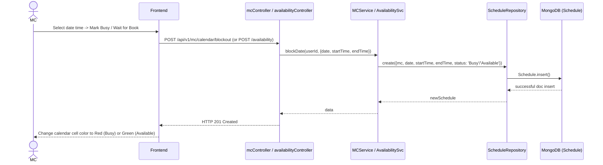

### Detail Design
- **API (Block Date):** `POST /api/v1/mc/calendar/blockout` -> automatically assigns `status = 'Busy'`.
- **API (Set Availability):** `POST /api/v1/availability` -> assigns `status` depending on `isAvailable` flag passed from Client.
- **Model:** `Schedule` contains schema `status: { enum: ["Available", "Booked", "Busy"] }`.

---

## UC32 - View Users Lists

**Use Case Description:** Admin views the list of all Users on the system.
**Actor:** Admin

### Sequence / Interaction Diagram
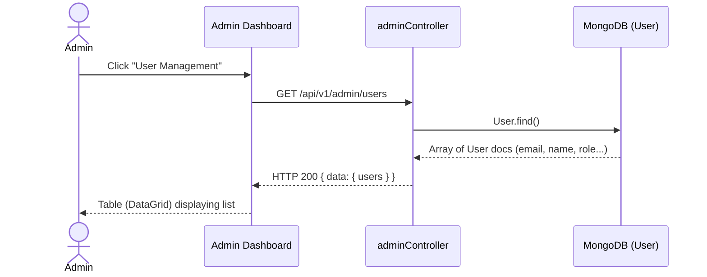

---

## UC33 & UC34 - Lock/Unlock Account & Verify MC

**Use Case Description:** Admin verifies MC's profile (Verify = true) or bans violating User (Active = false).
**Actor:** Admin

### State Diagram
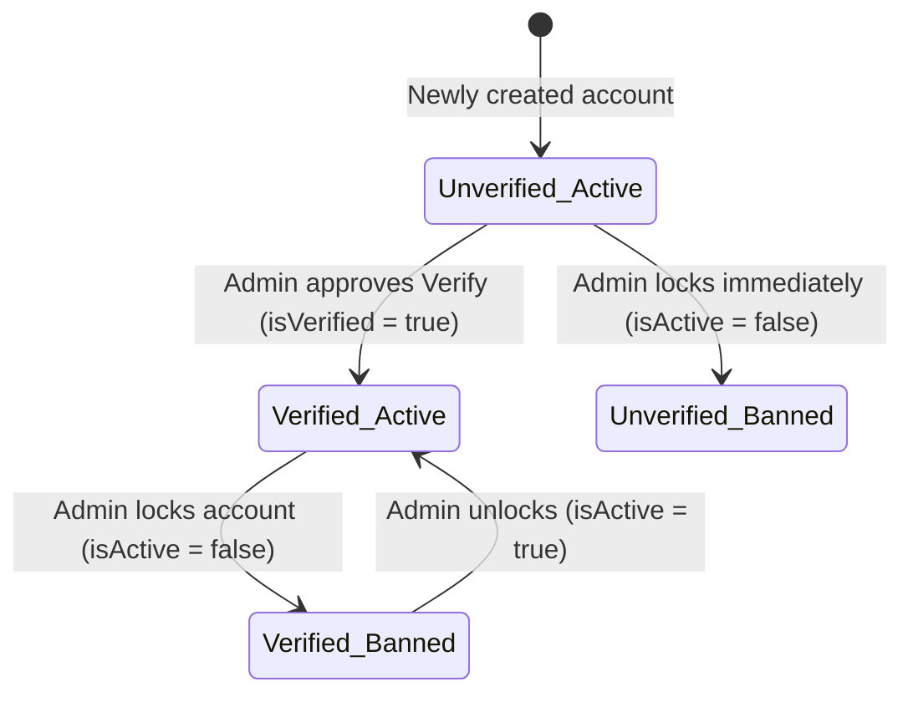

### Sequence / Interaction Diagram

### Detail Design
- Both actions (Lock/Unlock and Verify MC documentation) share 1 Controller function `adminController.updateUserStatus`.
- **Database Fields:** `User.isActive` (Default: true), `User.isVerified` (Default: false). Only changes Boolean through MongoDB Update.

---

## UC36 - View All Bookings

**Use Case Description:** Manages all contract transactions on the system to help Admin track incoming revenue and progress.
**Actor:** Admin

### Sequence / Interaction Diagram
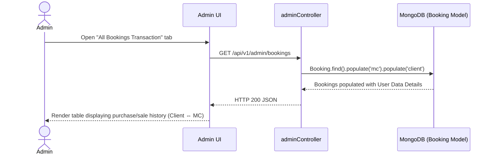

---

## UC37 - Resolve Disputes

_This feature has not materialized in the backend APIs route files (`api/v1/admin`) or `adminController.js` during code check, therefore there is no Detail Design or Sequence Diagram for backend logic. Logic is entirely Missing in Codebase._ 
_Request Backend / PM to issue a new topic to Develop Complaint/Dispute Tracking feature._
