# Detailed Design Analysis based on System Architecture

This is the detailed design and system communication structure for the MC Hub system, built strictly based on the actual source code of the `src/controllers`, `src/services`, `src/dtos`, `src/repositories`, `src/models` directories of the Node.js Backend. Every Use Case (UC) is fully separated and includes all requested diagrams.

---

## UC19 - Update MC Profile

### 1. Use Case Description
**Name:** Update MC Profile
**Actor:** MC
**Description:** MC updates their professional profile (operating regions, experience, rates, event types, biography, etc.). The backend maps the raw input using a Data Transfer Object (DTO) before updating the database.

### 2. State Diagram
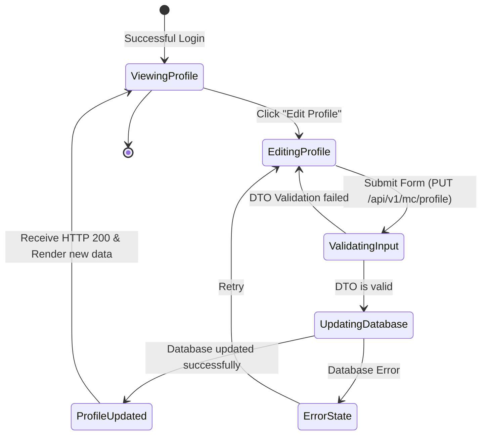

### 3. Interaction / Sequence Diagram
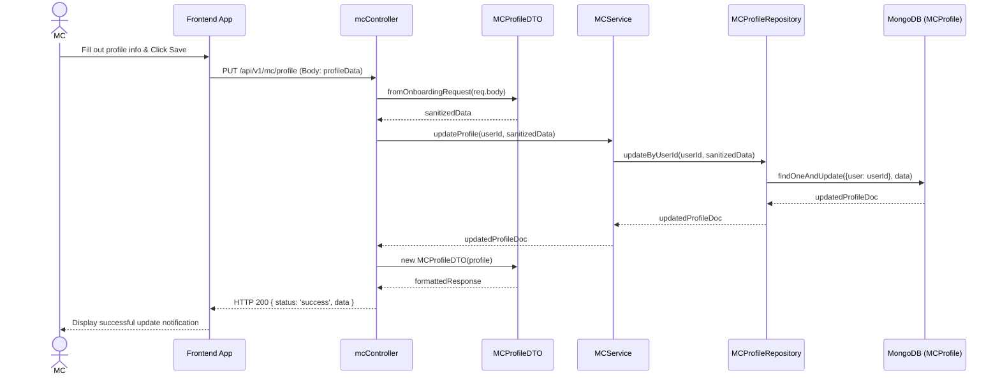

### 4. Integrated Communication Diagram
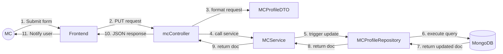

### 5. Detail Design
- **API Endpoint:** `PUT /api/v1/mc/profile`
- **Request Body:** `{ niche: "Wedding", experience: 5, rates: {min: 100, max: 500}, languages: ["EN", "VN"] }`
- **Controller:** `mcController.updateProfile(req, res)`
- **DTO Validation:** `MCProfileDTO.fromOnboardingRequest` maps input variables (e.g., converts `niche` -> `eventTypes`).
- **Database Model:** `MCProfile` linked with `User` Model via `user` ref ObjectId.

### 6. System High-Level Design
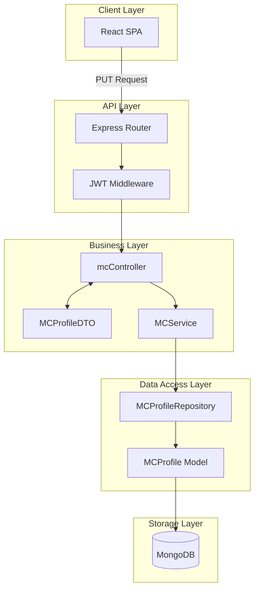

---

## UC20 - Upload Media

### 1. Use Case Description
**Name:** Upload Media
**Actor:** MC
**Description:** MC uploads media files (photos/video showreels). The Client directly uploads files to a Cloud Storage service, receives the URLs, and submits them to the backend via the Profile update API.

### 2. State Diagram
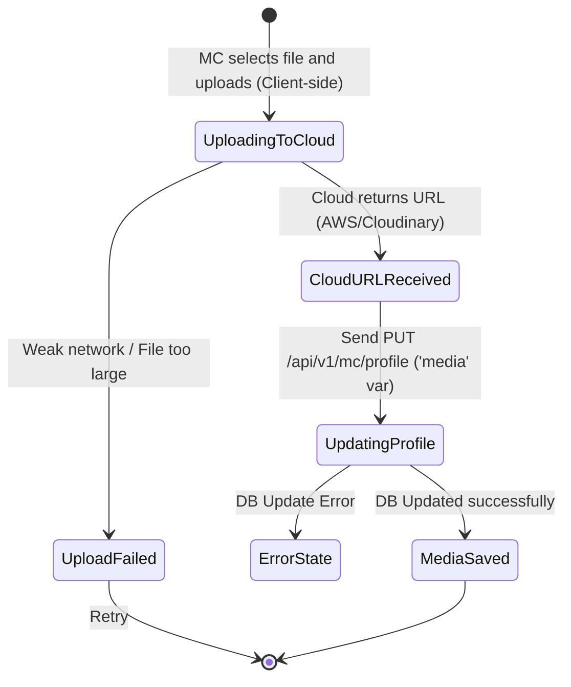

### 3. Interaction / Sequence Diagram
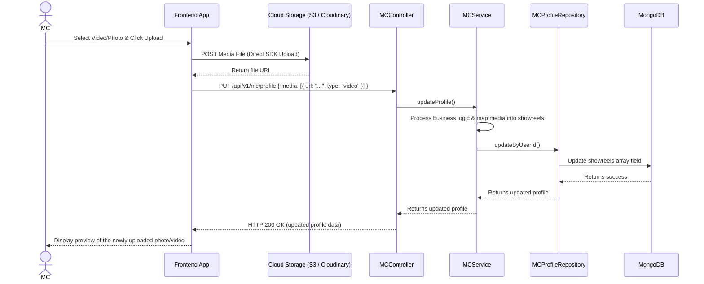

### 4. Integrated Communication Diagram
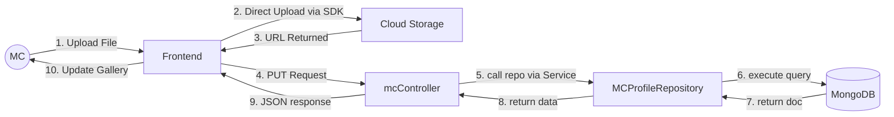

### 5. Detail Design
- **Mechanism:** There is no dedicated backend controller to handle form multipart file uploads. The backend solely stores the URL strings.
- **API Endpoint:** `PUT /api/v1/mc/profile`
- **Controller:** `mcController.updateProfile(req, res)`
- **Database Field:** Saved into `showreels: [ { url: String, type: Enum['image','video'] } ]` array in `MCProfile` collection.

### 6. System High-Level Design
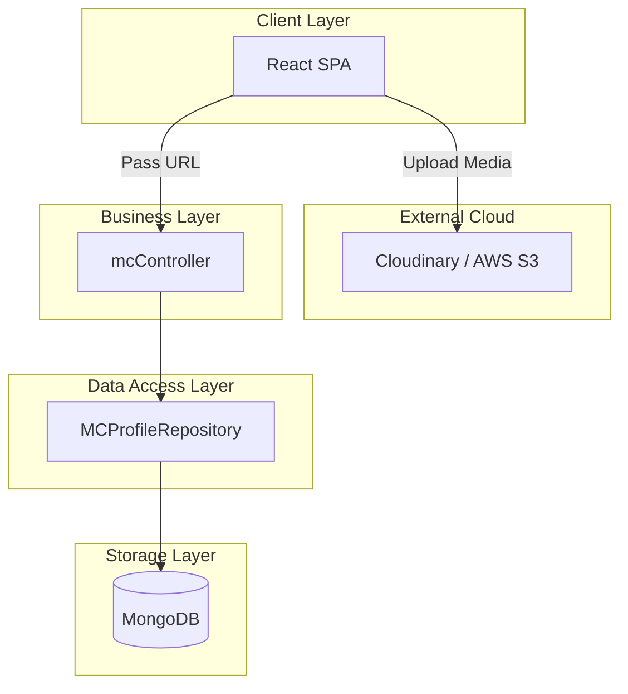

---

## UC21 - View Schedule

### 1. Use Case Description
**Name:** View Schedule
**Actor:** MC
**Description:** Consolidates data to display the working schedule, merging manually blocked schedules (Busy/Available) with actually confirmed Bookings.

### 2. State Diagram
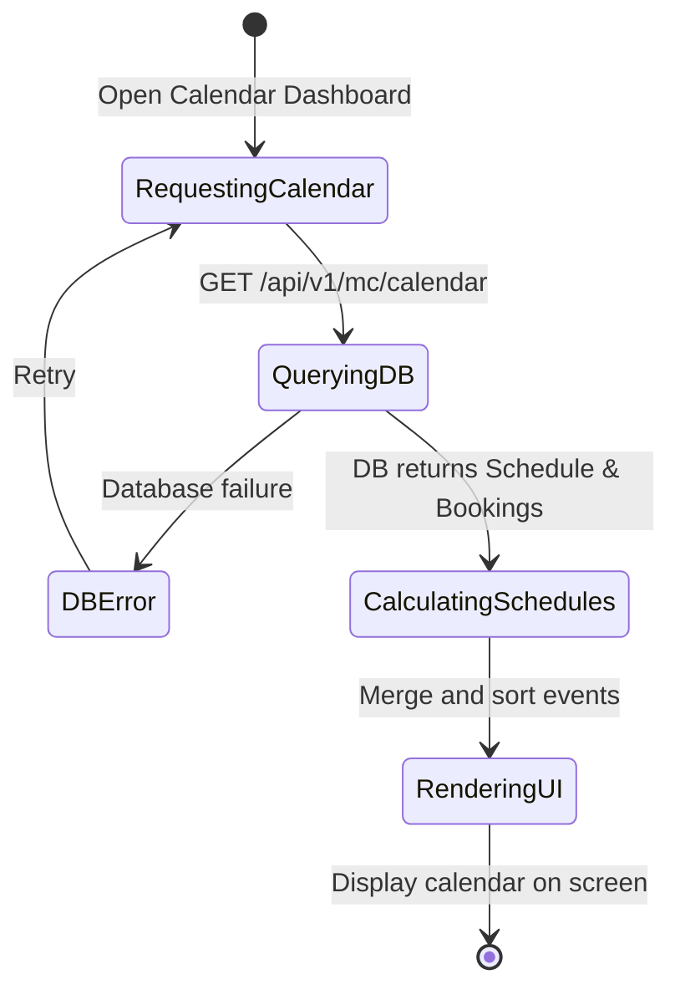

### 3. Interaction / Sequence Diagram
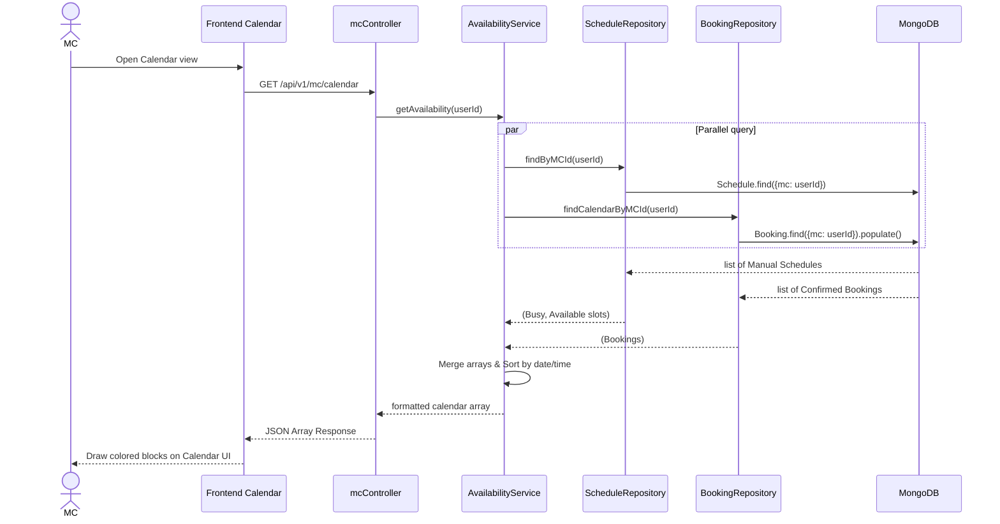

### 4. Integrated Communication Diagram
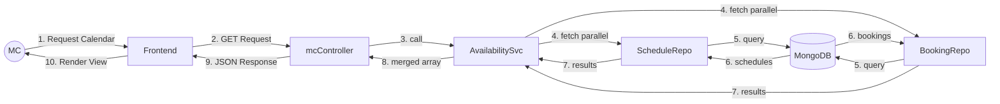

### 5. Detail Design
- **API Endpoint:** `GET /api/v1/mc/calendar`
- **Controller:** `mcController.getCalendar(req, res)`
- **Dependencies:** Uses `AvailabilityService` to merge data.
- **Data sources:** Unifies items from `Schedule` model and `Booking` model into a standard JSON component array for calendar rendering.

### 6. System High-Level Design
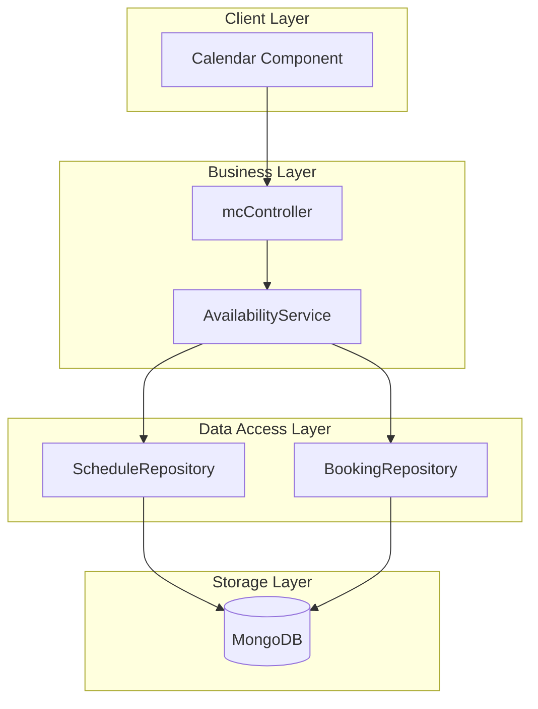

---

## UC22 - Update Busy Schedule

### 1. Use Case Description
**Name:** Update Busy Schedule
**Actor:** MC
**Description:** MC locks their schedule, marking specific dates and time slots as explicitly "Busy" so clients cannot book them in those slots.

### 2. State Diagram
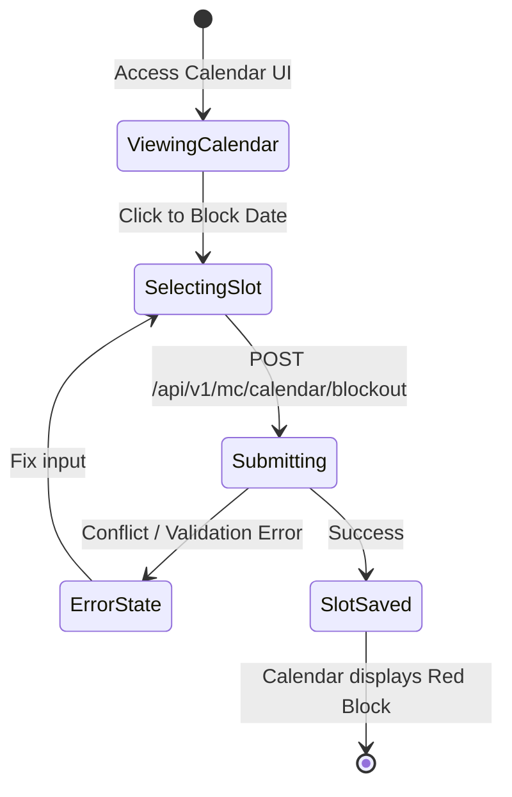

### 3. Interaction / Sequence Diagram
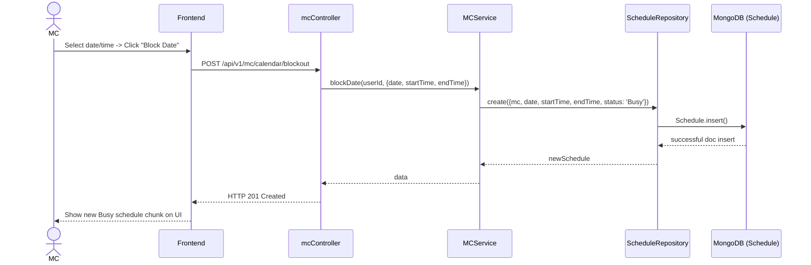

### 4. Integrated Communication Diagram
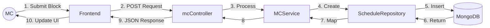

### 5. Detail Design
- **API Endpoint:** `POST /api/v1/mc/calendar/blockout`
- **Controller:** `mcController.blockDate`
- **Database Model:** Creates a `Schedule` doc implicitly assigned the property `status = "Busy"`.

### 6. System High-Level Design
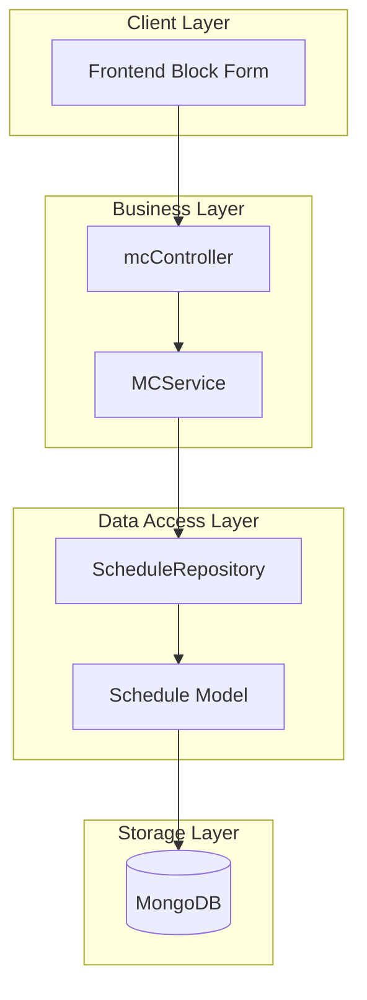

---

## UC23 - Set Availability Status

### 1. Use Case Description
**Name:** Set Availability Status
**Actor:** MC
**Description:** MC manually sets custom slot statuses (Available / Busy) depending on availability, allowing granular control rather than just full-time blocking.

### 2. State Diagram
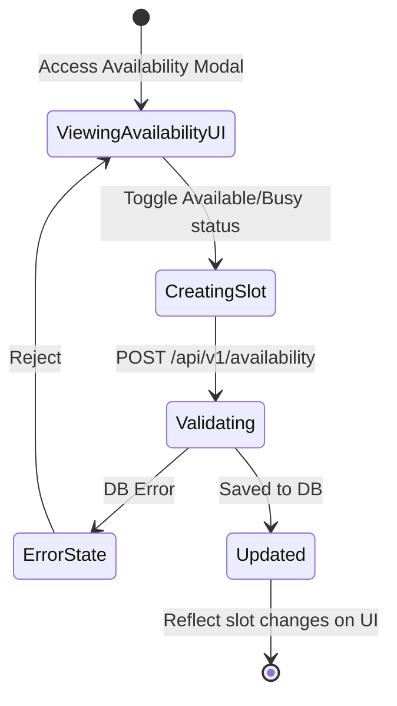

### 3. Interaction / Sequence Diagram
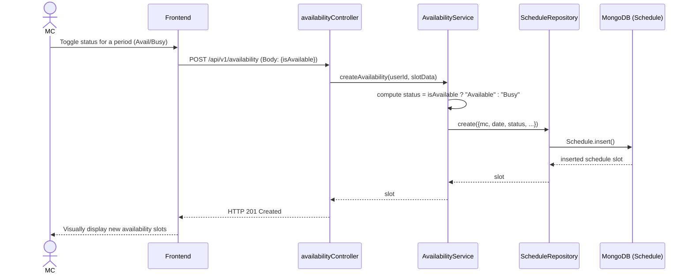

### 4. Integrated Communication Diagram
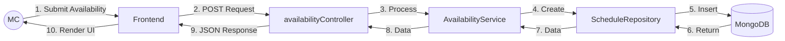

### 5. Detail Design
- **API Endpoint:** `POST /api/v1/availability`
- **Controller:** `availabilityController.createAvailability`
- **Logic:** Relies on the frontend passing the `isAvailable` boolean to ascertain if `status` inside the `Schedule` model logic becomes "Available" (true) or "Busy" (false). 

### 6. System High-Level Design
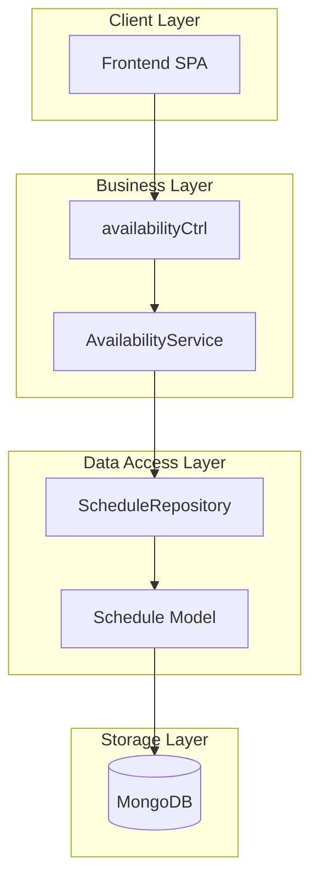

---

## UC32 - View Users Lists

### 1. Use Case Description
**Name:** View Users Lists
**Actor:** Admin
**Description:** The Administrator views a complete list of all Users registered on the system (both Clients and MCs) to manage them.

### 2. State Diagram
```mermaid
stateDiagram-v2
    [*] --> Dashboard: Admin logs into Admin Panel
    Dashboard --> LoadingUsers: Click "User Management"
    LoadingUsers --> RenderedList: API Returns Data
    LoadingUsers --> ErrorState: Request Failure
    ErrorState --> Dashboard: Retry
    RenderedList --> [*]: Admin views table
```

### 3. Interaction / Sequence Diagram
```mermaid
sequenceDiagram
    actor Admin
    participant FE as Admin Dashboard
    participant Ctrl as adminController
    participant DB as MongoDB (User Model)

    Admin->>FE: Access "Users List" Tab
    FE->>Ctrl: GET /api/v1/admin/users
    Ctrl->>DB: User.find()
    DB-->>Ctrl: Array of User docs (email, name, role...)
    Ctrl-->>FE: HTTP 200 { status: 'success', data: { users } }
    FE-->>Admin: Render DataGrid Table of users
```

### 4. Integrated Communication Diagram
```mermaid
flowchart LR
    Admin((Admin)) -->|1. Click Tab| FE[Admin Frontend]
    FE -->|2. GET Request| Ctrl[adminController]
    Ctrl -->|3. find() query| DB[(MongoDB)]
    DB -->|4. Array of Users| Ctrl
    Ctrl -->|5. JSON Response| FE
    FE -->|6. Render DataGrid| Admin
```

### 5. Detail Design
- **API Endpoint:** `GET /api/v1/admin/users`
- **Controller:** `adminController.getAllUsers`
- **Logic:** Direct `User.find()` query fetching all registered users without complex filtering natively in the controller. Data rendering is managed by the client-side table.

### 6. System High-Level Design
```mermaid
flowchart TB
    subgraph ClientLayer ["Client Layer"]
        FE[Admin Dashboard UI]
    end
    subgraph APILayer ["API Layer"]
        Route[Admin Routes]
    end
    subgraph BusinessLayer ["Business Layer"]
        Ctrl[adminController]
    end
    subgraph DataLayer ["Data Storage"]
        DB[(MongoDB - User Collection)]
    end

    FE --> Route --> Ctrl --> DB
```

---

## UC33 - Lock/Unlock Account

### 1. Use Case Description
**Name:** Lock/Unlock Account
**Actor:** Admin
**Description:** Admin changes the account accessibility status of any User by modifying the `isActive` flag, practically banning them or giving them access back to the system.

### 2. State Diagram
```mermaid
stateDiagram-v2
    [*] --> ViewingUser: Admin opens user row
    ViewingUser --> ModifyingStatus: Admin toggles "Lock Account" switch
    ModifyingStatus --> Requesting: PATCH /admin/users/:id {isActive: false}
    Requesting --> Saved: Success (Account Banned)
    Requesting --> Failed: Unsuccessful execution
    Failed --> ViewingUser: Return
    Saved --> [*]: Visual confirmation
```

### 3. Interaction / Sequence Diagram
```mermaid
sequenceDiagram
    actor Admin
    participant FE as Admin UI
    participant Ctrl as adminController
    participant DB as MongoDB (User Model)

    Admin->>FE: Toggle Switch (Lock/Unlock User)
    FE->>Ctrl: PATCH /api/v1/admin/users/:id { isActive: false/true }
    Ctrl->>DB: User.findByIdAndUpdate(id, body, {new:true})
    DB-->>Ctrl: updatedUserDoc / Null (if not found)
    alt User not found
        Ctrl-->>FE: HTTP 404 (User not found)
    else Update successful
        Ctrl-->>FE: HTTP 200 { data: { user } }
        FE-->>Admin: Notification "Status updated successfully"
    end
```

### 4. Integrated Communication Diagram
```mermaid
flowchart LR
    Admin((Admin)) -->|1. Toggle Switch| FE[Admin Frontend]
    FE -->|2. PATCH Request| Ctrl[adminController]
    Ctrl -->|3. findByIdAndUpdate| DB[(MongoDB)]
    DB -->|4. Updated Doc| Ctrl
    Ctrl -->|5. JSON Response| FE
    FE -->|6. Show Alert| Admin
```

### 5. Detail Design
- **API Endpoint:** `PATCH /api/v1/admin/users/:id`
- **Controller:** `adminController.updateUserStatus`
- **Database Field:** Acts specifically upon the `isActive` boolean within the `User` schema implicitly via standard body pass-through.

### 6. System High-Level Design
```mermaid
flowchart TB
    subgraph ClientLayer ["Client Layer"]
        FE[Admin Dashboard UI]
    end
    subgraph BusinessLayer ["Business Layer"]
        Ctrl[adminController]
    end
    subgraph DataLayer ["Data Storage"]
        DB[(MongoDB)]
    end

    FE --> Ctrl --> DB
```

---

## UC34 - Verify MC

### 1. Use Case Description
**Name:** Verify MC
**Actor:** Admin
**Description:** The Administrator verifies and authenticates the expertise/identity documents of an MC, altering the `isVerified` status of their account.

### 2. State Diagram
```mermaid
stateDiagram-v2
    [*] --> Unverified: New MC registered
    Unverified --> Appraising: Admin reviews submitted info
    Appraising --> Confirming: Admin clicks "Verify Account"
    Confirming --> Processing: PATCH /admin/users/:id {isVerified: true}
    Processing --> Success: Successfully Approved
    Processing --> Failed: Database Error
    Failed --> Appraising: Re-retry
    Success --> [*]: Account marked Verified
```

### 3. Interaction / Sequence Diagram
```mermaid
sequenceDiagram
    actor Admin
    participant FE as Admin UI
    participant Ctrl as adminController
    participant DB as MongoDB (User Model)

    Admin->>FE: Click Verify on MC User row
    FE->>Ctrl: PATCH /api/v1/admin/users/:id { isVerified: true }
    Ctrl->>DB: User.findByIdAndUpdate(id, body, {new:true})
    DB-->>Ctrl: updatedUserDoc / Null
    alt Target not found
        Ctrl-->>FE: HTTP 404 (User not found)
    else Update successful
        Ctrl-->>FE: HTTP 200 { data: { user } }
        FE-->>Admin: Notification "MC Verified Successfully"
    end
```

### 4. Integrated Communication Diagram
```mermaid
flowchart LR
    Admin((Admin)) -->|1. Click Verify| FE[Admin Frontend]
    FE -->|2. PATCH Request| Ctrl[adminController]
    Ctrl -->|3. update query| DB[(MongoDB)]
    DB -->|4. Updated User| Ctrl
    Ctrl -->|5. JSON Response| FE
    FE -->|6. Update UI Element| Admin
```

### 5. Detail Design
- **API Endpoint:** `PATCH /api/v1/admin/users/:id`
- **Controller:** `adminController.updateUserStatus`
- **Logic:** Evaluates identical endpoint logic as UC33 but this scenario distinctly targets modifying the `isVerified` configuration within the `User` DB level.

### 6. System High-Level Design
```mermaid
flowchart TB
    subgraph ClientLayer ["Client Layer"]
        FE[Admin Dashboard UI]
    end
    subgraph BusinessLayer ["Business Layer"]
        Ctrl[adminController]
    end
    subgraph DataLayer ["Data Storage"]
        DB[(MongoDB)]
    end

    FE --> Ctrl --> DB
```

---

## UC36 - View All Bookings

### 1. Use Case Description
**Name:** View All Bookings
**Actor:** Admin
**Description:** Admin accesses the centralized transaction log viewing all Booking interactions transpiring system-wide among Clients and MCs.

### 2. State Diagram
```mermaid
stateDiagram-v2
    [*] --> Dashboard: Admin enters main dashboard
    Dashboard --> Fetching: Admin clicks 'Bookings Management'
    Fetching --> Loading: GET /api/v1/admin/bookings
    Loading --> ErrorState: Fail to process
    Loading --> Rendering: Success fetching array
    Rendering --> [*]: Displays comprehensive logs
```

### 3. Interaction / Sequence Diagram
```mermaid
sequenceDiagram
    actor Admin
    participant FE as Admin UI
    participant Ctrl as adminController
    participant DB as MongoDB (Booking Model)

    Admin->>FE: Open "All Bookings Transaction" tab
    FE->>Ctrl: GET /api/v1/admin/bookings
    Ctrl->>DB: Booking.find().populate('mc').populate('client')
    DB-->>Ctrl: Bookings populated with User Data Details
    Ctrl-->>FE: HTTP 200 JSON { bookings }
    FE-->>Admin: Render table displaying transactions (Client ⇔ MC)
```

### 4. Integrated Communication Diagram
```mermaid
flowchart LR
    Admin((Admin)) -->|1. Click Tab| FE[Admin Frontend]
    FE -->|2. GET Request| Ctrl[adminController]
    Ctrl -->|3. find and populate| DB[(MongoDB)]
    DB -->|4. Populated Array| Ctrl
    Ctrl -->|5. JSON Response| FE
    FE -->|6. Render Booking Table| Admin
```

### 5. Detail Design
- **API Endpoint:** `GET /api/v1/admin/bookings`
- **Controller:** `adminController.getAllBookings`
- **Data Model Extraction:** `Booking` model is natively queried and populates related `MC` IDs and `Client` IDs into thorough nested user records before replying.

### 6. System High-Level Design
```mermaid
flowchart TB
    subgraph ClientLayer ["Client Layer"]
        FE[Admin Dashboard]
    end
    subgraph APILayer ["API Layer"]
        Route[Admin Routes]
    end
    subgraph BusinessLayer ["Business Layer"]
        Ctrl[adminController]
    end
    subgraph DataLayer ["Data Storage"]
        DB[(MongoDB - Booking Collection)]
    end

    FE --> Route --> Ctrl --> DB
```

---

## UC37 - Resolve Disputes

### 1. Use Case Description
**Name:** Resolve Disputes / Ticketing
**Actor:** Admin
**Notice:** *This feature has not materialized in the Node.js backend codebase. There is no `Dispute` or `Ticket` model, and no related `adminController.js` logic implemented in the FPT_S7_NodeJS-Backend repository code.*
**Description (Theoretical):** Admin receives complaints logged between clients and MCs to evaluate communication logs, and dictate refunds or penalties.

### 2. State Diagram
*(Missing in Backend Codebase. Must be implemented via Issue backlog).*

### 3. Interaction / Sequence Diagram
*(Missing in Backend Codebase. Request development of Disputes route before graphing).*

### 4. Integrated Communication Diagram
*(Missing in Backend Codebase. Cannot evaluate communication flows).*

### 5. Detail Design
*(Missing in Backend Codebase. No endpoints or Database models discovered).*

### 6. System High-Level Design
*(Missing in Backend Codebase).*
