## Phân tích thiết kế chi tiết (Detail Design) dựa trên kiến trúc hệ thống

Đây là phần thiết kế chi tiết và cấu trúc giao tiếp hệ thống cho hệ thống MC Hub, được xây dựng dựa trên mã nguồn thực tế của thư mục `src/controllers`, `src/services`, `src/dtos`, `src/repositories`, `src/models` của Backend Node.js.

### Quy ước chung về System High-Level Design cho toàn bộ Use Case

Kiến trúc backend của tất cả các Use Case đều tuân thủ mô hình sau:

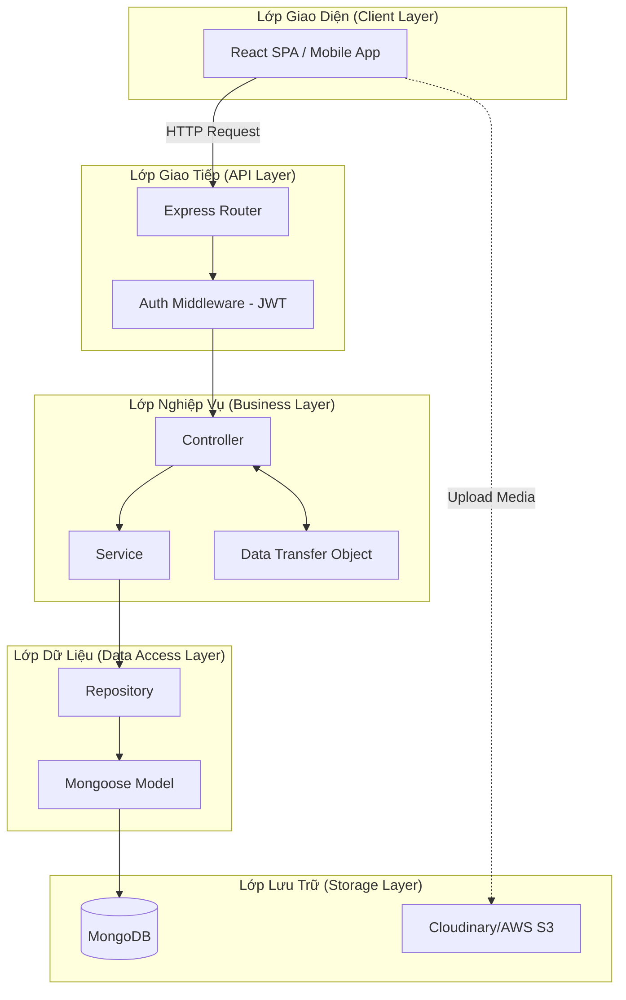

---

## UC19 - Update MC Profile

**Use Case Description:** MC cập nhật hồ sơ năng lực (khu vực hoạt động, kinh nghiệm, cát-xê, loại sự kiện, v.v.)
**Actor:** MC

### State Diagram
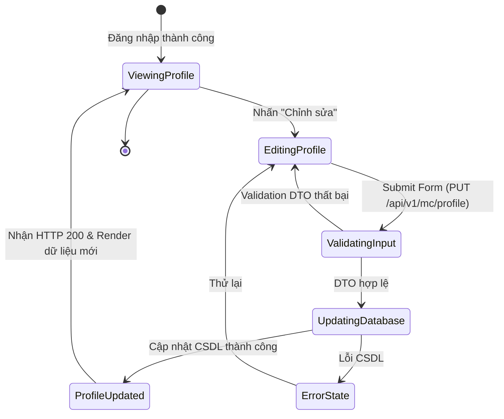

### Sequence / Interaction Diagram
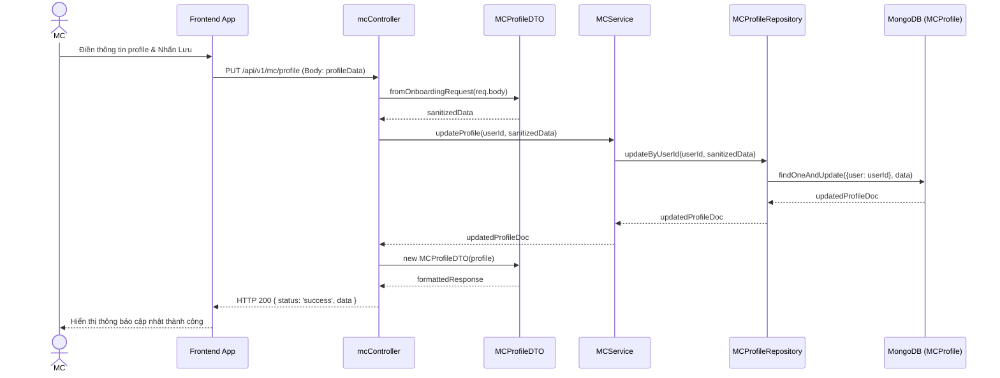

### Integrated Communication Diagram
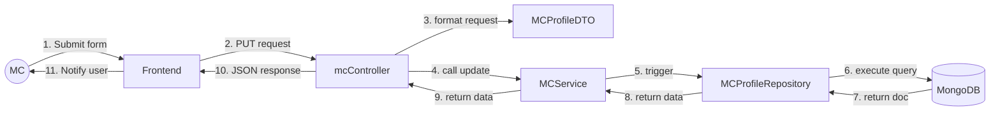

### Detail Design
- **API Endpoint:** `PUT /api/v1/mc/profile`
- **Request Body (Example):** `{ eventsType: ["Wedding"], experience: 5, rates: {min: 100, max: 500} }`
- **Controller:** `mcController.updateProfile`
- **DTO Validation:** `MCProfileDTO.fromOnboardingRequest` ánh xạ biến đầu vào (VD: chuyển `niche` -> `eventTypes`).
- **Database Model:** `MCProfile` (mongoose schema) liên kết với `User` Model qua `user` ref ObjectId.

---

## UC20 - Upload Media

**Use Case Description:** MC tải tập tin (ảnh/video showreel) thông qua Frontend upload trực tiếp lên Storage, gửi URL về DB.
**Actor:** MC

### State Diagram
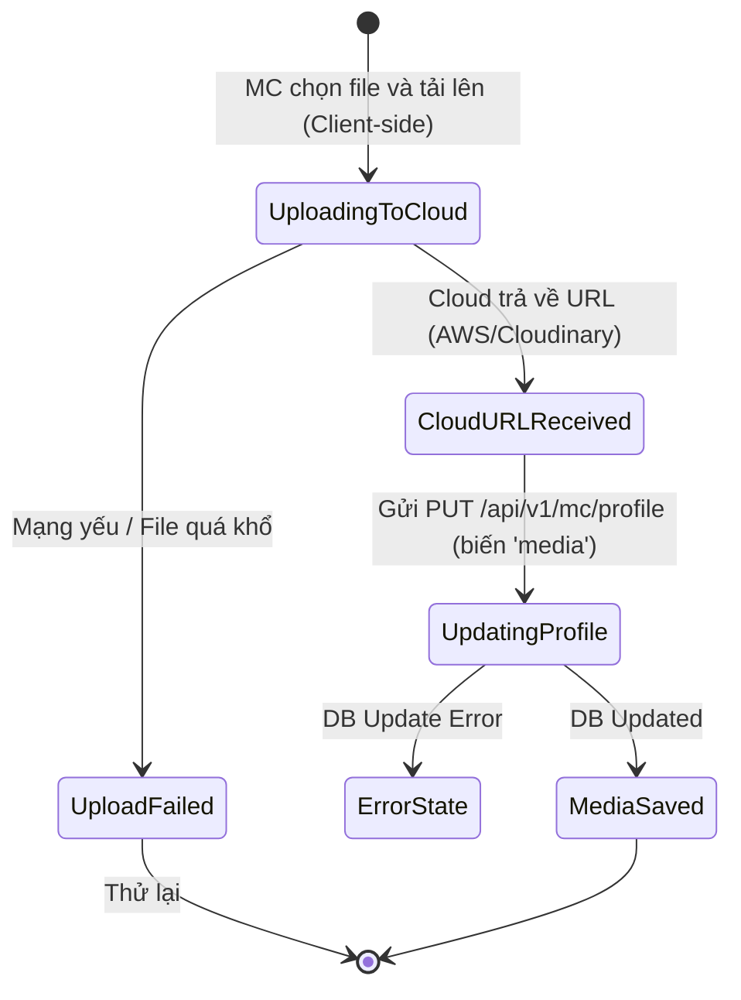

### Sequence / Interaction Diagram
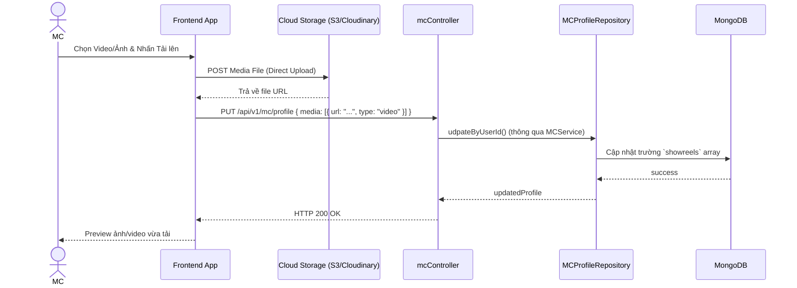

### Detail Design
- Không có backend controller chuyên biệt xử lý form-data file upload (Multer không được sử dụng ở layer profile).
- **Trường CSDL:** Lưu vào biến `showreels: [ { url: String, type: Enum['image','video'] } ]` trong `MCProfile`.

---

## UC21 - View Schedule

**Use Case Description:** Chức năng hiển thị lịch làm việc, tổng hợp giữa các lịch bị block thủ công và các Booking đã được khách hàng đặt thành công chức năng.
**Actor:** MC

### State Diagram
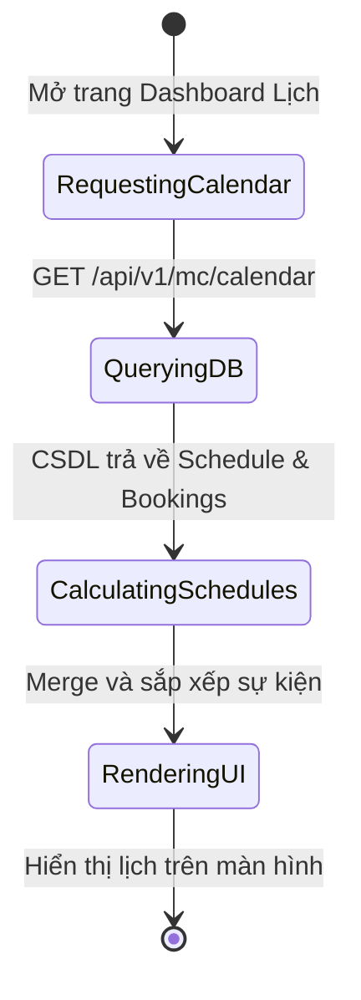

### Sequence / Interaction Diagram
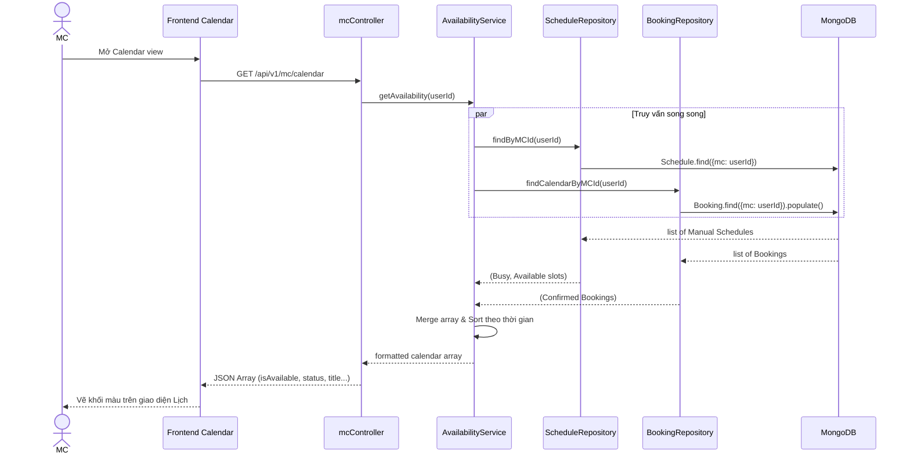

### Detail Design
- **Controller:** `mcController.getCalendar`
- Việc thống kê Lịch được gộp bởi 2 Model độc lập là `Schedule` (lịch do MC tự khoá báo bận) và `Booking` (Hợp đồng thực tế diễn ra). Mapping bởi `AvailabilityService`.

---

## UC22 & UC23 - Update Busy Schedule / Set Availability Status

**Use Case Description:** MC khoá lịch (báo bận) trong một khoảng thời gian cụ thể (qua UC22) hoặc đánh dấu Slot Available khả dụng (UC23).
**Actor:** MC

*Backend sử dụng chung Table `Schedule` để đánh dấu trạng thái "Busy" hoặc "Available" cho khoảng thời gian này.*

### Sequence / Interaction Diagram
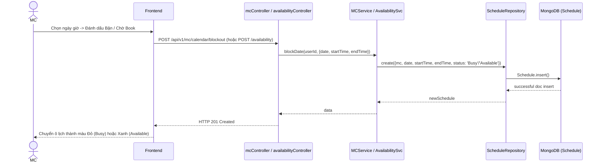

### Detail Design
- **API (Block Date):** `POST /api/v1/mc/calendar/blockout` -> gán tự động `status = 'Busy'`.
- **API (Set Availability):** `POST /api/v1/availability` -> gán `status` phụ thuộc vào cờ `isAvailable` truyền từ Client.
- **Model:** `Schedule` chứa schema `status: { enum: ["Available", "Booked", "Busy"] }`.

---

## UC32 - View Users Lists

**Use Case Description:** Admin xem danh sách toàn bộ Users trên hệ thống.
**Actor:** Admin

### Sequence / Interaction Diagram
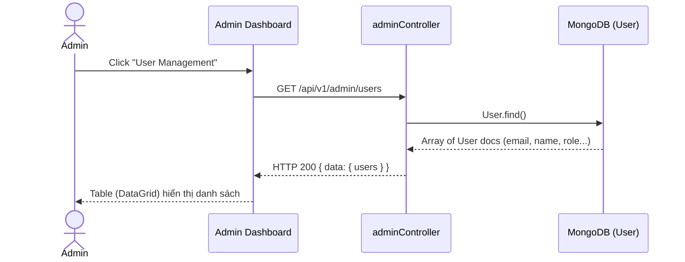

---

## UC33 & UC34 - Lock/Unlock Account & Verify MC

**Use Case Description:** Admin xác nhận hồ sơ của MC (Verify = true) hoặc khóa mõm User vi phạm (Active = false).
**Actor:** Admin

### State Diagram
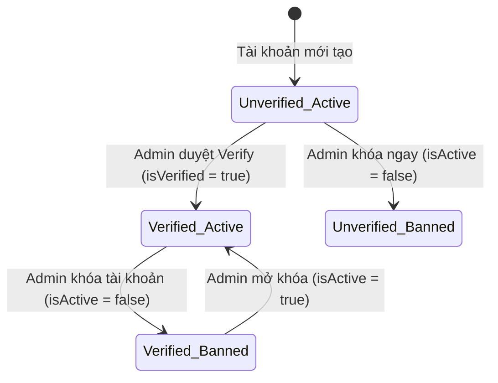

### Sequence / Interaction Diagram
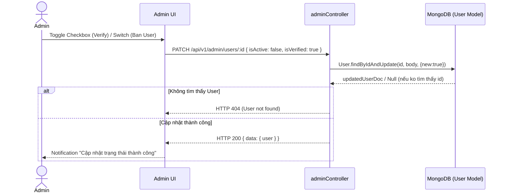

### Detail Design
- Cả hai thao tác (Khóa/Mở và Xác nhận tài liệu MC) đều chung 1 hàm Controller `adminController.updateUserStatus`.
- **Database Fields:** `User.isActive` (Mặc định: true), `User.isVerified` (Mặc định: false). Chỉ thay đổi Boolean thông qua Update MongoDB.

---

## UC36 - View All Bookings

**Use Case Description:** Trình quản lý toàn bộ các giao dịch hợp đồng trên hệ thống giúp Admin theo dõi doanh thu và tiến độ.
**Actor:** Admin

### Sequence / Interaction Diagram
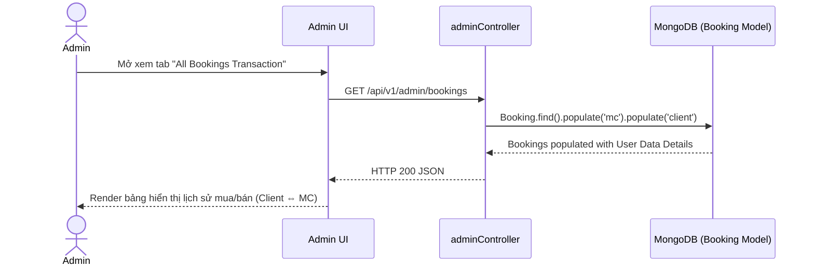

---

## UC37 - Resolve Disputes (Giải quyết tranh chấp)

_Tính năng này theo thực tế Check Code backend chưa được hiện thực hóa ở file tuyến APIs (api/v1/admin) cũng như `adminController.js`, do vậy không có Detail Design hay Sequence Diagram cho logic backend. Logic hoàn toàn Missing in Codebase._ 
_Yêu cầu phía Backend / PM phát hành thêm Issue để Develop tính năng Complaint/Dispute Tracking._
