# Detailed Design Analysis based on System Architecture

This is the detailed design and system communication structure for the MC Hub system, built strictly based on the actual source code of the `src/controllers`, `src/services`, `src/dtos`, `src/repositories`, `src/models` directories of the Node.js Backend. Every Use Case (UC) is fully separated and includes all requested diagrams.

---

## UC19 - Update MC Profile

### 1. Use Case Description

**Name:** Update MC Profile
**Actor:** MC
**Description:** MC updates their professional profile (operating regions, experience, rates, event types, biography, etc.). The backend maps the raw input using a Data Transfer Object (DTO) before updating the database.

### 2. State Diagram

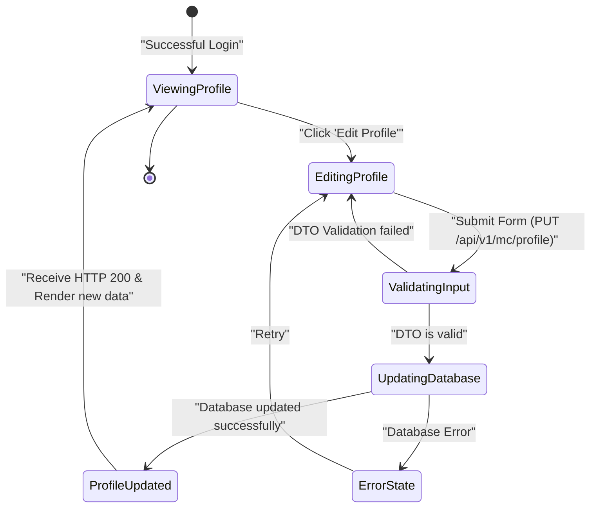

### 3. Interaction / Sequence Diagram

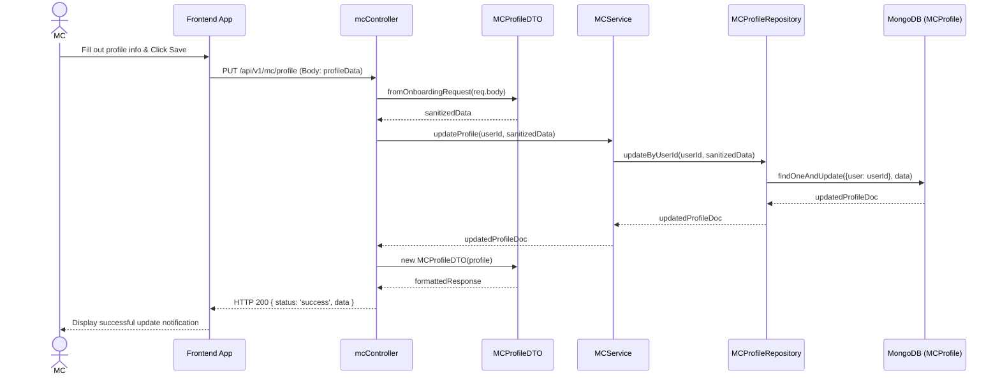

### 4. Integrated Communication Diagram

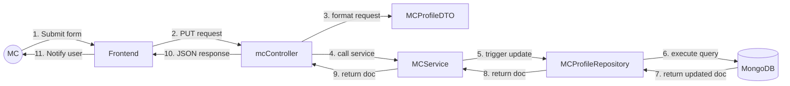

### 5. Detail Design

**Figure III-4.19** Detailed Design Classes for UC: Update MC Profile

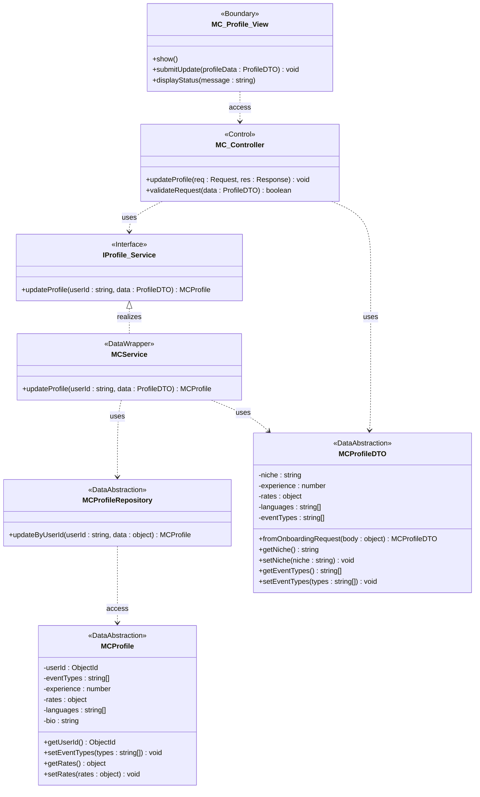

### 6. System High-Level Design

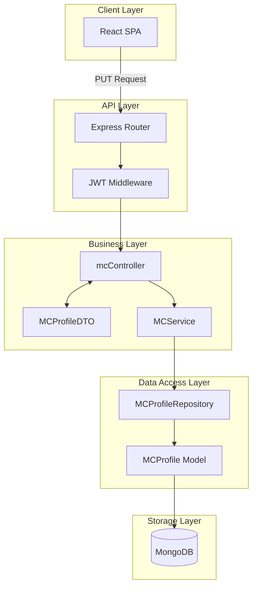

---

## UC20 - Upload Media

### 1. Use Case Description

**Name:** Upload Media
**Actor:** MC
**Description:** MC uploads media files (photos/video showreels). The Client directly uploads files to a Cloud Storage service, receives the URLs, and submits them to the backend via the Profile update API.

### 2. State Diagram

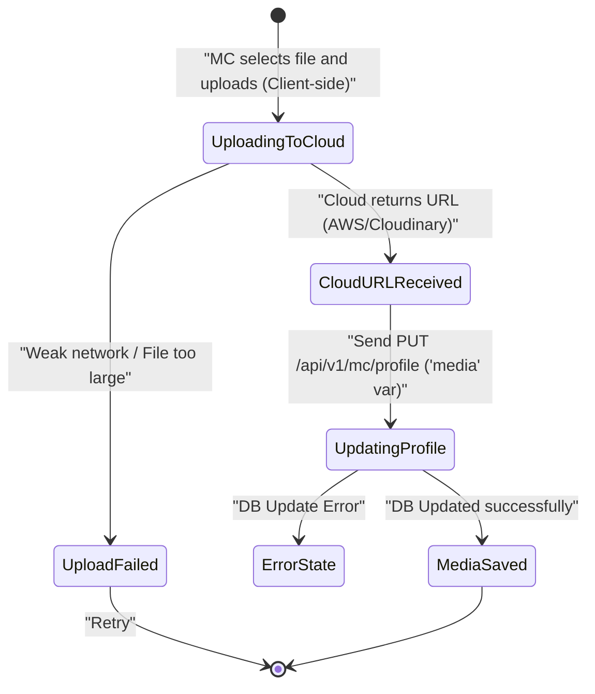

### 3. Interaction / Sequence Diagram

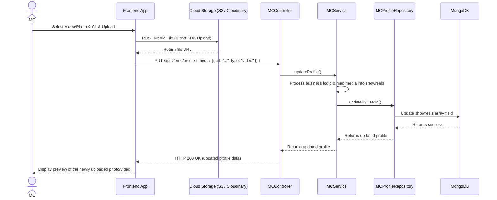

### 4. Integrated Communication Diagram

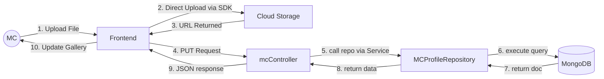

### 5. Detail Design

**Figure III-4.20** Detailed Design Classes for UC: Upload Media

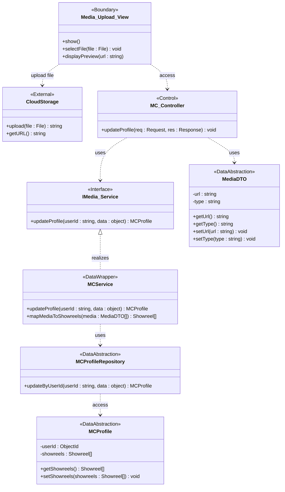

### 6. System High-Level Design

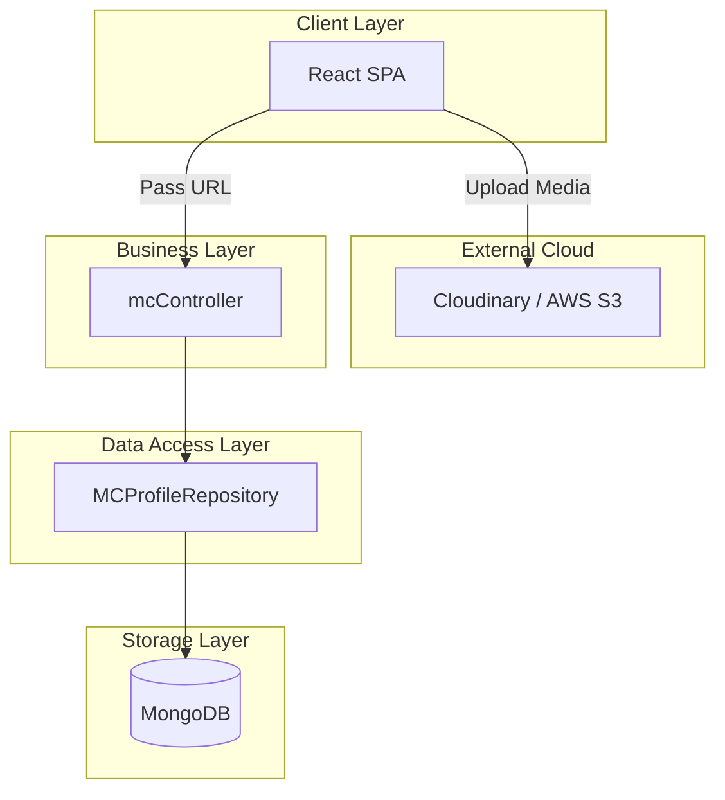

---

## UC21 - View Schedule

### 1. Use Case Description

**Name:** View Schedule
**Actor:** MC
**Description:** Consolidates data to display the working schedule, merging manually blocked schedules (Busy/Available) with actually confirmed Bookings.

### 2. State Diagram

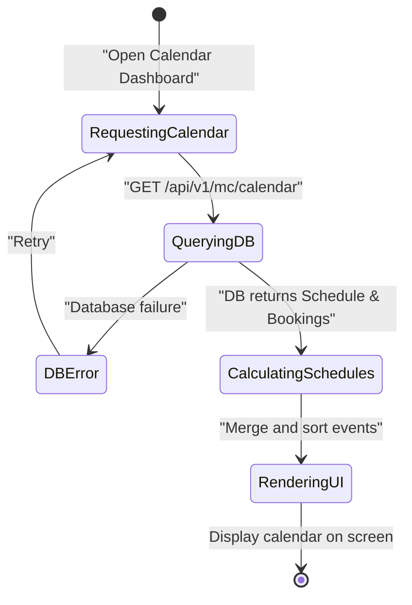

### 3. Interaction / Sequence Diagram

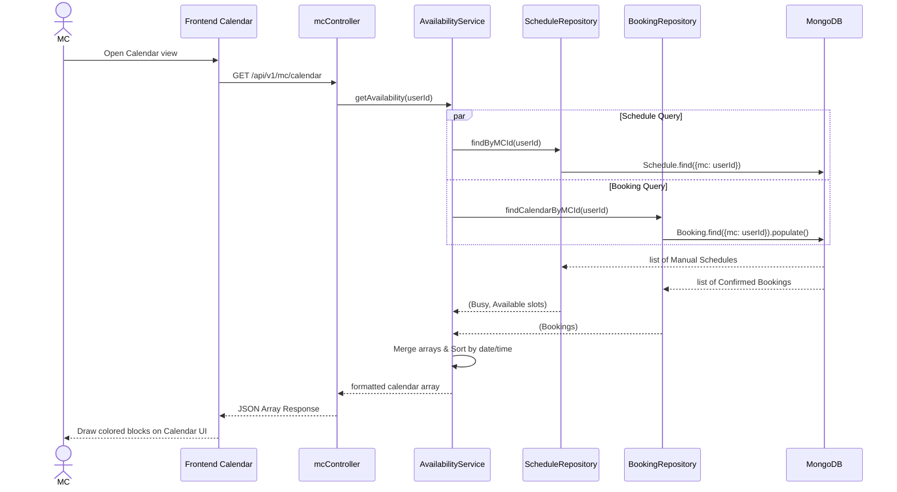

### 4. Integrated Communication Diagram

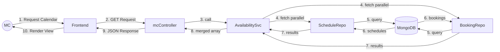

### 5. Detail Design

**Figure III-4.21** Detailed Design Classes for UC: View Schedule

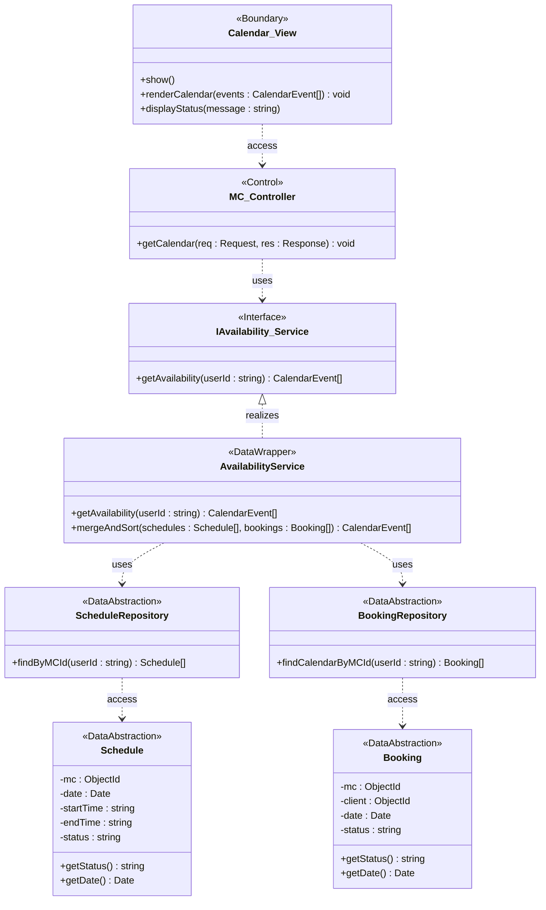

### 6. System High-Level Design

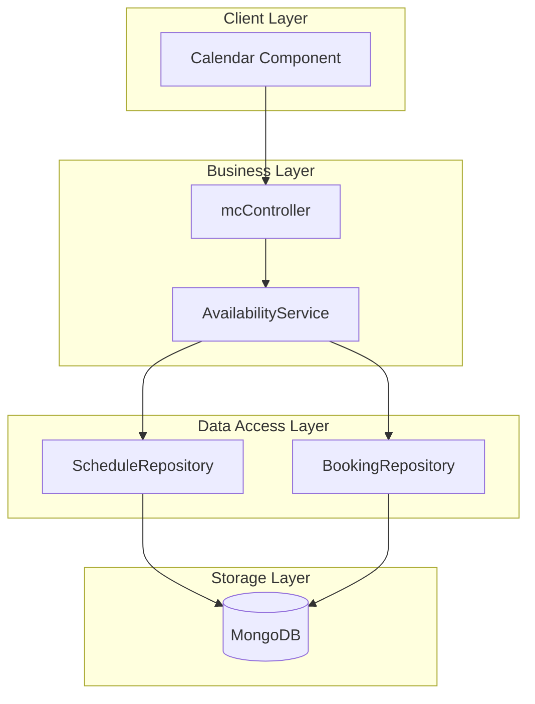

---

## UC22 - Update Busy Schedule

### 1. Use Case Description

**Name:** Update Busy Schedule
**Actor:** MC
**Description:** MC locks their schedule, marking specific dates and time slots as explicitly "Busy" so clients cannot book them in those slots.

### 2. State Diagram

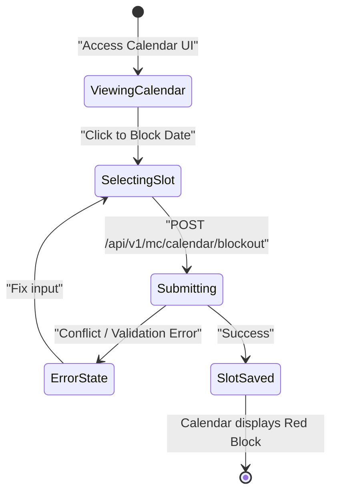

### 3. Interaction / Sequence Diagram

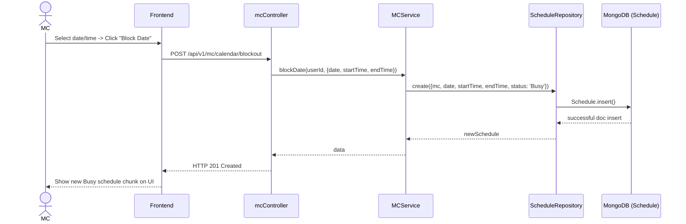

### 4. Integrated Communication Diagram

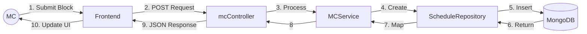

### 5. Detail Design

**Figure III-4.22** Detailed Design Classes for UC: Update Busy Schedule

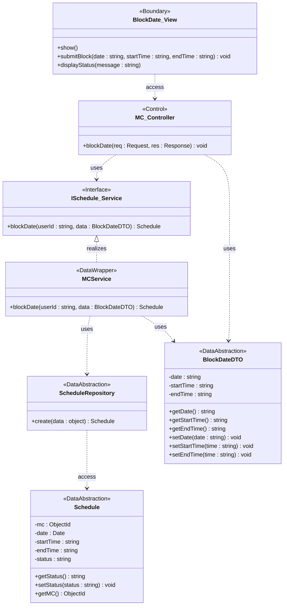

### 6. System High-Level Design

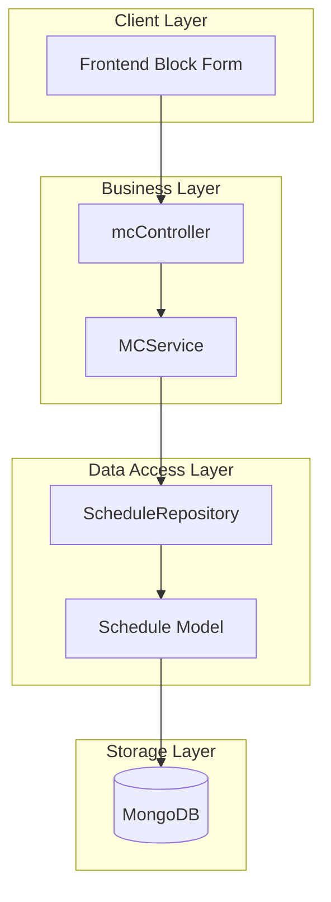

---

## UC23 - Set Availability Status

### 1. Use Case Description

**Name:** Set Availability Status
**Actor:** MC
**Description:** MC manually sets custom slot statuses (Available / Busy) depending on availability, allowing granular control rather than just full-time blocking.

### 2. State Diagram

```mermaid
stateDiagram-v2
    [*] --> ViewingAvailabilityUI : "Access Availability Modal"
    ViewingAvailabilityUI --> CreatingSlot : "Toggle Available/Busy status"
    CreatingSlot --> Validating : "POST /api/v1/availability"
    Validating --> ErrorState : "DB Error"
    ErrorState --> ViewingAvailabilityUI : "Reject"
    Validating --> Updated : "Saved to DB"
    Updated --> [*] : "Reflect slot changes on UI"
```

### 3. Interaction / Sequence Diagram

```mermaid
sequenceDiagram
    actor MC
    participant FE as Frontend
    participant Ctrl as availabilityController
    participant Svc as AvailabilityService
    participant Repo as ScheduleRepository
    participant DB as MongoDB (Schedule)

    MC->>FE: Toggle status for a period (Avail/Busy)
    FE->>Ctrl: POST /api/v1/availability (Body: {isAvailable})
    Ctrl->>Svc: createAvailability(userId, slotData)
    Svc->>Svc: compute status = isAvailable ? "Available" : "Busy"
    Svc->>Repo: create({mc, date, status, ...})
    Repo->>DB: Schedule.insert()
    DB-->>Repo: inserted schedule slot
    Repo-->>Svc: slot
    Svc-->>Ctrl: slot
    Ctrl-->>FE: HTTP 201 Created
    FE-->>MC: Visually display new availability slots
```

### 4. Integrated Communication Diagram

```mermaid
flowchart LR
    MC((MC)) -->|1. Submit Availability| FE[Frontend]
    FE -->|2. POST Request| Ctrl[availabilityController]
    Ctrl -->|3. Process| Svc[AvailabilityService]
    Svc -->|4. Create| Repo[ScheduleRepository]
    Repo -->|5. Insert| DB[(MongoDB)]
    DB -->|6. Return| Repo
    Repo -->|7. Data| Svc
    Svc -->|8. Data| Ctrl
    Ctrl -->|9. JSON Response| FE
    FE -->|10. Render UI| MC
```

### 5. Detail Design

**Figure III-4.23** Detailed Design Classes for UC: Set Availability Status

```mermaid
classDiagram
    class Availability_View {
        <<Boundary>>
        +show()
        +toggleSlot(isAvailable : boolean) void
        +displaySlots(slots : Schedule[]) void
    }

    class Availability_Controller {
        <<Control>>
        +createAvailability(req : Request, res : Response) void
    }

    class IAvailability_Service {
        <<Interface>>
        +createAvailability(userId : string, data : AvailabilityDTO) Schedule
    }

    class AvailabilityService {
        <<DataWrapper>>
        +createAvailability(userId : string, data : AvailabilityDTO) Schedule
        +computeStatus(isAvailable : boolean) string
    }

    class ScheduleRepository {
        <<DataAbstraction>>
        +create(data : object) Schedule
    }

    class AvailabilityDTO {
        <<DataAbstraction>>
        -isAvailable : boolean
        -date : string
        -startTime : string
        -endTime : string
        +getIsAvailable() boolean
        +setIsAvailable(val : boolean) void
        +getDate() string
        +setDate(date : string) void
    }

    class Schedule {
        <<DataAbstraction>>
        -mc : ObjectId
        -date : Date
        -startTime : string
        -endTime : string
        -status : string
        +getStatus() string
        +setStatus(status : string) void
        +getMC() ObjectId
    }

    Availability_View ..> Availability_Controller : access
    Availability_Controller ..> IAvailability_Service : uses
    Availability_Controller ..> AvailabilityDTO : uses
    IAvailability_Service <|.. AvailabilityService : realizes
    AvailabilityService ..> ScheduleRepository : uses
    AvailabilityService ..> AvailabilityDTO : uses
    ScheduleRepository ..> Schedule : access
```

### 6. System High-Level Design

```mermaid
flowchart TB
    subgraph ClientLayer ["Client Layer"]
        FE[Frontend SPA]
    end
    subgraph BusinessLayer ["Business Layer"]
        Ctrl[availabilityCtrl]
        Svc[AvailabilityService]
    end
    subgraph DataLayer ["Data Access Layer"]
        Repo[ScheduleRepository]
        Model[Schedule Model]
    end
    subgraph StorageLayer ["Storage Layer"]
        DB[(MongoDB)]
    end

    FE --> Ctrl --> Svc --> Repo --> Model --> DB
```

---

## UC32 - View Users Lists

### 1. Use Case Description

**Name:** View Users Lists
**Actor:** Admin
**Description:** The Administrator views a complete list of all Users registered on the system (both Clients and MCs) to manage them.

### 2. State Diagram

```mermaid
stateDiagram-v2
    [*] --> Dashboard : "Admin logs into Admin Panel"
    Dashboard --> LoadingUsers : "Click 'User Management'"
    LoadingUsers --> RenderedList : "API Returns Data"
    LoadingUsers --> ErrorState : "Request Failure"
    ErrorState --> Dashboard : "Retry"
    RenderedList --> [*] : "Admin views table"
```

### 3. Interaction / Sequence Diagram

```mermaid
sequenceDiagram
    actor Admin
    participant FE as Admin Dashboard
    participant Ctrl as adminController
    participant Svc as UserService
    participant Repo as UserRepository
    participant DB as MongoDB (User Model)

    Admin->>FE: Access "Users List" Tab
    FE->>Ctrl: GET /api/v1/admin/users
    Ctrl->>Svc: getAllUsers()
    Svc->>Repo: findAll()
    Repo->>DB: User.find()
    DB-->>Repo: Array of User docs
    Repo-->>Svc: Array of users
    Svc-->>Ctrl: Array of users
    Ctrl-->>FE: HTTP 200 { status: 'success', data: { users } }
    FE-->>Admin: Render DataGrid Table of users
```

### 4. Integrated Communication Diagram

```mermaid
flowchart LR
    Admin((Admin)) -->|1. Click Tab| FE[Admin Frontend]
    FE -->|2. GET Request| Ctrl[adminController]
    Ctrl -->|3. call service| Svc[UserService]
    Svc -->|4. call repo| Repo[UserRepository]
    Repo -->|5. execute query| DB[(MongoDB)]
    DB -->|6. Array of Users| Repo
    Repo -->|7. return data| Svc
    Svc -->|8. return data| Ctrl
    Ctrl -->|9. JSON Response| FE
    FE -->|10. Render DataGrid| Admin
```

### 5. Detail Design

**Figure III-4.32** Detailed Design Classes for UC: View Users Lists

```mermaid
classDiagram
    class UserList_View {
        <<Boundary>>
        +show()
        +renderTable(users : User[]) void
        +displayStatus(message : string)
    }

    class Admin_Controller {
        <<Control>>
        +getAllUsers(req : Request, res : Response) void
    }

    class IUser_Service {
        <<Interface>>
        +getAllUsers() User[]
    }

    class UserService {
        <<DataWrapper>>
        +getAllUsers() User[]
    }

    class UserRepository {
        <<DataAbstraction>>
        +findAll() User[]
    }

    class User {
        <<DataAbstraction>>
        -userId : ObjectId
        -email : string
        -name : string
        -role : string
        -isActive : boolean
        -isVerified : boolean
        +getEmail() string
        +getRole() string
        +getIsActive() boolean
        +getIsVerified() boolean
    }

    UserList_View ..> Admin_Controller : access
    Admin_Controller ..> IUser_Service : uses
    IUser_Service <|.. UserService : realizes
    UserService ..> UserRepository : uses
    UserRepository ..> User : access
```

### 6. System High-Level Design

```mermaid
flowchart TB
    subgraph ClientLayer ["Client Layer"]
        FE[Admin Dashboard UI]
    end
    subgraph APILayer ["API Layer"]
        Route[Admin Routes]
    end
    subgraph BusinessLayer ["Business Layer"]
        Ctrl[adminController]
        Svc[UserService]
    end
    subgraph DataLayer ["Data Access Layer"]
        Repo[UserRepository]
        DB[(MongoDB - User Collection)]
    end

    FE --> Route --> Ctrl --> Svc --> Repo --> DB
```

---

## UC33 - Lock/Unlock Account

### 1. Use Case Description

**Name:** Lock/Unlock Account
**Actor:** Admin
**Description:** Admin changes the account accessibility status of any User by modifying the `isActive` flag, practically banning them or giving them access back to the system.

### 2. State Diagram

```mermaid
stateDiagram-v2
    [*] --> ViewingUser : Admin opens user row
    ViewingUser --> ModifyingStatus : Admin toggles Lock Account switch
    ModifyingStatus --> Requesting : Send PATCH request to update isActive
    Requesting --> Saved : Account Banned Successfully
    Requesting --> Failed : Unsuccessful execution
    Failed --> ViewingUser : Return
    Saved --> [*] : Visual confirmation
```

### 3. Interaction / Sequence Diagram

```mermaid
sequenceDiagram
    actor Admin
    participant FE as Admin UI
    participant Ctrl as adminController
    participant Svc as UserService
    participant Repo as UserRepository
    participant DB as MongoDB (User Model)

    Admin->>FE: Toggle Switch (Lock/Unlock User)
    FE->>Ctrl: PATCH /api/v1/admin/users/:id { isActive: false/true }
    Ctrl->>Svc: updateUserStatus(id, { isActive })
    Svc->>Repo: updateById(id, { isActive })
    Repo->>DB: User.findByIdAndUpdate(id, {isActive}, {new:true})
    DB-->>Repo: updatedUserDoc / Null
    Repo-->>Svc: updatedUserDoc / Null
    Svc-->>Ctrl: updatedUserDoc / Null
    alt User not found
        Ctrl-->>FE: HTTP 404 (User not found)
    else Update successful
        Ctrl-->>FE: HTTP 200 { data: { user } }
        FE-->>Admin: Notification "Status updated successfully"
    end
```

### 4. Integrated Communication Diagram

```mermaid
flowchart LR
    Admin((Admin)) -->|1. Toggle Switch| FE[Admin Frontend]
    FE -->|2. PATCH Request| Ctrl[adminController]
    Ctrl -->|3. call service| Svc[UserService]
    Svc -->|4. call repo| Repo[UserRepository]
    Repo -->|5. findByIdAndUpdate| DB[(MongoDB)]
    DB -->|6. Updated Doc| Repo
    Repo -->|7. return data| Svc
    Svc -->|8. return data| Ctrl
    Ctrl -->|9. JSON Response| FE
    FE -->|10. Show Alert| Admin
```

### 5. Detail Design

**Figure III-4.33** Detailed Design Classes for UC: Lock/Unlock Account

```mermaid
classDiagram
    class LockUnlock_View {
        <<Boundary>>
        +show()
        +toggleSwitch(userId : string, isActive : boolean) void
        +displayNotification(message : string)
    }

    class Admin_Controller {
        <<Control>>
        +updateUserStatus(req : Request, res : Response) void
        +validateRequest(id : string, body : StatusDTO) boolean
    }

    class IUser_Service {
        <<Interface>>
        +updateUserStatus(id : string, data : StatusDTO) User
    }

    class UserService {
        <<DataWrapper>>
        +updateUserStatus(id : string, data : StatusDTO) User
    }

    class UserRepository {
        <<DataAbstraction>>
        +updateById(id : string, data : object) User
    }

    class StatusDTO {
        <<DataAbstraction>>
        -isActive : boolean
        +getIsActive() boolean
        +setIsActive(val : boolean) void
    }

    class User {
        <<DataAbstraction>>
        -userId : ObjectId
        -email : string
        -isActive : boolean
        -isVerified : boolean
        +getIsActive() boolean
        +setIsActive(val : boolean) void
        +getEmail() string
    }

    LockUnlock_View ..> Admin_Controller : access
    Admin_Controller ..> IUser_Service : uses
    Admin_Controller ..> StatusDTO : uses
    IUser_Service <|.. UserService : realizes
    UserService ..> UserRepository : uses
    UserService ..> StatusDTO : uses
    UserRepository ..> User : access
```

### 6. System High-Level Design

```mermaid
flowchart TB
    subgraph ClientLayer ["Client Layer"]
        FE[Admin Dashboard UI]
    end
    subgraph BusinessLayer ["Business Layer"]
        Ctrl[adminController]
        Svc[UserService]
    end
    subgraph DataLayer ["Data Access Layer"]
        Repo[UserRepository]
        DB[(MongoDB)]
    end

    FE --> Ctrl --> Svc --> Repo --> DB
```

---

## UC34 - Verify MC

### 1. Use Case Description

**Name:** Verify MC
**Actor:** Admin
**Description:** The Administrator verifies and authenticates the expertise/identity documents of an MC, altering the `isVerified` status of their account.

### 2. State Diagram

```mermaid
stateDiagram-v2
    [*] --> Unverified : New MC registered
    Unverified --> Appraising : Admin reviews submitted info
    Appraising --> Confirming : Admin clicks Verify Account
    Confirming --> Processing : Send PATCH request to update isVerified
    Processing --> Success : Successfully Approved
    Processing --> Failed : Database Error
    Failed --> Appraising : Re-retry
    Success --> [*] : Account marked Verified
```

### 3. Interaction / Sequence Diagram

```mermaid
sequenceDiagram
    actor Admin
    participant FE as Admin UI
    participant Ctrl as adminController
    participant Svc as UserService
    participant Repo as UserRepository
    participant DB as MongoDB (User Model)

    Admin->>FE: Click Verify on MC User row
    FE->>Ctrl: PATCH /api/v1/admin/users/:id { isVerified: true }
    Ctrl->>Svc: updateUserStatus(id, { isVerified })
    Svc->>Repo: updateById(id, { isVerified })
    Repo->>DB: User.findByIdAndUpdate(id, {isVerified}, {new:true})
    DB-->>Repo: updatedUserDoc / Null
    Repo-->>Svc: updatedUserDoc / Null
    Svc-->>Ctrl: updatedUserDoc / Null
    alt Target not found
        Ctrl-->>FE: HTTP 404 (User not found)
    else Update successful
        Ctrl-->>FE: HTTP 200 { data: { user } }
        FE-->>Admin: Notification "MC Verified Successfully"
    end
```

### 4. Integrated Communication Diagram

```mermaid
flowchart LR
    Admin((Admin)) -->|1. Click Verify| FE[Admin Frontend]
    FE -->|2. PATCH Request| Ctrl[adminController]
    Ctrl -->|3. call service| Svc[UserService]
    Svc -->|4. call repo| Repo[UserRepository]
    Repo -->|5. update query| DB[(MongoDB)]
    DB -->|6. Updated User| Repo
    Repo -->|7. return data| Svc
    Svc -->|8. return data| Ctrl
    Ctrl -->|9. JSON Response| FE
    FE -->|10. Update UI Element| Admin
```

### 5. Detail Design

**Figure III-4.34** Detailed Design Classes for UC: Verify MC

```mermaid
classDiagram
    class VerifyMC_View {
        <<Boundary>>
        +show()
        +clickVerify(userId : string) void
        +displayBadge(isVerified : boolean)
    }

    class Admin_Controller {
        <<Control>>
        +updateUserStatus(req : Request, res : Response) void
        +validateRequest(id : string, body : VerifyDTO) boolean
    }

    class IUser_Service {
        <<Interface>>
        +updateUserStatus(id : string, data : VerifyDTO) User
    }

    class UserService {
        <<DataWrapper>>
        +updateUserStatus(id : string, data : VerifyDTO) User
    }

    class UserRepository {
        <<DataAbstraction>>
        +updateById(id : string, data : object) User
    }

    class VerifyDTO {
        <<DataAbstraction>>
        -isVerified : boolean
        +getIsVerified() boolean
        +setIsVerified(val : boolean) void
    }

    class User {
        <<DataAbstraction>>
        -userId : ObjectId
        -email : string
        -role : string
        -isVerified : boolean
        +getIsVerified() boolean
        +setIsVerified(val : boolean) void
        +getRole() string
    }

    VerifyMC_View ..> Admin_Controller : access
    Admin_Controller ..> IUser_Service : uses
    Admin_Controller ..> VerifyDTO : uses
    IUser_Service <|.. UserService : realizes
    UserService ..> UserRepository : uses
    UserService ..> VerifyDTO : uses
    UserRepository ..> User : access
```

### 6. System High-Level Design

```mermaid
flowchart TB
    subgraph ClientLayer ["Client Layer"]
        FE[Admin Dashboard UI]
    end
    subgraph BusinessLayer ["Business Layer"]
        Ctrl[adminController]
        Svc[UserService]
    end
    subgraph DataLayer ["Data Access Layer"]
        Repo[UserRepository]
        DB[(MongoDB)]
    end

    FE --> Ctrl --> Svc --> Repo --> DB
```

---

## UC36 - View All Bookings

### 1. Use Case Description

**Name:** View All Bookings
**Actor:** Admin
**Description:** Admin accesses the centralized transaction log viewing all Booking interactions transpiring system-wide among Clients and MCs.

### 2. State Diagram

```mermaid
stateDiagram-v2
    [*] --> Dashboard : "Admin enters main dashboard"
    Dashboard --> Fetching : "Admin clicks 'Bookings Management'"
    Fetching --> Loading : "GET /api/v1/admin/bookings"
    Loading --> ErrorState : "Fail to process"
    Loading --> Rendering : "Success fetching array"
    Rendering --> [*] : "Displays comprehensive logs"
```

### 3. Interaction / Sequence Diagram

```mermaid
sequenceDiagram
    actor Admin
    participant FE as Admin UI
    participant Ctrl as adminController
    participant Svc as BookingService
    participant Repo as BookingRepository
    participant DB as MongoDB (Booking Model)

    Admin->>FE: Open "All Bookings Transaction" tab
    FE->>Ctrl: GET /api/v1/admin/bookings
    Ctrl->>Svc: getAllBookings()
    Svc->>Repo: findAll()
    Repo->>DB: Booking.find().populate('mc').populate('client')
    DB-->>Repo: Populated bookings array
    Repo-->>Svc: bookings (with mc + client details)
    Svc-->>Ctrl: bookings
    Ctrl-->>FE: HTTP 200 JSON { bookings }
    FE-->>Admin: Render table displaying transactions (Client ⇔ MC)
```

### 4. Integrated Communication Diagram

```mermaid
flowchart LR
    Admin((Admin)) -->|1. Click Tab| FE[Admin Frontend]
    FE -->|2. GET Request| Ctrl[adminController]
    Ctrl -->|3. call service| Svc[BookingService]
    Svc -->|4. call repo| Repo[BookingRepository]
    Repo -->|5. find and populate| DB[(MongoDB)]
    DB -->|6. Populated Array| Repo
    Repo -->|7. return data| Svc
    Svc -->|8. return data| Ctrl
    Ctrl -->|9. JSON Response| FE
    FE -->|10. Render Booking Table| Admin
```

### 5. Detail Design

**Figure III-4.36** Detailed Design Classes for UC: View All Bookings

```mermaid
classDiagram
    class BookingList_View {
        <<Boundary>>
        +show()
        +renderTable(bookings : Booking[]) void
        +displayStatus(message : string)
    }

    class Admin_Controller {
        <<Control>>
        +getAllBookings(req : Request, res : Response) void
    }

    class IBooking_Service {
        <<Interface>>
        +getAllBookings() Booking[]
    }

    class BookingService {
        <<DataWrapper>>
        +getAllBookings() Booking[]
    }

    class BookingRepository {
        <<DataAbstraction>>
        +findAll() Booking[]
    }

    class Booking {
        <<DataAbstraction>>
        -bookingId : ObjectId
        -mc : ObjectId
        -client : ObjectId
        -date : Date
        -status : string
        -amount : number
        +getMC() ObjectId
        +getClient() ObjectId
        +getStatus() string
        +getAmount() number
    }

    class User {
        <<DataAbstraction>>
        -userId : ObjectId
        -name : string
        -email : string
        +getName() string
        +getEmail() string
    }

    BookingList_View ..> Admin_Controller : access
    Admin_Controller ..> IBooking_Service : uses
    IBooking_Service <|.. BookingService : realizes
    BookingService ..> BookingRepository : uses
    BookingRepository ..> Booking : access
    Booking ..> User : populate mc
    Booking ..> User : populate client
```

### 6. System High-Level Design

```mermaid
flowchart TB
    subgraph ClientLayer ["Client Layer"]
        FE[Admin Dashboard]
    end
    subgraph APILayer ["API Layer"]
        Route[Admin Routes]
    end
    subgraph BusinessLayer ["Business Layer"]
        Ctrl[adminController]
        Svc[BookingService]
    end
    subgraph DataLayer ["Data Access Layer"]
        Repo[BookingRepository]
        DB[(MongoDB - Booking Collection)]
    end

    FE --> Route --> Ctrl --> Svc --> Repo --> DB
```

---

## UC37 - Resolve Disputes

### 1. Use Case Description

**Name:** Resolve Disputes / Ticketing
**Actor:** Admin
**Description:** (Theoretical Design - Pending Implementation) Admin receives complaints logged between clients and MCs, evaluates communication logs/evidence, and dictates resolution decisions (e.g., Refunds, Payouts, or Penalties). This process finalizes the dispute and cascades the outcome to the booking status.

### 2. State Diagram

```mermaid
stateDiagram-v2
    [*] --> Pending : "Dispute submitted by Client/MC"
    Pending --> UnderReview : "Admin claims and starts reviewing"
    UnderReview --> WaitingEvidence : "Admin requests additional evidence"
    WaitingEvidence --> UnderReview : "User submits evidence"
    UnderReview --> Resolved : "Admin enforces final decision"
    Resolved --> [*] : "Dispute Closed"
```

### 3. Interaction / Sequence Diagram

```mermaid
sequenceDiagram
    actor Admin
    participant FE as Admin Panel
    participant Ctrl as disputeController
    participant Svc as DisputeService
    participant Repo as DisputeRepository
    participant BookingRepo as BookingRepository
    participant DB as MongoDB

    Admin->>FE: Review details & Click "Resolve Dispute" (Submit Decision)
    FE->>Ctrl: POST /api/v1/admin/disputes/:id/resolve (decision)
    Ctrl->>Svc: processResolution(disputeId, decision)
    Svc->>Repo: updateDisputeStatus(disputeId, 'Resolved', decision)
    Repo->>DB: Dispute.findByIdAndUpdate(disputeId, ...)
    DB-->>Repo: disputeDoc
    Repo-->>Svc: updatedDispute

    opt If decision mandates Booking status change (e.g., Refunded)
        Svc->>BookingRepo: updateStatus(bookingId, decisionState)
        BookingRepo->>DB: Booking.findByIdAndUpdate(bookingId, { status: decisionState })
        DB-->>BookingRepo: updatedBooking
        BookingRepo-->>Svc: updatedBooking
    end

    Svc-->>Ctrl: executionResult
    Ctrl-->>FE: HTTP 200 { status: 'success', data }
    FE-->>Admin: Render Success state & updated data
```

### 4. Integrated Communication Diagram

```mermaid
flowchart LR
    Admin((Admin)) -->|1. Submit Decision| FE[Admin Frontend]
    FE -->|2. POST request| Ctrl[disputeController]
    Ctrl -->|3. process resolution| Svc[DisputeService]
    Svc -->|4. execute update| Repo[DisputeRepository]
    Repo -->|5. update status| DB[(MongoDB)]
    DB -->|6. return doc| Repo
    Repo -->|7. return doc| Svc
    Svc -->|8. update Booking status| BookingRepo[BookingRepository]
    BookingRepo -->|9. findByIdAndUpdate| DB
    DB -->|10. return booking| BookingRepo
    BookingRepo -->|11. return booking| Svc
    Svc -->|12. result| Ctrl
    Ctrl -->|13. JSON response| FE
    FE -->|14. Render UI| Admin
```

### 5. Detail Design

**Figure III-4.37** Detailed Design Classes for UC: Resolve Disputes

```mermaid
classDiagram
    class Dispute_View {
        <<Boundary>>
        +show()
        +submitDecision(disputeId : string, decision : string) void
        +displayResult(message : string)
    }

    class Dispute_Controller {
        <<Control>>
        +resolveDispute(req : Request, res : Response) void
        +validateRequest(id : string, body : DecisionDTO) boolean
    }

    class IDispute_Service {
        <<Interface>>
        +processResolution(disputeId : string, decision : string) object
    }

    class DisputeService {
        <<DataWrapper>>
        +processResolution(disputeId : string, decision : string) object
        +cascadeToBooking(bookingId : string, decisionState : string) void
    }

    class DisputeRepository {
        <<DataAbstraction>>
        +updateDisputeStatus(id : string, status : string, decision : string) Dispute
    }

    class BookingRepository {
        <<DataAbstraction>>
        +updateStatus(bookingId : string, status : string) Booking
    }

    class DecisionDTO {
        <<DataAbstraction>>
        -decision : string
        +getDecision() string
        +setDecision(decision : string) void
    }

    class Dispute {
        <<DataAbstraction>>
        -disputeId : ObjectId
        -bookingId : ObjectId
        -reportedBy : ObjectId
        -reason : string
        -evidenceUrls : string[]
        -status : string
        -decision : string
        +getStatus() string
        +setStatus(status : string) void
        +getDecision() string
        +setDecision(decision : string) void
    }

    class Booking {
        <<DataAbstraction>>
        -bookingId : ObjectId
        -status : string
        +getStatus() string
        +setStatus(status : string) void
    }

    Dispute_View ..> Dispute_Controller : access
    Dispute_Controller ..> IDispute_Service : uses
    Dispute_Controller ..> DecisionDTO : uses
    IDispute_Service <|.. DisputeService : realizes
    DisputeService ..> DisputeRepository : uses
    DisputeService ..> BookingRepository : uses
    DisputeRepository ..> Dispute : access
    BookingRepository ..> Booking : access
```

### 6. System High-Level Design

```mermaid
flowchart TB
    subgraph ClientLayer ["Client Layer"]
        FE[Admin Dashboard UI]
    end
    subgraph APILayer ["API Layer"]
        Route[Admin/Dispute Routes]
    end
    subgraph BusinessLayer ["Business Layer"]
        Ctrl[disputeController]
        Svc[DisputeService]
    end
    subgraph DataLayer ["Data Access Layer"]
        Repo[DisputeRepository]
        BookingRepo[BookingRepository]
        Model[Dispute / Booking Models]
    end
    subgraph StorageLayer ["Storage Layer"]
        DB[(MongoDB)]
    end

    FE -->|POST: resolve| Route
    Route --> Ctrl --> Svc --> Repo --> Model --> DB
    Svc -->|opt| BookingRepo --> Model
```

---

## UC38 - View All Transactions

### 1. Use Case Description

**Name:** View All Transactions
**Actor:** Admin
**Description:** Admin monitors all financial movements on the platform, including deposits, final payments, and theoretical refund transactions.

### 2. State Diagram

```mermaid
stateDiagram-v2
    [*] --> Dashboard : "Admin enters Finance section"
    Dashboard --> FetchingData : "Trigger GET /api/v1/admin/transactions"
    FetchingData --> Processing : "Server query"
    Processing --> Error : "Database error"
    Processing --> Loaded : "Success"
    Error --> Dashboard : "Retry"
    Loaded --> [*] : "Display transaction table"
```

### 3. Interaction / Sequence Diagram

```mermaid
sequenceDiagram
    actor Admin
    participant FE as Admin Panel
    participant Ctrl as adminController
    participant Svc as TransactionService
    participant Repo as TransactionRepository
    participant DB as MongoDB (Transaction Model)

    Admin->>FE: Open "Platform Transactions" page
    FE->>Ctrl: GET /api/v1/admin/transactions
    Ctrl->>Svc: getAllTransactions()
    Svc->>Repo: findAll()
    Repo->>DB: Transaction.find().populate('mc').populate('client')
    DB-->>Repo: Array of populated transactions
    Repo-->>Svc: transactions (with mc + client name/email)
    Svc-->>Ctrl: transactions
    Ctrl-->>FE: HTTP 200 { data: { transactions } }
    FE-->>Admin: Render transaction list with IDs, amounts, and statuses
```

### 4. Integrated Communication Diagram

```mermaid
flowchart LR
    Admin((Admin)) -->|1. View Finance| FE[Admin Frontend]
    FE -->|2. GET Request| Ctrl[adminController]
    Ctrl -->|3. call service| Svc[TransactionService]
    Svc -->|4. call repo| Repo[TransactionRepository]
    Repo -->|5. find and populate| DB[(MongoDB)]
    DB -->|6. Results| Repo
    Repo -->|7. return data| Svc
    Svc -->|8. return data| Ctrl
    Ctrl -->|9. JSON Response| FE
    FE -->|10. Render List| Admin
```

### 5. Detail Design

**Figure III-4.38** Detailed Design Classes for UC: View All Transactions

```mermaid
classDiagram
    class Transaction_View {
        <<Boundary>>
        +show()
        +renderList(transactions : Transaction[]) void
        +displayStatus(message : string)
    }

    class Admin_Controller {
        <<Control>>
        +getAllTransactions(req : Request, res : Response) void
    }

    class ITransaction_Service {
        <<Interface>>
        +getAllTransactions() Transaction[]
    }

    class TransactionService {
        <<DataWrapper>>
        +getAllTransactions() Transaction[]
    }

    class TransactionRepository {
        <<DataAbstraction>>
        +findAll() Transaction[]
    }

    class Transaction {
        <<DataAbstraction>>
        -transactionId : ObjectId
        -mc : ObjectId
        -client : ObjectId
        -amount : number
        -type : string
        -status : string
        -createdAt : Date
        +getMC() ObjectId
        +getClient() ObjectId
        +getAmount() number
        +getStatus() string
    }

    class User {
        <<DataAbstraction>>
        -userId : ObjectId
        -name : string
        -email : string
        +getName() string
        +getEmail() string
    }

    Transaction_View ..> Admin_Controller : access
    Admin_Controller ..> ITransaction_Service : uses
    ITransaction_Service <|.. TransactionService : realizes
    TransactionService ..> TransactionRepository : uses
    TransactionRepository ..> Transaction : access
    Transaction ..> User : populate mc
    Transaction ..> User : populate client
```

### 6. System High-Level Design

```mermaid
flowchart TB
    subgraph ClientLayer ["Client Layer"]
        FE[Admin Finance UI]
    end
    subgraph BusinessLayer ["Business Layer"]
        Ctrl[adminController]
        Svc[TransactionService]
    end
    subgraph DataLayer ["Data Access Layer"]
        Repo[TransactionRepository]
        DB[(MongoDB - Transaction Collection)]
    end

    FE --> Ctrl --> Svc --> Repo --> DB
```
