# The MC Hub - Use Case Diagrams & Design Documentation

> Tài liệu mô tả chi tiết các Use Case bao gồm: Activity Diagram, Sequence Diagram, State Diagram, Integrated Communication Diagram, Detail Design, System High-Level Design và Use Case Description.

---

## Mục lục

- [UC19 - Update MC Profile](#uc19---update-mc-profile)
- [UC20 - Upload Media](#uc20---upload-media)
- [UC21 - View Schedule](#uc21---view-schedule)
- [UC22 - Update Busy Schedule](#uc22---update-busy-schedule)
- [UC23 - Set Availability Status](#uc23---set-availability-status)
- [UC32 - View Users Lists](#uc32---view-users-lists)
- [UC33 - Lock/Unlock Account](#uc33---lockunlock-account)
- [UC34 - Verify MC](#uc34---verify-mc)
- [UC36 - View All Bookings](#uc36---view-all-bookings)
- [UC37 - Resolve Disputes](#uc37---resolve-disputes)

---

# UC19 - Update MC Profile

## 1. Use Case Description

| Thuộc tính | Mô tả |
|---|---|
| **Use Case ID** | UC19 |
| **Tên** | Update MC Profile |
| **Actor** | MC (Master of Ceremonies) |
| **Mô tả** | MC cập nhật hồ sơ năng lực, giới thiệu bản thân bao gồm: khu vực hoạt động, kinh nghiệm, phong cách dẫn, mức giá, loại sự kiện |
| **Tiền điều kiện** | MC đã đăng nhập, có tài khoản role = 'mc', đã có MCProfile |
| **Hậu điều kiện** | Hồ sơ MC được cập nhật thành công trong database |
| **Luồng chính** | 1. MC truy cập trang Profile<br>2. Hệ thống hiển thị form với dữ liệu hiện tại<br>3. MC chỉnh sửa thông tin (regions, experience, styles, rates, eventTypes)<br>4. MC nhấn "Save"<br>5. Hệ thống validate dữ liệu<br>6. Hệ thống cập nhật MCProfile qua MCProfileRepository<br>7. Hệ thống trả về profile đã cập nhật |
| **Luồng ngoại lệ** | 5a. Dữ liệu không hợp lệ → Hiển thị lỗi validation<br>6a. Không tìm thấy profile → Trả về lỗi 404 |
| **Business Rules** | - Rates min phải nhỏ hơn rates max<br>- Experience phải >= 0<br>- Styles và eventTypes phải thuộc danh sách cho phép |

## 2. Activity Diagram

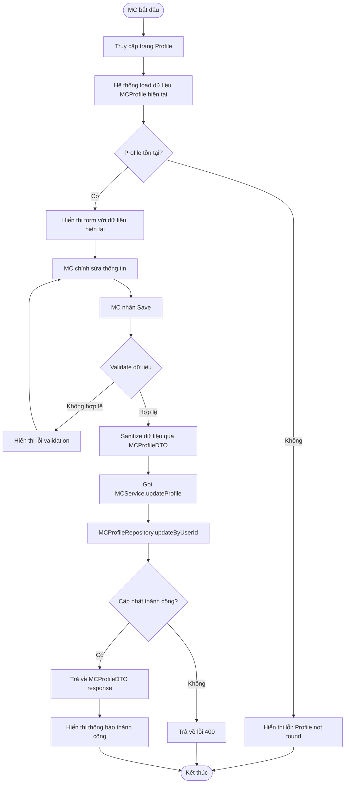

## 3. Sequence Diagram

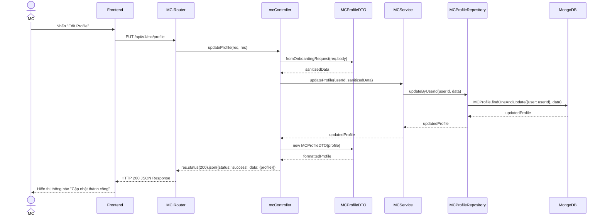

## 4. State Diagram

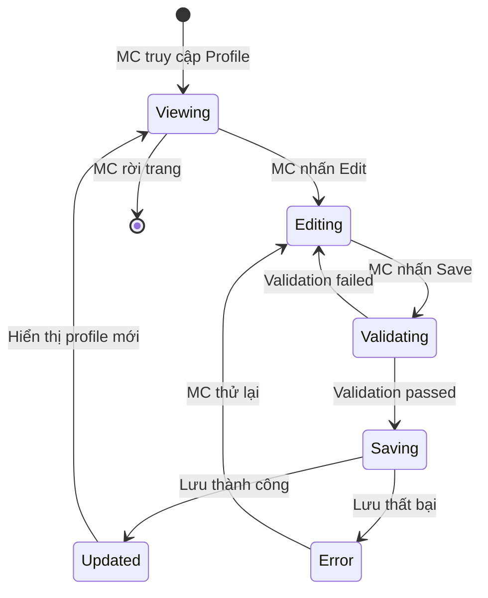

## 5. Integrated Communication Diagram

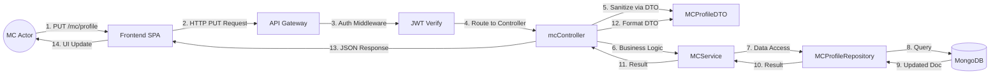

## 6. Detail Design

### API Endpoint
- **Method:** PUT
- **URL:** `/api/v1/mc/profile`
- **Auth:** JWT Bearer Token (role: mc)

### Request Body
```json
{
  "regions": ["HCM", "Hà Nội"],
  "experience": 5,
  "styles": ["MC sự kiện", "MC đám cưới"],
  "rates": { "min": 2000000, "max": 10000000 },
  "eventTypes": ["Wedding", "Corporate", "Birthday"]
}
```

### Response (200 OK)
```json
{
  "status": "success",
  "data": {
    "profile": {
      "regions": ["HCM", "Hà Nội"],
      "experience": 5,
      "styles": ["MC sự kiện", "MC đám cưới"],
      "rates": { "min": 2000000, "max": 10000000 },
      "eventTypes": ["Wedding", "Corporate", "Birthday"],
      "status": "Available",
      "rating": 4.5,
      "reviewsCount": 23
    }
  }
}
```

### Classes Involved
| Class | Responsibility |
|---|---|
| `mcController.updateProfile` | Nhận request, gọi DTO sanitize, gọi service |
| `MCProfileDTO.fromOnboardingRequest` | Validate & sanitize input data |
| `MCService.updateProfile` | Business logic layer |
| `MCProfileRepository.updateByUserId` | Data access layer |
| `MCProfile` (Model) | Mongoose schema definition |

## 7. System High-Level Design

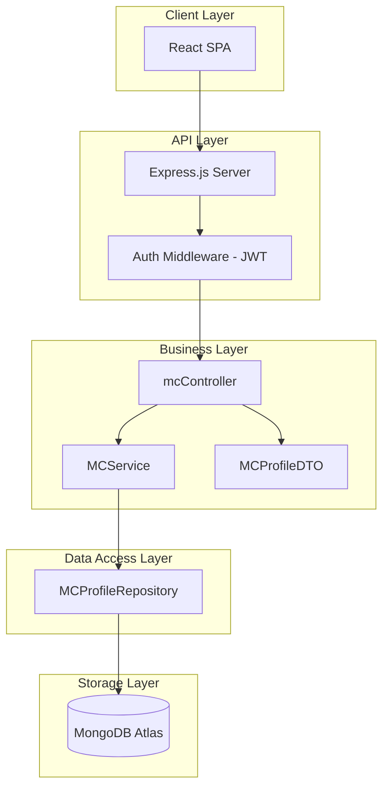

---

# UC20 - Upload Media

## 1. Use Case Description

| Thuộc tính | Mô tả |
|---|---|
| **Use Case ID** | UC20 |
| **Tên** | Upload Media |
| **Actor** | MC |
| **Mô tả** | MC tải lên hình ảnh, video clip các chương trình đã dẫn để quảng bá (showreel) |
| **Tiền điều kiện** | MC đã đăng nhập, có MCProfile |
| **Hậu điều kiện** | Media file được upload lên cloud storage và URL được lưu trong MCProfile.showreels |
| **Luồng chính** | 1. MC truy cập trang Portfolio/Media<br>2. MC chọn file (image/video)<br>3. Hệ thống validate file (type, size)<br>4. Hệ thống upload file lên Cloud Storage (S3/Cloudinary)<br>5. Hệ thống lưu URL vào MCProfile.showreels<br>6. Hiển thị media mới trong gallery |
| **Luồng ngoại lệ** | 3a. File không hợp lệ (sai format, quá lớn) → Hiển thị lỗi<br>4a. Upload cloud thất bại → Retry hoặc thông báo lỗi |
| **Business Rules** | - Image: max 10MB, formats: jpg, png, webp<br>- Video: max 100MB, formats: mp4, mov<br>- Max 20 showreels per MC |

## 2. Activity Diagram

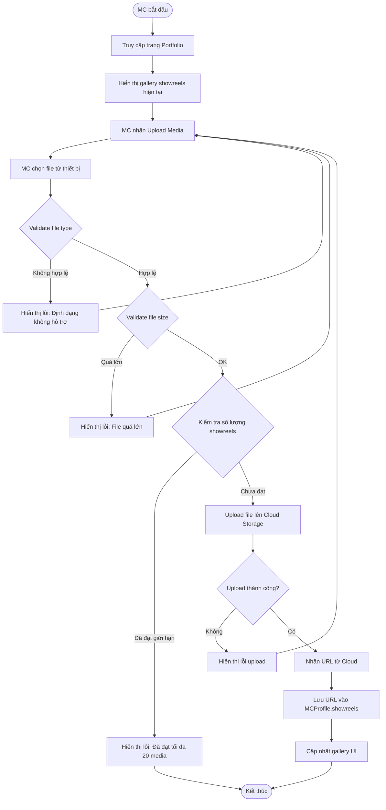

## 3. Sequence Diagram

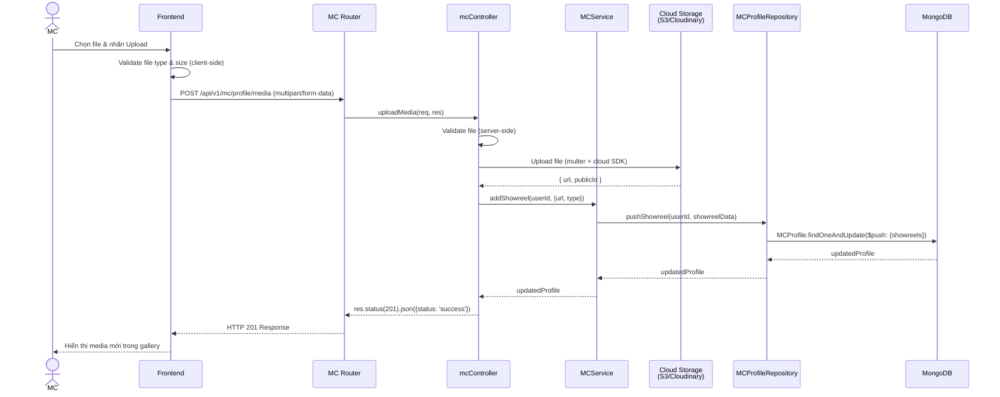

## 4. State Diagram

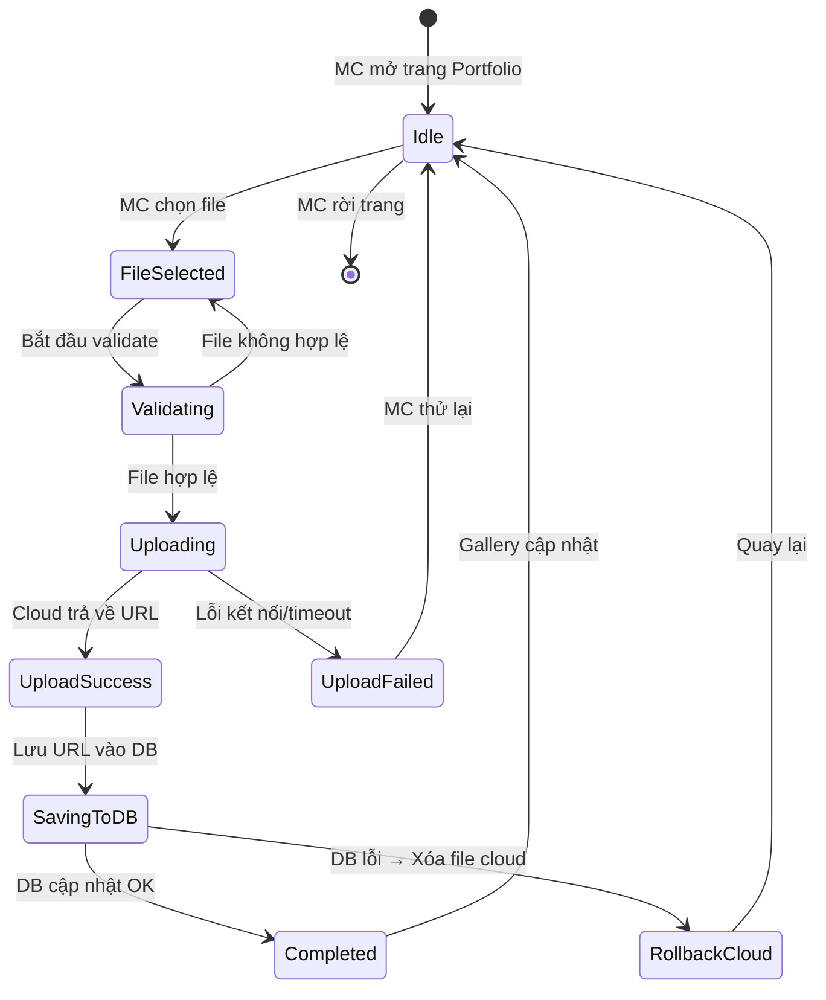

## 5. Integrated Communication Diagram

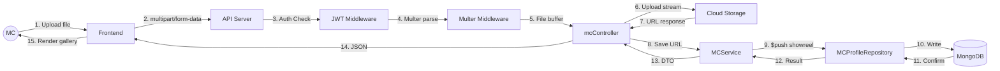

## 6. Detail Design

### API Endpoint
- **Method:** POST
- **URL:** `/api/v1/mc/profile/media`
- **Auth:** JWT Bearer Token (role: mc)
- **Content-Type:** multipart/form-data

### Request Body (FormData)
| Field | Type | Description |
|---|---|---|
| `file` | File | Image hoặc Video file |
| `type` | String | `"image"` hoặc `"video"` |

### Response (201 Created)
```json
{
  "status": "success",
  "data": {
    "showreel": {
      "url": "https://cloudinary.com/mc-hub/showreel_abc123.mp4",
      "type": "video"
    }
  }
}
```

### Data Model (MCProfile.showreels)
```javascript
showreels: [
    {
        url: { type: String, required: true },
        type: { type: String, enum: ['image', 'video'], required: true }
    }
]
```

## 7. System High-Level Design

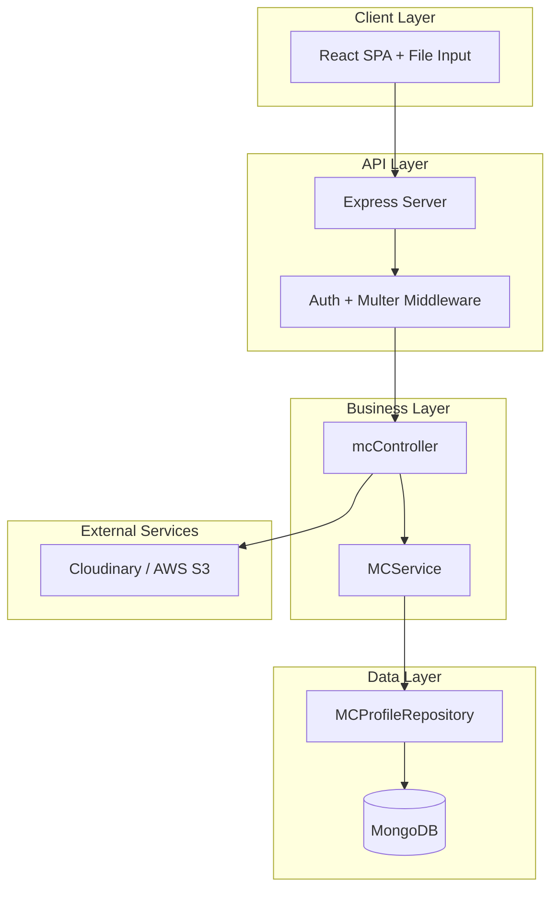

---

# UC21 - View Schedule

## 1. Use Case Description

| Thuộc tính | Mô tả |
|---|---|
| **Use Case ID** | UC21 |
| **Tên** | View Schedule |
| **Actor** | MC |
| **Mô tả** | MC xem lịch trình làm việc cá nhân theo ngày/tuần/tháng, bao gồm các booking đã xác nhận và các ngày tự đánh dấu bận |
| **Tiền điều kiện** | MC đã đăng nhập |
| **Hậu điều kiện** | Lịch trình được hiển thị chính xác |
| **Luồng chính** | 1. MC truy cập trang Calendar<br>2. Hệ thống lấy tất cả Schedule entries theo MC ID<br>3. Hệ thống trả về danh sách: Available / Booked / Busy<br>4. Frontend render calendar view (ngày/tuần/tháng) |
| **Luồng ngoại lệ** | 2a. Không có schedule nào → Hiển thị calendar trống |
| **Business Rules** | - Hiển thị 3 trạng thái: Available (xanh), Booked (vàng), Busy (đỏ)<br>- Booking entries link tới chi tiết booking |

## 2. Activity Diagram

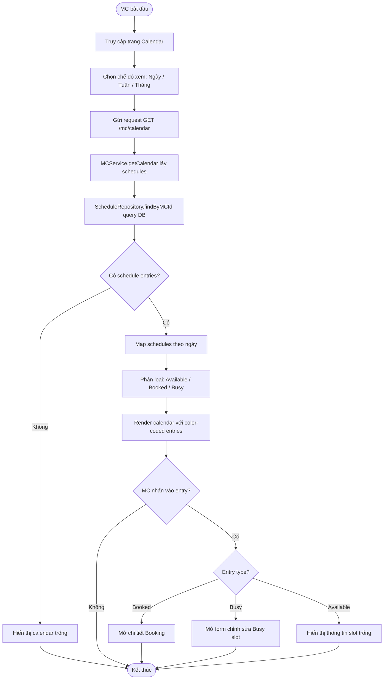

## 3. Sequence Diagram

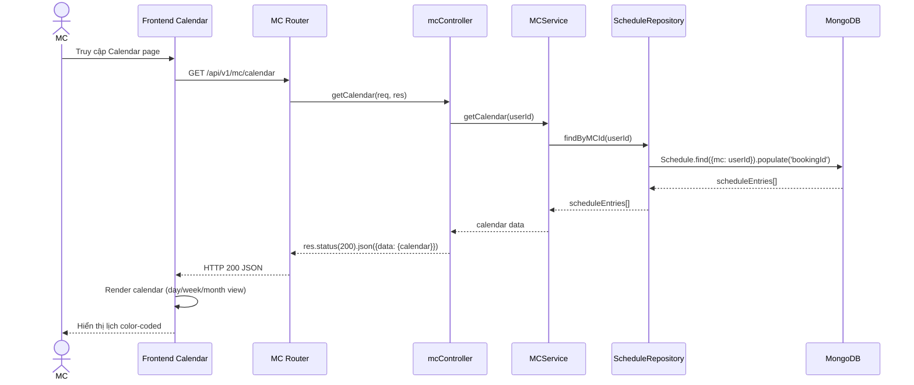

## 4. State Diagram

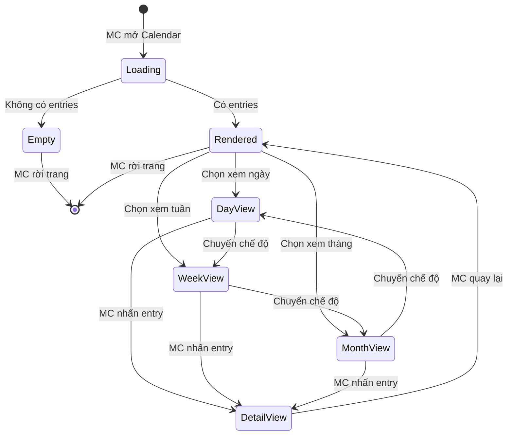

## 5. Integrated Communication Diagram

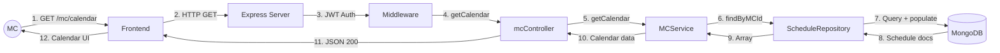

## 6. Detail Design

### API Endpoint
- **Method:** GET
- **URL:** `/api/v1/mc/calendar`
- **Auth:** JWT Bearer Token (role: mc)
- **Query Params (optional):** `?month=2026-03&view=month`

### Response (200 OK)
```json
{
  "status": "success",
  "data": {
    "calendar": [
      {
        "_id": "...",
        "mc": "userId",
        "date": "2026-03-15T00:00:00.000Z",
        "startTime": "08:00",
        "endTime": "12:00",
        "status": "Booked",
        "bookingId": {
          "_id": "bookingId",
          "client": { "name": "Nguyễn Văn A" },
          "eventType": "Wedding",
          "location": "TP.HCM"
        }
      },
      {
        "_id": "...",
        "date": "2026-03-16T00:00:00.000Z",
        "status": "Busy",
        "bookingId": null
      }
    ]
  }
}
```

### Schedule Model
```javascript
{
    mc: ObjectId (ref: User),
    date: Date,
    startTime: String,  // "08:00"
    endTime: String,     // "12:00"
    status: 'Available' | 'Booked' | 'Busy',
    bookingId: ObjectId (ref: Booking) | null
}
```

## 7. System High-Level Design

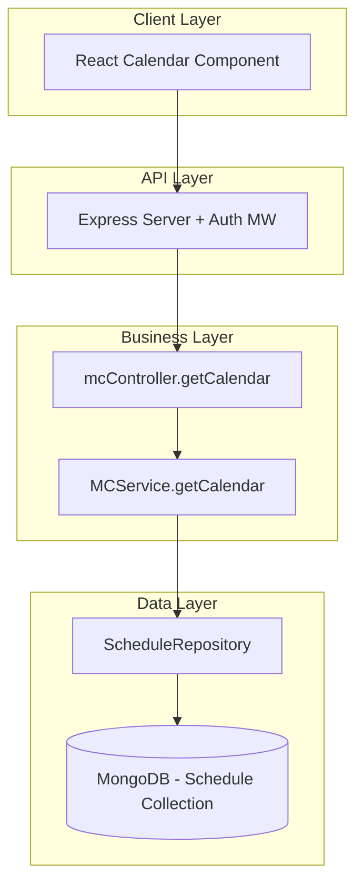

---

# UC22 - Update Busy Schedule

## 1. Use Case Description

| Thuộc tính | Mô tả |
|---|---|
| **Use Case ID** | UC22 |
| **Tên** | Update Busy Schedule |
| **Actor** | MC |
| **Mô tả** | MC đánh dấu các khoảng thời gian bận để khách không thể đặt lịch trong thời gian đó |
| **Tiền điều kiện** | MC đã đăng nhập, slot chưa bị Booked |
| **Hậu điều kiện** | Schedule entry được tạo với status = 'Busy' |
| **Luồng chính** | 1. MC truy cập Calendar<br>2. MC chọn ngày/giờ cần block<br>3. MC nhấn "Block Date"<br>4. Hệ thống kiểm tra xem slot đã bị Booked chưa<br>5. Hệ thống tạo Schedule entry {status: 'Busy'}<br>6. Calendar cập nhật hiển thị slot bận (đỏ) |
| **Luồng ngoại lệ** | 4a. Slot đã có Booking → Hiển thị lỗi "Không thể block slot đã có booking"<br>4b. Ngày trong quá khứ → Hiển thị lỗi |
| **Business Rules** | - Không được block slot đã có Booking<br>- Không được chọn ngày trong quá khứ<br>- endTime phải sau startTime |

## 2. Activity Diagram

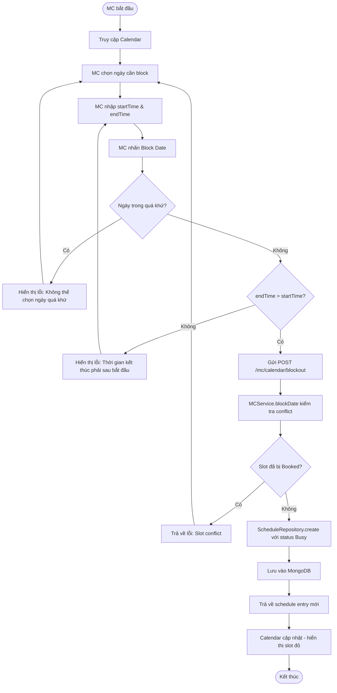

## 3. Sequence Diagram

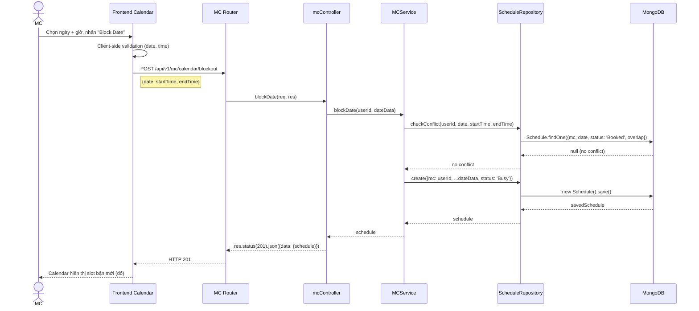

## 4. State Diagram

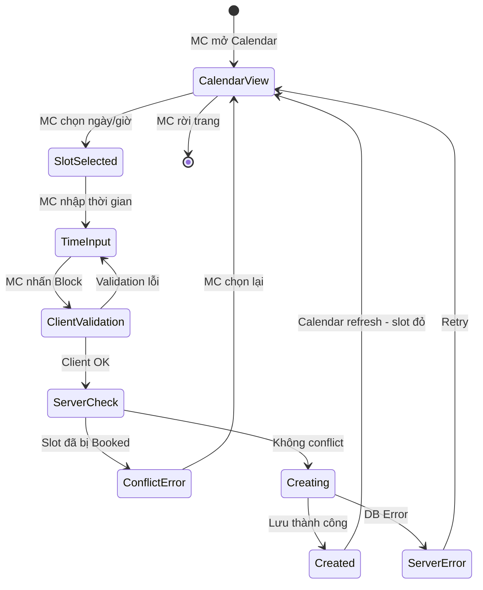

## 5. Integrated Communication Diagram

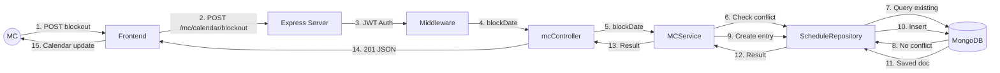

## 6. Detail Design

### API Endpoint
- **Method:** POST
- **URL:** `/api/v1/mc/calendar/blockout`
- **Auth:** JWT Bearer Token (role: mc)

### Request Body
```json
{
  "date": "2026-03-20",
  "startTime": "08:00",
  "endTime": "17:00"
}
```

### Response (201 Created)
```json
{
  "status": "success",
  "data": {
    "schedule": {
      "_id": "...",
      "mc": "userId",
      "date": "2026-03-20T00:00:00.000Z",
      "startTime": "08:00",
      "endTime": "17:00",
      "status": "Busy",
      "bookingId": null
    }
  }
}
```

### Error Response (409 Conflict)
```json
{
  "status": "fail",
  "message": "Slot này đã có booking, không thể đánh dấu bận"
}
```

## 7. System High-Level Design

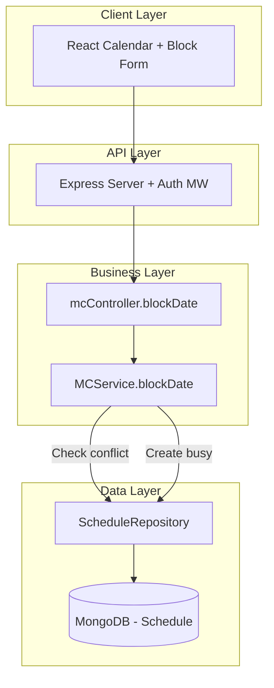

---

# UC23 - Set Availability Status

## 1. Use Case Description

| Thuộc tính | Mô tả |
|---|---|
| **Use Case ID** | UC23 |
| **Tên** | Set Availability Status |
| **Actor** | MC |
| **Mô tả** | MC thiết lập trạng thái tổng thể: đang sẵn sàng nhận show (Available) hoặc đang tạm nghỉ (Busy). Khi status = Busy, khách hàng không thể đặt lịch MC này |
| **Tiền điều kiện** | MC đã đăng nhập, có MCProfile |
| **Hậu điều kiện** | MCProfile.status được cập nhật |
| **Luồng chính** | 1. MC truy cập Dashboard/Profile<br>2. MC toggle trạng thái Available ↔ Busy<br>3. Hệ thống cập nhật MCProfile.status<br>4. Nếu Busy → MC không xuất hiện trong search kết quả public |
| **Luồng ngoại lệ** | 3a. Có booking Pending → Cảnh báo MC trước khi chuyển Busy |
| **Business Rules** | - Available: MC xuất hiện trong tìm kiếm, có thể nhận booking<br>- Busy: MC ẩn khỏi tìm kiếm, từ chối booking mới tự động |

## 2. Activity Diagram

```mermaid
flowchart TD
    A([MC bắt đầu]) --> B[Truy cập Dashboard/Profile]
    B --> C[Hiển thị status toggle hiện tại]
    C --> D[MC nhấn toggle trạng thái]
    D --> E{Trạng thái mới?}
    E -- Available → Busy --> F{Có booking Pending?}
    F -- Có --> G[Hiển thị cảnh báo: Bạn có X booking đang chờ]
    G --> H{MC xác nhận?}
    H -- Không --> C
    H -- Có --> I[Gửi request cập nhật status = Busy]
    F -- Không --> I
    E -- Busy → Available --> J[Gửi request cập nhật status = Available]
    I --> K[MCService.updateProfile - status]
    J --> K
    K --> L[MCProfileRepository.updateByUserId]
    L --> M{Cập nhật OK?}
    M -- Không --> N[Hiển thị lỗi]
    N --> C
    M -- Có --> O[Cập nhật UI toggle]
    O --> P{Status = Busy?}
    P -- Có --> Q[MC ẩn khỏi Public Search]
    P -- Không --> R[MC hiện trong Public Search]
    Q --> Z([Kết thúc])
    R --> Z
```

## 3. Sequence Diagram

```mermaid
sequenceDiagram
    actor MC
    participant FE as Frontend Dashboard
    participant Router as MC Router
    participant Ctrl as mcController
    participant DTO as MCProfileDTO
    participant Svc as MCService
    participant BookRepo as BookingRepository
    participant McRepo as MCProfileRepository
    participant DB as MongoDB

    MC->>FE: Toggle status (Available ↔ Busy)
    FE->>Router: PUT /api/v1/mc/profile
    Note right of FE: { "status": "Busy" }
    Router->>Ctrl: updateProfile(req, res)
    Ctrl->>DTO: fromOnboardingRequest(req.body)
    DTO-->>Ctrl: { status: "Busy" }
    Ctrl->>Svc: updateProfile(userId, { status: "Busy" })
    
    opt Chuyển sang Busy
        Svc->>BookRepo: findPendingByMCId(userId)
        BookRepo->>DB: Booking.find({mc: userId, status: 'Pending'})
        DB-->>BookRepo: pendingBookings[]
        BookRepo-->>Svc: pendingBookings (nếu có → cảnh báo)
    end
    
    Svc->>McRepo: updateByUserId(userId, {status: "Busy"})
    McRepo->>DB: MCProfile.findOneAndUpdate()
    DB-->>McRepo: updatedProfile
    McRepo-->>Svc: updatedProfile
    Svc-->>Ctrl: updatedProfile
    Ctrl->>DTO: new MCProfileDTO(profile)
    Ctrl-->>Router: res.status(200).json({data: {profile}})
    Router-->>FE: HTTP 200
    FE-->>MC: Toggle cập nhật - badge "Busy" / "Available"
```

## 4. State Diagram

```mermaid
stateDiagram-v2
    [*] --> Available: MCProfile khởi tạo
    Available --> PendingBusy: MC toggle → Busy
    PendingBusy --> ConfirmBusy: Có pending bookings → MC xác nhận
    PendingBusy --> Busy: Không có pending bookings
    ConfirmBusy --> Busy: MC đồng ý
    ConfirmBusy --> Available: MC hủy
    Busy --> Available: MC toggle → Available

    state Available {
        [*] --> VisibleInSearch
        VisibleInSearch: MC xuất hiện trong search
        VisibleInSearch: Có thể nhận booking mới
    }
    state Busy {
        [*] --> HiddenFromSearch
        HiddenFromSearch: MC ẩn khỏi search 
        HiddenFromSearch: Tự động từ chối booking mới
    }
```

## 5. Integrated Communication Diagram

```mermaid
flowchart LR
    MC((MC)) -->|1. Toggle status| FE[Frontend]
    FE -->|2. PUT /mc/profile| API[Express Server]
    API -->|3. JWT Auth| AUTH[Middleware]
    AUTH -->|4. updateProfile| CTRL[mcController]
    CTRL -->|5. Sanitize| DTO[MCProfileDTO]
    CTRL -->|6. updateProfile| SVC[MCService]
    SVC -->|7. Check pending| BREPO[BookingRepository]
    BREPO -->|8. Query| DB[(MongoDB)]
    SVC -->|9. Update status| MREPO[MCProfileRepository]
    MREPO -->|10. Update| DB
    DB -->|11. Confirm| MREPO
    MREPO -->|12. Result| SVC
    SVC -->|13. Result| CTRL
    CTRL -->|14. JSON| FE
    FE -->|15. UI toggle| MC
```

## 6. Detail Design

### API Endpoint
- **Method:** PUT
- **URL:** `/api/v1/mc/profile`
- **Auth:** JWT Bearer Token (role: mc)

### Request Body
```json
{
  "status": "Busy"
}
```

### Response (200 OK)
```json
{
  "status": "success",
  "data": {
    "profile": {
      "status": "Busy",
      "regions": ["HCM"],
      "experience": 5,
      "rating": 4.5
    }
  }
}
```

### Impact on Public API
Khi `MCProfile.status = 'Busy'`:
- `GET /api/v1/public/mcs` → MC bị filter ra khỏi kết quả search
- `POST /api/v1/bookings` → Trả lỗi nếu mc.status === 'Busy'

## 7. System High-Level Design

```mermaid
flowchart TB
    subgraph Client["Client Layer"]
        Toggle[Toggle Status Component]
    end
    subgraph API["API Layer"]
        GW[Express + Auth]
    end
    subgraph Business["Business Layer"]
        CTRL[mcController]
        SVC[MCService]
        DTO[MCProfileDTO]
    end
    subgraph Data["Data Layer"]
        MREPO[MCProfileRepository]
        BREPO[BookingRepository]
        DB[(MongoDB)]
    end
    subgraph PublicImpact["Side Effects"]
        SEARCH[Public Search Filter]
        BOOKING[Booking Validation]
    end

    Toggle --> GW --> CTRL
    CTRL --> DTO
    CTRL --> SVC
    SVC --> MREPO --> DB
    SVC --> BREPO --> DB
    SVC -.->|status change| SEARCH
    SVC -.->|status change| BOOKING
```

---

# UC32 - View Users Lists

## 1. Use Case Description

| Thuộc tính | Mô tả |
|---|---|
| **Use Case ID** | UC32 |
| **Tên** | View Users Lists |
| **Actor** | Admin |
| **Mô tả** | Admin xem và quản lý danh sách toàn bộ người dùng (Customer & MC), bao gồm thông tin tài khoản, trạng thái, role |
| **Tiền điều kiện** | Admin đã đăng nhập với role = 'admin' |
| **Hậu điều kiện** | Danh sách người dùng được hiển thị |
| **Luồng chính** | 1. Admin truy cập trang User Management<br>2. Hệ thống lấy tất cả users từ DB<br>3. Hiển thị danh sách dạng table (name, email, role, isActive, isVerified, createdAt)<br>4. Admin có thể filter theo role, search theo tên/email<br>5. Admin có thể sắp xếp theo các cột |
| **Luồng ngoại lệ** | 2a. Không có users → Hiển thị danh sách trống |
| **Business Rules** | - Chỉ admin mới truy cập được<br>- Phân trang: 20 users/page<br>- Hỗ trợ search, filter, sort |

## 2. Activity Diagram

```mermaid
flowchart TD
    A([Admin bắt đầu]) --> B[Truy cập User Management]
    B --> C{Kiểm tra quyền Admin}
    C -- Không phải Admin --> D[Redirect 403 Forbidden]
    D --> Z([Kết thúc])
    C -- Là Admin --> E[Gửi GET /admin/users]
    E --> F[adminController.getAllUsers]
    F --> G[User.find query tất cả users]
    G --> H{Có kết quả?}
    H -- Không --> I[Hiển thị bảng trống]
    I --> Z
    H -- Có --> J[Trả về danh sách users]
    J --> K[Frontend render table]
    K --> L{Admin thao tác?}
    L -- Search --> M[Filter theo name/email]
    M --> K
    L -- Filter role --> N[Filter theo client/mc/admin]
    N --> K
    L -- Sort --> O[Sort theo cột]
    O --> K
    L -- Phân trang --> P[Load page tiếp theo]
    P --> K
    L -- Chọn user --> Q[Mở chi tiết user]
    Q --> Z
    L -- Không --> Z([Kết thúc])
```

## 3. Sequence Diagram

```mermaid
sequenceDiagram
    actor Admin
    participant FE as Admin Dashboard
    participant Router as Admin Router
    participant MW as Auth Middleware
    participant Ctrl as adminController
    participant Model as User Model
    participant DB as MongoDB

    Admin->>FE: Truy cập User Management
    FE->>Router: GET /api/v1/admin/users?page=1&role=mc&search=keyword
    Router->>MW: protect() + restrictTo('admin')
    MW->>MW: Verify JWT + Check role
    MW-->>Router: Authorized
    Router->>Ctrl: getAllUsers(req, res)
    Ctrl->>Model: User.find(filters).skip().limit().sort()
    Model->>DB: Aggregate query
    DB-->>Model: users[]
    Model-->>Ctrl: users[]
    Ctrl-->>Router: res.status(200).json({results: users.length, data: {users}})
    Router-->>FE: HTTP 200 JSON
    FE->>FE: Render DataTable component
    FE-->>Admin: Hiển thị danh sách users
```

## 4. State Diagram

```mermaid
stateDiagram-v2
    [*] --> AuthCheck: Admin truy cập
    AuthCheck --> Forbidden: Không phải Admin
    Forbidden --> [*]
    AuthCheck --> Loading: Xác thực OK
    Loading --> EmptyList: Không có users
    Loading --> DisplayList: Có users
    EmptyList --> [*]
    DisplayList --> Filtering: Admin search/filter
    Filtering --> DisplayList: Kết quả mới
    DisplayList --> Sorting: Admin sort
    Sorting --> DisplayList: Sorted list
    DisplayList --> Paginating: Admin chuyển trang
    Paginating --> DisplayList: New page
    DisplayList --> UserDetail: Admin click user
    UserDetail --> DisplayList: Quay lại
    DisplayList --> [*]: Admin rời trang
```

## 5. Integrated Communication Diagram

```mermaid
flowchart LR
    ADMIN((Admin)) -->|1. GET /admin/users| FE[Admin Dashboard]
    FE -->|2. HTTP GET| API[Express Server]
    API -->|3. JWT + Role check| AUTH[Auth Middleware]
    AUTH -->|4. getAllUsers| CTRL[adminController]
    CTRL -->|5. Query| MODEL[User Model]
    MODEL -->|6. find + populate| DB[(MongoDB)]
    DB -->|7. User docs| MODEL
    MODEL -->|8. users[]| CTRL
    CTRL -->|9. JSON Response| FE
    FE -->|10. DataTable UI| ADMIN
```

## 6. Detail Design

### API Endpoint
- **Method:** GET
- **URL:** `/api/v1/admin/users`
- **Auth:** JWT Bearer Token (role: admin)
- **Query Params:**

| Param | Type | Description |
|---|---|---|
| `page` | Number | Số trang (default: 1) |
| `limit` | Number | Số users/trang (default: 20) |
| `role` | String | Filter theo role: client, mc, admin |
| `search` | String | Tìm kiếm theo name hoặc email |
| `sortBy` | String | Cột sắp xếp (default: createdAt) |
| `order` | String | asc / desc (default: desc) |

### Response (200 OK)
```json
{
  "status": "success",
  "results": 150,
  "data": {
    "users": [
      {
        "_id": "...",
        "name": "Trần Văn B",
        "email": "tranvanb@example.com",
        "role": "mc",
        "phoneNumber": "0901234567",
        "isVerified": true,
        "isActive": true,
        "createdAt": "2026-01-15T10:30:00.000Z"
      }
    ],
    "pagination": {
      "currentPage": 1,
      "totalPages": 8,
      "totalUsers": 150
    }
  }
}
```

## 7. System High-Level Design

```mermaid
flowchart TB
    subgraph Client["Client Layer"]
        Dashboard[Admin Dashboard + DataTable]
    end
    subgraph API["API Layer"]
        GW[Express Server]
        MW[Auth + Admin Role MW]
    end
    subgraph Business["Business Layer"]
        CTRL[adminController.getAllUsers]
    end
    subgraph Data["Data Layer"]
        MODEL[User Model - Mongoose]
        DB[(MongoDB - Users Collection)]
    end

    Dashboard --> GW
    GW --> MW
    MW --> CTRL
    CTRL --> MODEL
    MODEL --> DB
```

---

# UC33 - Lock/Unlock Account

## 1. Use Case Description

| Thuộc tính | Mô tả |
|---|---|
| **Use Case ID** | UC33 |
| **Tên** | Lock/Unlock Account |
| **Actor** | Admin |
| **Mô tả** | Admin xử lý tài khoản người dùng bằng cách khóa (Lock) hoặc mở lại (Unlock) quyền truy cập. User bị lock sẽ không thể đăng nhập |
| **Tiền điều kiện** | Admin đã đăng nhập, user target tồn tại |
| **Hậu điều kiện** | User.isActive được toggle (true ↔ false) |
| **Luồng chính** | 1. Admin xem danh sách users (UC32)<br>2. Admin chọn user cần Lock/Unlock<br>3. Admin nhấn nút Lock (hoặc Unlock)<br>4. Hệ thống xác nhận hành động<br>5. Hệ thống cập nhật User.isActive<br>6. Nếu Lock → force logout user đó |
| **Luồng ngoại lệ** | 3a. Admin cố lock chính mình → Từ chối<br>5a. User không tồn tại → 404 |
| **Business Rules** | - Admin không thể lock chính mình<br>- Không thể lock admin khác<br>- Lock = isActive: false → User không đăng nhập được<br>- Gửi email thông báo khi Lock/Unlock |

## 2. Activity Diagram

```mermaid
flowchart TD
    A([Admin bắt đầu]) --> B[Xem danh sách Users - UC32]
    B --> C[Chọn user cần Lock/Unlock]
    C --> D{User = chính Admin?}
    D -- Có --> E[Hiển thị lỗi: Không thể lock bản thân]
    E --> B
    D -- Không --> F{User là Admin khác?}
    F -- Có --> G[Hiển thị lỗi: Không thể lock Admin]
    G --> B
    F -- Không --> H{Trạng thái hiện tại?}
    H -- isActive = true --> I[Hiển thị dialog: Xác nhận LOCK user?]
    H -- isActive = false --> J[Hiển thị dialog: Xác nhận UNLOCK user?]
    I --> K{Admin xác nhận?}
    J --> K
    K -- Không --> B
    K -- Có --> L[Gửi PATCH /admin/users/:id]
    L --> M[adminController.updateUserStatus]
    M --> N[User.findByIdAndUpdate isActive toggle]
    N --> O{Cập nhật OK?}
    O -- Không --> P[Hiển thị lỗi]
    P --> B
    O -- Có --> Q{isActive = false - Locked?}
    Q -- Có --> R[Force logout user + Gửi email Lock]
    Q -- Không --> S[Gửi email Unlock]
    R --> T[Cập nhật UI - badge trạng thái]
    S --> T
    T --> Z([Kết thúc])
```

## 3. Sequence Diagram

```mermaid
sequenceDiagram
    actor Admin
    participant FE as Admin Dashboard
    participant Router as Admin Router
    participant MW as Auth Middleware
    participant Ctrl as adminController
    participant Model as User Model
    participant DB as MongoDB
    participant Email as Email Service
    participant Notif as Notification Service

    Admin->>FE: Nhấn Lock/Unlock trên user row
    FE->>FE: Hiển thị confirmation dialog
    Admin->>FE: Xác nhận
    FE->>Router: PATCH /api/v1/admin/users/:id
    Note right of FE: { "isActive": false }
    Router->>MW: protect() + restrictTo('admin')
    MW-->>Router: Authorized
    Router->>Ctrl: updateUserStatus(req, res)
    Ctrl->>Ctrl: Validate: không lock bản thân / admin khác
    Ctrl->>Model: User.findByIdAndUpdate(id, {isActive: false})
    Model->>DB: updateOne
    DB-->>Model: updatedUser
    Model-->>Ctrl: user
    
    par Gửi thông báo song song
        Ctrl->>Email: Gửi email thông báo Lock
        Ctrl->>Notif: Tạo system notification
    end
    
    Ctrl-->>Router: res.status(200).json({data: {user}})
    Router-->>FE: HTTP 200
    FE-->>Admin: Cập nhật badge: 🔴 Locked
```

## 4. State Diagram

```mermaid
stateDiagram-v2
    [*] --> Active: User đăng ký thành công
    
    Active --> LockRequested: Admin nhấn Lock
    LockRequested --> LockConfirm: Hiện dialog xác nhận
    LockConfirm --> Active: Admin hủy
    LockConfirm --> Locked: Admin xác nhận
    
    Locked --> UnlockRequested: Admin nhấn Unlock
    UnlockRequested --> UnlockConfirm: Hiện dialog xác nhận
    UnlockConfirm --> Locked: Admin hủy
    UnlockConfirm --> Active: Admin xác nhận

    state Active {
        [*] --> CanLogin
        CanLogin: isActive = true
        CanLogin: User đăng nhập bình thường
    }
    state Locked {
        [*] --> CannotLogin
        CannotLogin: isActive = false
        CannotLogin: Từ chối đăng nhập
        CannotLogin: Ẩn khỏi public search
    }
```

## 5. Integrated Communication Diagram

```mermaid
flowchart LR
    ADMIN((Admin)) -->|1. PATCH /admin/users/:id| FE[Admin Dashboard]
    FE -->|2. HTTP PATCH| API[Express Server]
    API -->|3. Auth + Admin role| MW[Middleware]
    MW -->|4. updateUserStatus| CTRL[adminController]
    CTRL -->|5. Validate rules| CTRL
    CTRL -->|6. findByIdAndUpdate| MODEL[User Model]
    MODEL -->|7. Update| DB[(MongoDB)]
    DB -->|8. Updated doc| MODEL
    MODEL -->|9. User| CTRL
    CTRL -->|10. Send notification| EMAIL[Email Service]
    CTRL -->|11. Create notification| NOTIF[Notification Model]
    NOTIF -->|12. Save| DB
    CTRL -->|13. JSON Response| FE
    FE -->|14. UI Update| ADMIN
```

## 6. Detail Design

### API Endpoint
- **Method:** PATCH
- **URL:** `/api/v1/admin/users/:id`
- **Auth:** JWT Bearer Token (role: admin)

### Request Body
```json
{
  "isActive": false
}
```

### Response (200 OK)
```json
{
  "status": "success",
  "data": {
    "user": {
      "_id": "userId",
      "name": "Nguyễn Văn A",
      "email": "nguyenvana@example.com",
      "role": "mc",
      "isActive": false,
      "isVerified": true
    }
  }
}
```

### Error Cases
| Status | Message |
|---|---|
| 403 | Không thể lock tài khoản admin |
| 403 | Không thể lock bản thân |
| 404 | User not found |

### User Model Fields Affected
```javascript
{
    isActive: Boolean  // true → false (Lock) | false → true (Unlock)
}
```

## 7. System High-Level Design

```mermaid
flowchart TB
    subgraph Client["Client Layer"]
        Dashboard[Admin Dashboard + Confirm Dialog]
    end
    subgraph API["API Layer"]
        GW[Express Server]
        MW[Auth + Admin MW]
    end
    subgraph Business["Business Layer"]
        CTRL[adminController.updateUserStatus]
        VALID[Validation Rules]
    end
    subgraph Data["Data Layer"]
        MODEL[User Model]
        DB[(MongoDB)]
    end
    subgraph SideEffects["Side Effects"]
        EMAIL[Email Service]
        NOTIF[Notification]
        SESSION[Session Invalidation]
    end

    Dashboard --> GW --> MW --> CTRL
    CTRL --> VALID
    CTRL --> MODEL --> DB
    CTRL -.-> EMAIL
    CTRL -.-> NOTIF
    CTRL -.-> SESSION
```

---

# UC34 - Verify MC

## 1. Use Case Description

| Thuộc tính | Mô tả |
|---|---|
| **Use Case ID** | UC34 |
| **Tên** | Verify MC |
| **Actor** | Admin |
| **Mô tả** | Admin kiểm tra và xác thực các chứng chỉ, hồ sơ chuyên môn của MC. MC được verify sẽ nhận Verified Badge và được ưu tiên trong ranking |
| **Tiền điều kiện** | Admin đã đăng nhập, MC đã submit KYC documents |
| **Hậu điều kiện** | User.isVerified = true, MC nhận Verified Badge |
| **Luồng chính** | 1. Admin xem danh sách MC chưa verify<br>2. Admin chọn MC cần review<br>3. Hệ thống hiển thị hồ sơ MC: profile, KYC docs, showreels<br>4. Admin review từng document<br>5. Admin nhấn "Verify" hoặc "Reject"<br>6. Hệ thống cập nhật isVerified<br>7. Gửi thông báo cho MC |
| **Luồng ngoại lệ** | 5a. Admin reject → Phải nhập lý do<br>3a. MC chưa upload KYC → Không thể verify |
| **Business Rules** | - Verified MC có badge vàng trên profile<br>- Verified MC được boost trong Smart Ranking<br>- Reject phải kèm lý do<br>- MC có thể resubmit sau reject |

## 2. Activity Diagram

```mermaid
flowchart TD
    A([Admin bắt đầu]) --> B[Truy cập MC Verification Queue]
    B --> C[Hiển thị danh sách MC pending verification]
    C --> D{Có MC pending?}
    D -- Không --> E[Hiển thị: Không có MC nào cần xác thực]
    E --> Z([Kết thúc])
    D -- Có --> F[Admin chọn MC cần review]
    F --> G[Hiển thị hồ sơ chi tiết MC]
    G --> H[Admin xem: MCProfile + KYC docs + Showreels]
    H --> I{Quyết định của Admin?}
    I -- Verify --> J[Admin nhấn Approve/Verify]
    J --> K[Cập nhật User.isVerified = true]
    K --> L[Gửi notification + email cho MC: Đã được xác thực]
    L --> M[MC nhận Verified Badge]
    M --> Z
    I -- Reject --> N[Admin nhấn Reject]
    N --> O[Admin nhập lý do reject]
    O --> P{Lý do hợp lệ?}
    P -- Không --> O
    P -- Có --> Q[Giữ User.isVerified = false]
    Q --> R[Gửi notification + email cho MC: Bị từ chối kèm lý do]
    R --> S[MC có thể resubmit]
    S --> Z([Kết thúc])
```

## 3. Sequence Diagram

```mermaid
sequenceDiagram
    actor Admin
    participant FE as Admin Dashboard
    participant Router as Admin Router
    participant MW as Auth Middleware
    participant Ctrl as adminController
    participant UserModel as User Model
    participant McModel as MCProfile Model
    participant DB as MongoDB
    participant Notif as Notification Service
    participant Email as Email Service

    Admin->>FE: Mở Verification Queue
    FE->>Router: GET /api/v1/admin/users?role=mc&isVerified=false
    Router->>MW: protect() + restrictTo('admin')
    MW-->>Router: OK
    Router->>Ctrl: getAllUsers (filtered)
    Ctrl->>UserModel: User.find({role:'mc', isVerified:false}).populate('mcProfile')
    UserModel->>DB: Query
    DB-->>UserModel: unverifiedMCs[]
    UserModel-->>Ctrl: users
    Ctrl-->>FE: HTTP 200 - List of unverified MCs
    FE-->>Admin: Hiển thị danh sách

    Admin->>FE: Chọn MC, review hồ sơ
    Admin->>FE: Nhấn "Verify" (hoặc "Reject" + lý do)
    FE->>Router: PATCH /api/v1/admin/users/:mcId
    Note right of FE: { "isVerified": true }
    Router->>MW: Auth check
    MW-->>Router: OK
    Router->>Ctrl: updateUserStatus(req, res)
    Ctrl->>UserModel: User.findByIdAndUpdate(mcId, {isVerified: true})
    UserModel->>DB: Update
    DB-->>UserModel: updatedUser
    UserModel-->>Ctrl: user

    par Thông báo cho MC
        Ctrl->>Notif: createNotification({user: mcId, title: 'Verified!'})
        Notif->>DB: Save notification
        Ctrl->>Email: sendVerificationEmail(mc.email)
    end

    Ctrl-->>FE: HTTP 200
    FE-->>Admin: MC đã được verify ✓
```

## 4. State Diagram

```mermaid
stateDiagram-v2
    [*] --> Unverified: MC đăng ký tài khoản

    Unverified --> KYCSubmitted: MC submit KYC documents
    KYCSubmitted --> UnderReview: Admin bắt đầu review
    UnderReview --> Verified: Admin Approve
    UnderReview --> Rejected: Admin Reject (kèm lý do)
    Rejected --> KYCSubmitted: MC resubmit documents
    
    state Unverified {
        [*] --> NoVerifiedBadge
        NoVerifiedBadge: isVerified = false
        NoVerifiedBadge: Không có badge
        NoVerifiedBadge: Ranking bình thường
    }
    
    state Verified {
        [*] --> HasVerifiedBadge
        HasVerifiedBadge: isVerified = true
        HasVerifiedBadge: Verified Badge hiển thị
        HasVerifiedBadge: Ranking boost
    }
    
    state Rejected {
        [*] --> NeedResubmit
        NeedResubmit: isVerified = false
        NeedResubmit: Có lý do reject
        NeedResubmit: MC cần sửa & nộp lại
    }
```

## 5. Integrated Communication Diagram

```mermaid
flowchart LR
    ADMIN((Admin)) -->|1. Review & Approve| FE[Admin Dashboard]
    FE -->|2. PATCH /admin/users/:id| API[Express Server]
    API -->|3. Auth + Admin| MW[Middleware]
    MW -->|4. updateUserStatus| CTRL[adminController]
    CTRL -->|5. Update isVerified| USER[User Model]
    USER -->|6. Update| DB[(MongoDB)]
    CTRL -->|7. Get MC Profile| MC[MCProfile Model]
    MC -->|8. Query| DB
    CTRL -->|9. Create notification| NOTIF[Notification Model]
    NOTIF -->|10. Save| DB
    CTRL -->|11. Send email| EMAIL[Email Service]
    DB -->|12. Confirm all| CTRL
    CTRL -->|13. JSON Response| FE
    FE -->|14. Verified badge UI| ADMIN
```

## 6. Detail Design

### API Endpoints

#### Lấy danh sách MC chờ verify
- **Method:** GET
- **URL:** `/api/v1/admin/users?role=mc&isVerified=false`
- **Auth:** JWT (admin)

#### Verify/Reject MC
- **Method:** PATCH
- **URL:** `/api/v1/admin/users/:mcId`
- **Auth:** JWT (admin)

### Request Body - Verify
```json
{
  "isVerified": true
}
```

### Request Body - Reject
```json
{
  "isVerified": false,
  "rejectReason": "Chứng chỉ không rõ ràng, vui lòng upload lại ảnh chất lượng cao hơn"
}
```

### Response (200 OK)
```json
{
  "status": "success",
  "data": {
    "user": {
      "_id": "mcUserId",
      "name": "MC Phương Anh",
      "email": "phuonganh@example.com",
      "role": "mc",
      "isVerified": true,
      "isActive": true,
      "mcProfile": {
        "rating": 4.8,
        "reviewsCount": 15,
        "status": "Available"
      }
    }
  }
}
```

### Notification Created
```javascript
{
    user: mcUserId,
    title: "Hồ sơ đã được xác thực!",
    body: "Chúc mừng! Hồ sơ MC của bạn đã được xác thực. Bạn đã nhận Verified Badge.",
    type: "System",
    linkAction: "/mc/profile"
}
```

## 7. System High-Level Design

```mermaid
flowchart TB
    subgraph Client["Client Layer"]
        AdminUI[Admin Verification Panel]
    end
    subgraph API["API Layer"]
        GW[Express Server]
        MW[Auth + Admin MW]
    end
    subgraph Business["Business Layer"]
        CTRL[adminController]
        RANKING[Smart Ranking Boost Logic]
    end
    subgraph Data["Data Layer"]
        USER[User Model]
        MCPROFILE[MCProfile Model]
        NOTIFM[Notification Model]
        DB[(MongoDB)]
    end
    subgraph External["External"]
        EMAIL[Email Service]
    end

    AdminUI --> GW --> MW --> CTRL
    CTRL --> USER --> DB
    CTRL --> MCPROFILE --> DB
    CTRL --> NOTIFM --> DB
    CTRL --> EMAIL
    CTRL -.->|Trigger| RANKING
```

---

# UC36 - View All Bookings

## 1. Use Case Description

| Thuộc tính | Mô tả |
|---|---|
| **Use Case ID** | UC36 |
| **Tên** | View All Bookings |
| **Actor** | Admin |
| **Mô tả** | Admin quản lý toàn bộ các giao dịch đặt lịch diễn ra trên nền tảng, xem chi tiết, theo dõi trạng thái |
| **Tiền điều kiện** | Admin đã đăng nhập |
| **Hậu điều kiện** | Danh sách bookings được hiển thị đầy đủ |
| **Luồng chính** | 1. Admin truy cập Booking Management<br>2. Hệ thống lấy tất cả bookings + populate MC & Client info<br>3. Hiển thị danh sách dạng table<br>4. Admin filter theo status, date range, MC, payment status<br>5. Admin có thể xem chi tiết từng booking |
| **Luồng ngoại lệ** | 2a. Không có bookings → Danh sách trống |
| **Business Rules** | - Hiển thị: client, mc, eventDate, eventType, price, status, paymentStatus<br>- Filter: status, paymentStatus, dateRange<br>- Export báo cáo CSV/Excel |

## 2. Activity Diagram

```mermaid
flowchart TD
    A([Admin bắt đầu]) --> B[Truy cập Booking Management]
    B --> C{Quyền Admin?}
    C -- Không --> D[403 Forbidden]
    D --> Z([Kết thúc])
    C -- Có --> E[Gửi GET /admin/bookings]
    E --> F[adminController.getAllBookings]
    F --> G[Booking.find.populate mc và client]
    G --> H{Có bookings?}
    H -- Không --> I[Hiển thị danh sách trống]
    I --> Z
    H -- Có --> J[Render DataTable bookings]
    J --> K{Admin thao tác?}
    K -- Filter status --> L[Filter: Pending/Accepted/Completed/Cancelled]
    L --> J
    K -- Filter date --> M[Chọn date range]
    M --> J
    K -- Filter payment --> N[Filter: Pending/DepositPaid/FullyPaid/Refunded]
    N --> J
    K -- Xem chi tiết --> O[Mở booking detail panel]
    O --> P[Hiển thị: Client + MC + Event info + Payment + Timeline]
    P --> J
    K -- Export --> Q[Xuất báo cáo CSV/Excel]
    Q --> Z
    K -- Không --> Z([Kết thúc])
```

## 3. Sequence Diagram

```mermaid
sequenceDiagram
    actor Admin
    participant FE as Admin Dashboard
    participant Router as Admin Router
    participant MW as Auth Middleware
    participant Ctrl as adminController
    participant Model as Booking Model
    participant DB as MongoDB

    Admin->>FE: Truy cập Booking Management
    FE->>Router: GET /api/v1/admin/bookings?status=Pending&page=1
    Router->>MW: protect() + restrictTo('admin')
    MW-->>Router: Authorized
    Router->>Ctrl: getAllBookings(req, res)
    Ctrl->>Model: Booking.find(filters).populate('mc').populate('client').sort('-createdAt')
    Model->>DB: Aggregate + lookup
    DB-->>Model: bookings[] with populated refs
    Model-->>Ctrl: bookings[]
    Ctrl-->>Router: res.status(200).json({results, data: {bookings}})
    Router-->>FE: HTTP 200
    FE->>FE: Render DataTable
    FE-->>Admin: Hiển thị bookings table

    opt Xem chi tiết
        Admin->>FE: Click booking row
        FE->>Router: GET /api/v1/admin/bookings/:id
        Router->>Ctrl: getBookingDetail(req, res)
        Ctrl->>Model: Booking.findById(id).populate('mc client')
        Model->>DB: findById + lookup
        DB-->>Model: booking detail
        Model-->>Ctrl: booking
        Ctrl-->>FE: HTTP 200
        FE-->>Admin: Hiển thị chi tiết booking
    end
```

## 4. State Diagram

```mermaid
stateDiagram-v2
    [*] --> Loading: Admin mở Booking Management
    Loading --> EmptyList: Không có bookings
    Loading --> DisplayTable: Có bookings
    EmptyList --> [*]
    
    DisplayTable --> FilterActive: Admin áp dụng filter
    FilterActive --> DisplayTable: Kết quả mới
    DisplayTable --> DetailView: Click booking
    DetailView --> DisplayTable: Quay lại
    DisplayTable --> Exporting: Admin xuất báo cáo
    Exporting --> DisplayTable: Download complete
    DisplayTable --> [*]: Admin rời trang
    
    state DisplayTable {
        [*] --> ShowAll
        ShowAll --> FilteredByStatus: Filter status
        ShowAll --> FilteredByDate: Filter date
        ShowAll --> FilteredByPayment: Filter payment
        FilteredByStatus --> ShowAll: Clear filter
        FilteredByDate --> ShowAll: Clear filter
        FilteredByPayment --> ShowAll: Clear filter
    }
```

## 5. Integrated Communication Diagram

```mermaid
flowchart LR
    ADMIN((Admin)) -->|1. GET /admin/bookings| FE[Admin Dashboard]
    FE -->|2. HTTP GET + filters| API[Express Server]
    API -->|3. JWT + Admin Auth| MW[Middleware]
    MW -->|4. getAllBookings| CTRL[adminController]
    CTRL -->|5. find + populate| MODEL[Booking Model]
    MODEL -->|6. Aggregate query| DB[(MongoDB)]
    DB -->|7. Booking docs with MC & Client| MODEL
    MODEL -->|8. bookings[]| CTRL
    CTRL -->|9. JSON Response| FE
    FE -->|10. DataTable render| ADMIN
```

## 6. Detail Design

### API Endpoint
- **Method:** GET
- **URL:** `/api/v1/admin/bookings`
- **Auth:** JWT Bearer Token (role: admin)
- **Query Params:**

| Param | Type | Description |
|---|---|---|
| `status` | String | Pending, Accepted, Completed, Cancelled, Rejected |
| `paymentStatus` | String | Pending, DepositPaid, FullyPaid, Refunded |
| `fromDate` | Date | Lọc từ ngày |
| `toDate` | Date | Lọc đến ngày |
| `mcId` | ObjectId | Lọc theo MC |
| `page` | Number | Phân trang |
| `limit` | Number | Số bookings/trang |

### Response (200 OK)
```json
{
  "status": "success",
  "results": 85,
  "data": {
    "bookings": [
      {
        "_id": "bookingId",
        "client": {
          "_id": "clientId",
          "name": "Lê Thị C",
          "email": "lethic@example.com"
        },
        "mc": {
          "_id": "mcId",
          "name": "MC Tuấn Anh",
          "email": "tuananh@example.com"
        },
        "eventDate": "2026-04-10T00:00:00.000Z",
        "location": "Gem Center, Q1, HCM",
        "eventType": "Wedding",
        "price": 5000000,
        "status": "Accepted",
        "paymentStatus": "DepositPaid",
        "createdAt": "2026-03-01T08:30:00.000Z"
      }
    ],
    "pagination": {
      "currentPage": 1,
      "totalPages": 5,
      "totalBookings": 85
    }
  }
}
```

### Booking Model Schema
```javascript
{
    client: ObjectId → User,
    mc: ObjectId → User,
    eventDate: Date,
    location: String,
    eventType: String,
    specialRequests: String,
    price: Number,
    status: 'Pending' | 'Accepted' | 'Completed' | 'Cancelled' | 'Rejected',
    paymentStatus: 'Pending' | 'DepositPaid' | 'FullyPaid' | 'Refunded'
}
```

## 7. System High-Level Design

```mermaid
flowchart TB
    subgraph Client["Client Layer"]
        Table[Admin DataTable + Filters + Detail Panel]
    end
    subgraph API["API Layer"]
        GW[Express Server]
        MW[Auth + Admin MW]
    end
    subgraph Business["Business Layer"]
        CTRL[adminController.getAllBookings]
    end
    subgraph Data["Data Layer"]
        BOOKING[Booking Model]
        USER[User Model - populate]
        DB[(MongoDB)]
    end
    subgraph Export["Export"]
        CSV[CSV/Excel Generator]
    end

    Table --> GW --> MW --> CTRL
    CTRL --> BOOKING --> DB
    BOOKING --> USER
    CTRL -.-> CSV
```

---

# UC37 - Resolve Disputes

## 1. Use Case Description

| Thuộc tính | Mô tả |
|---|---|
| **Use Case ID** | UC37 |
| **Tên** | Resolve Disputes |
| **Actor** | Admin |
| **Mô tả** | Admin đứng ra phân xử và giải quyết các mâu thuẫn giữa MC và khách hàng (ví dụ: MC không đến, chất lượng kém, yêu cầu hoàn tiền, v.v.) |
| **Tiền điều kiện** | Admin đã đăng nhập, có dispute/complaint được tạo |
| **Hậu điều kiện** | Dispute được giải quyết với resolution, booking status và payment status được cập nhật tương ứng |
| **Luồng chính** | 1. Admin xem danh sách disputes/complaints<br>2. Admin chọn dispute cần xử lý<br>3. Hệ thống hiển thị: booking info, messages giữa 2 bên, evidence<br>4. Admin review toàn bộ thông tin<br>5. Admin đưa ra quyết định: Favor Client / Favor MC / Compromise<br>6. Hệ thống thực hiện actions theo quyết định (refund, cancel, v.v.)<br>7. Gửi thông báo cho cả 2 bên |
| **Luồng ngoại lệ** | 5a. Cần thêm thông tin → Admin yêu cầu bổ sung từ MC/Customer<br>6a. Refund thất bại → Admin xử lý thủ công |
| **Business Rules** | - Favor Client: Hoàn tiền + Cancel booking<br>- Favor MC: Giải ngân cho MC + Complete booking<br>- Compromise: Hoàn một phần + điều chỉnh payment<br>- Mọi quyết định phải có lý do chi tiết<br>- Timeline dispute không quá 7 ngày |

## 2. Activity Diagram

```mermaid
flowchart TD
    A([Admin bắt đầu]) --> B[Truy cập Dispute Resolution Center]
    B --> C[Hiển thị danh sách disputes]
    C --> D{Có disputes?}
    D -- Không --> E[Không có dispute cần xử lý]
    E --> Z([Kết thúc])
    D -- Có --> F[Admin chọn dispute]
    F --> G[Hiển thị chi tiết dispute]
    G --> H[Xem: Booking info + Chat history + Evidence]
    H --> I{Đủ thông tin?}
    I -- Không --> J[Admin yêu cầu bổ sung từ MC/Client]
    J --> K[Gửi notification yêu cầu evidence]
    K --> L[Chờ response]
    L --> H
    I -- Có --> M{Quyết định của Admin?}
    M -- Favor Client --> N[Hoàn tiền cho Client]
    N --> O[Cập nhật: Booking.status = Cancelled]
    O --> P[Cập nhật: paymentStatus = Refunded]
    P --> Q[Tạo Transaction refund]
    Q --> AA[Gửi notification cho cả 2 bên]
    M -- Favor MC --> R[Giải ngân cho MC]
    R --> S[Cập nhật: Booking.status = Completed]
    S --> T[Cập nhật: paymentStatus = FullyPaid]
    T --> U[Tạo Transaction payment]
    U --> AA
    M -- Compromise --> V[Hoàn một phần cho Client]
    V --> W[Giải ngân một phần cho MC]
    W --> X[Cập nhật booking & payment tương ứng]
    X --> Y[Tạo 2 Transactions]
    Y --> AA
    AA --> AB[Lưu resolution notes]
    AB --> AC[Đánh dấu dispute Resolved]
    AC --> Z([Kết thúc])
```

## 3. Sequence Diagram

```mermaid
sequenceDiagram
    actor Admin
    participant FE as Admin Dashboard
    participant Router as Admin Router
    participant MW as Auth Middleware
    participant Ctrl as adminController
    participant BookModel as Booking Model
    participant TxModel as Transaction Model
    participant MsgModel as Message Model
    participant NotifModel as Notification Model
    participant DB as MongoDB
    participant Payment as Payment Gateway

    Admin->>FE: Mở Dispute Resolution Center
    FE->>Router: GET /api/v1/admin/bookings?status=Disputed
    Router->>MW: Auth check
    MW-->>Router: OK
    Router->>Ctrl: getDisputedBookings(req, res)
    Ctrl->>BookModel: Booking.find({status: 'Disputed'}).populate('mc client')
    BookModel->>DB: Query
    DB-->>BookModel: disputes[]
    BookModel-->>Ctrl: disputes
    Ctrl-->>FE: HTTP 200 - Disputes list
    FE-->>Admin: Hiển thị danh sách

    Admin->>FE: Chọn dispute, review chi tiết
    FE->>Router: GET /api/v1/messages/:bookingId
    Router->>Ctrl: getDisputeMessages
    Ctrl->>MsgModel: Message.find({booking: bookingId})
    MsgModel->>DB: Query
    DB-->>MsgModel: messages[]
    MsgModel-->>Ctrl: chat history
    Ctrl-->>FE: Messages + Evidence
    FE-->>Admin: Hiển thị chat history & evidence

    Admin->>FE: Quyết định: Favor Client (Refund)
    FE->>Router: POST /api/v1/admin/disputes/:bookingId/resolve
    Note right of FE: { decision: "favor_client", reason: "MC không đến", refundAmount: 5000000 }
    Router->>MW: Auth
    MW-->>Router: OK
    Router->>Ctrl: resolveDispute(req, res)
    
    Ctrl->>BookModel: Booking.findByIdAndUpdate({status: 'Cancelled', paymentStatus: 'Refunded'})
    BookModel->>DB: Update booking
    DB-->>BookModel: updated

    Ctrl->>Payment: processRefund(bookingId, amount)
    Payment-->>Ctrl: refundSuccess

    Ctrl->>TxModel: Transaction.create({type: 'Refund', amount, status: 'Completed'})
    TxModel->>DB: Insert
    DB-->>TxModel: saved

    par Notify both parties
        Ctrl->>NotifModel: createNotification(client, "Dispute resolved - Refund")
        NotifModel->>DB: Save
        Ctrl->>NotifModel: createNotification(mc, "Dispute resolved - Booking cancelled")
        NotifModel->>DB: Save
    end

    Ctrl-->>FE: HTTP 200 - Dispute resolved
    FE-->>Admin: Dispute marked as Resolved ✓
```

## 4. State Diagram

```mermaid
stateDiagram-v2
    [*] --> Open: Client/MC tạo dispute

    Open --> UnderReview: Admin bắt đầu review
    UnderReview --> NeedMoreInfo: Cần thêm thông tin
    NeedMoreInfo --> UnderReview: Nhận evidence bổ sung
    
    UnderReview --> Resolving: Admin đưa ra quyết định
    
    Resolving --> ResolvedFavorClient: Favor Client
    Resolving --> ResolvedFavorMC: Favor MC
    Resolving --> ResolvedCompromise: Compromise

    state ResolvedFavorClient {
        [*] --> RefundClient
        RefundClient --> BookingCancelled
        BookingCancelled --> NotifyBothParties1
    }
    
    state ResolvedFavorMC {
        [*] --> PayMC
        PayMC --> BookingCompleted
        BookingCompleted --> NotifyBothParties2
    }
    
    state ResolvedCompromise {
        [*] --> PartialRefund
        PartialRefund --> PartialPayMC
        PartialPayMC --> NotifyBothParties3
    }

    ResolvedFavorClient --> Closed: Hoàn tất
    ResolvedFavorMC --> Closed: Hoàn tất
    ResolvedCompromise --> Closed: Hoàn tất
    Closed --> [*]
```

## 5. Integrated Communication Diagram

```mermaid
flowchart LR
    ADMIN((Admin)) -->|1. Review & Decide| FE[Admin Dashboard]
    FE -->|2. POST /disputes/:id/resolve| API[Express Server]
    API -->|3. Auth + Admin| MW[Middleware]
    MW -->|4. resolveDispute| CTRL[adminController]
    CTRL -->|5. Update booking| BOOK[Booking Model]
    BOOK -->|6. Update| DB[(MongoDB)]
    CTRL -->|7. Process refund/payment| PAY[Payment Gateway]
    PAY -->|8. Confirm| CTRL
    CTRL -->|9. Create transaction| TX[Transaction Model]
    TX -->|10. Save| DB
    CTRL -->|11. Get chat evidence| MSG[Message Model]
    MSG -->|12. Query| DB
    CTRL -->|13. Notify client| NOTIF1[Notification - Client]
    CTRL -->|14. Notify MC| NOTIF2[Notification - MC]
    NOTIF1 -->|15. Save| DB
    NOTIF2 -->|16. Save| DB
    CTRL -->|17. JSON Response| FE
    FE -->|18. Resolution UI| ADMIN
```

## 6. Detail Design

### API Endpoints

#### Lấy danh sách disputes
- **Method:** GET
- **URL:** `/api/v1/admin/bookings?status=Disputed`
- **Auth:** JWT (admin)

#### Xem evidence / chat history
- **Method:** GET
- **URL:** `/api/v1/messages/:bookingId`
- **Auth:** JWT (admin)

#### Resolve dispute
- **Method:** POST
- **URL:** `/api/v1/admin/disputes/:bookingId/resolve`
- **Auth:** JWT (admin)

### Request Body - Resolve
```json
{
  "decision": "favor_client",
  "reason": "MC không xuất hiện tại sự kiện, không có lý do chính đáng",
  "refundAmount": 5000000,
  "adminNote": "Đã liên hệ MC, MC không phản hồi trong 48h"
}
```

### Decision Options
| Decision | Action | Booking Status | Payment Status |
|---|---|---|---|
| `favor_client` | Hoàn tiền toàn bộ | Cancelled | Refunded |
| `favor_mc` | Giải ngân cho MC | Completed | FullyPaid |
| `compromise` | Hoàn một phần, trả một phần | Completed | FullyPaid (adjusted) |

### Response (200 OK)
```json
{
  "status": "success",
  "data": {
    "resolution": {
      "bookingId": "...",
      "decision": "favor_client",
      "reason": "MC không xuất hiện tại sự kiện",
      "refundAmount": 5000000,
      "booking": {
        "status": "Cancelled",
        "paymentStatus": "Refunded"
      },
      "transaction": {
        "type": "Refund",
        "amount": 5000000,
        "status": "Completed"
      },
      "resolvedAt": "2026-03-11T14:30:00.000Z",
      "resolvedBy": "adminId"
    }
  }
}
```

### Notifications Created
```javascript
// For Client
{
    user: clientId,
    title: "Tranh chấp đã được giải quyết",
    body: "Admin đã phân xử có lợi cho bạn. Số tiền 5,000,000 VND sẽ được hoàn trả.",
    type: "System",
    linkAction: "/bookings/:bookingId"
}

// For MC
{
    user: mcId,
    title: "Tranh chấp đã được giải quyết",
    body: "Admin đã phân xử. Booking #xyz đã bị hủy. Liên hệ support nếu cần.",
    type: "System",
    linkAction: "/bookings/:bookingId"
}
```

## 7. System High-Level Design

```mermaid
flowchart TB
    subgraph Client["Client Layer"]
        Panel[Admin Dispute Resolution Panel]
    end
    subgraph API["API Layer"]
        GW[Express Server]
        MW[Auth + Admin MW]
    end
    subgraph Business["Business Layer"]
        CTRL[adminController.resolveDispute]
        LOGIC[Dispute Resolution Logic]
    end
    subgraph Data["Data Layer"]
        BOOKING[Booking Model]
        TX[Transaction Model]
        MSG[Message Model]
        NOTIF[Notification Model]
        DB[(MongoDB)]
    end
    subgraph External["External Services"]
        PAY[Payment Gateway - VNPay/Momo]
        EMAIL[Email Service]
    end

    Panel --> GW --> MW --> CTRL
    CTRL --> LOGIC
    LOGIC --> BOOKING --> DB
    LOGIC --> TX --> DB
    LOGIC --> MSG --> DB
    LOGIC --> NOTIF --> DB
    LOGIC --> PAY
    LOGIC --> EMAIL
```

---

## Tổng quan kiến trúc hệ thống (Overall System Architecture)

```mermaid
flowchart TB
    subgraph Actors["Actors"]
        CLIENT((Customer))
        MC_ACTOR((MC))
        ADMIN((Admin))
    end

    subgraph Frontend["Frontend - React SPA"]
        PUBLIC[Public Pages]
        MC_DASH[MC Dashboard]
        ADMIN_DASH[Admin Dashboard]
        CALENDAR[Calendar Component]
        MEDIA[Media Gallery]
    end

    subgraph APIGateway["API Gateway - Express.js"]
        AUTH_MW[Auth Middleware - JWT]
        ROLE_MW[Role-based Access Control]
        UPLOAD_MW[Multer - File Upload]
    end

    subgraph Controllers["Controller Layer"]
        MC_CTRL[mcController]
        ADMIN_CTRL[adminController]
        BOOK_CTRL[bookingController]
        AUTH_CTRL[authController]
    end

    subgraph Services["Service Layer"]
        MC_SVC[MCService]
        BOOK_SVC[BookingService]
        AUTH_SVC[AuthService]
    end

    subgraph DTOs["DTO Layer"]
        MC_DTO[MCProfileDTO]
        BOOK_DTO[BookingDTO]
        TX_DTO[TransactionDTO]
    end

    subgraph Repositories["Repository Layer"]
        MC_REPO[MCProfileRepository]
        BOOK_REPO[BookingRepository]
        SCHED_REPO[ScheduleRepository]
        TX_REPO[TransactionRepository]
        USER_REPO[UserRepository]
    end

    subgraph Database["MongoDB Atlas"]
        USERS[(Users)]
        MCPROFILES[(MCProfiles)]
        SCHEDULES[(Schedules)]
        BOOKINGS[(Bookings)]
        TRANSACTIONS[(Transactions)]
        NOTIFICATIONS[(Notifications)]
        MESSAGES[(Messages)]
        REVIEWS[(Reviews)]
    end

    subgraph External["External Services"]
        CLOUD[Cloud Storage]
        PAYMENT[Payment Gateway]
        EMAIL_SVC[Email Service]
    end

    CLIENT --> PUBLIC
    MC_ACTOR --> MC_DASH
    MC_ACTOR --> CALENDAR
    MC_ACTOR --> MEDIA
    ADMIN --> ADMIN_DASH

    PUBLIC --> APIGateway
    MC_DASH --> APIGateway
    ADMIN_DASH --> APIGateway
    CALENDAR --> APIGateway
    MEDIA --> APIGateway

    APIGateway --> Controllers
    Controllers --> DTOs
    Controllers --> Services
    Services --> Repositories
    Repositories --> Database

    Controllers --> External
```

---

## Ma trận Use Case vs Diagram

| Use Case | Activity | Sequence | State | Communication | Detail Design | High-Level | UC Description |
|---|---|---|---|---|---|---|---|
| **UC19** - Update MC Profile | ✅ | ✅ | ✅ | ✅ | ✅ | ✅ | ✅ |
| **UC20** - Upload Media | ✅ | ✅ | ✅ | ✅ | ✅ | ✅ | ✅ |
| **UC21** - View Schedule | ✅ | ✅ | ✅ | ✅ | ✅ | ✅ | ✅ |
| **UC22** - Update Busy Schedule | ✅ | ✅ | ✅ | ✅ | ✅ | ✅ | ✅ |
| **UC23** - Set Availability Status | ✅ | ✅ | ✅ | ✅ | ✅ | ✅ | ✅ |
| **UC32** - View Users Lists | ✅ | ✅ | ✅ | ✅ | ✅ | ✅ | ✅ |
| **UC33** - Lock/Unlock Account | ✅ | ✅ | ✅ | ✅ | ✅ | ✅ | ✅ |
| **UC34** - Verify MC | ✅ | ✅ | ✅ | ✅ | ✅ | ✅ | ✅ |
| **UC36** - View All Bookings | ✅ | ✅ | ✅ | ✅ | ✅ | ✅ | ✅ |
| **UC37** - Resolve Disputes | ✅ | ✅ | ✅ | ✅ | ✅ | ✅ | ✅ |
