# The MC Hub - Use Case Diagrams & Design Documentation

> Detailed documentation for each Use Case including: Activity Diagram, Sequence Diagram, State Diagram, Integrated Communication Diagram, Detail Design, System High-Level Design, and Use Case Description.

---

## Table of Contents

- [UC19 - Update MC Profile](#uc19---update-mc-profile)
- [UC20 - Upload Media](#uc20---upload-media)
- [UC21 - View Schedule](#uc21---view-schedule)
- [UC22 - Update Busy Schedule](#uc22---update-busy-schedule)
- [UC23 - Set Availability Status](#uc23---set-availability-status)
- [UC32 - View Users Lists](#uc32---view-users-lists)
- [UC33 - Lock/Unlock Account](#uc33---lockunlock-account)
- [UC34 - Verify MC](#uc34---verify-mc)
- [UC36 - View All Bookings](#uc36---view-all-bookings)
- [UC37 - Resolve Disputes](#uc37---resolve-disputes)

---

# UC19 - Update MC Profile

## 1. Use Case Description

| Attribute | Description |
|---|---|
| **Use Case ID** | UC19 |
| **Name** | Update MC Profile |
| **Actor** | MC (Master of Ceremonies) |
| **Description** | MC updates their professional profile including: operating regions, experience, hosting styles, pricing rates, and event types |
| **Preconditions** | MC is logged in, has an account with role = 'mc', and already has an MCProfile |
| **Postconditions** | MC profile is successfully updated in the database |
| **Main Flow** | 1. MC navigates to the Profile page<br>2. System displays form with current data<br>3. MC edits information (regions, experience, styles, rates, eventTypes)<br>4. MC clicks "Save"<br>5. System validates data<br>6. System updates MCProfile via MCProfileRepository<br>7. System returns the updated profile |
| **Alternative Flows** | 5a. Invalid data → Display validation error<br>6a. Profile not found → Return 404 error |
| **Business Rules** | - Rates min must be less than rates max<br>- Experience must be >= 0<br>- Styles and eventTypes must belong to the allowed list |

## 2. Activity Diagram

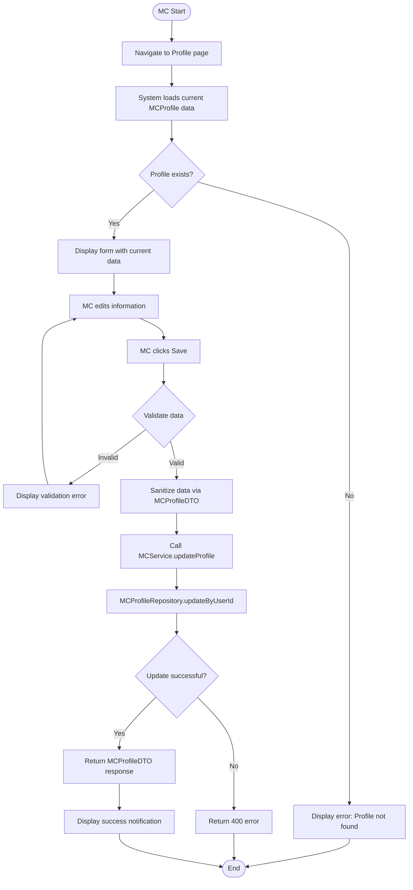

## 3. Sequence Diagram

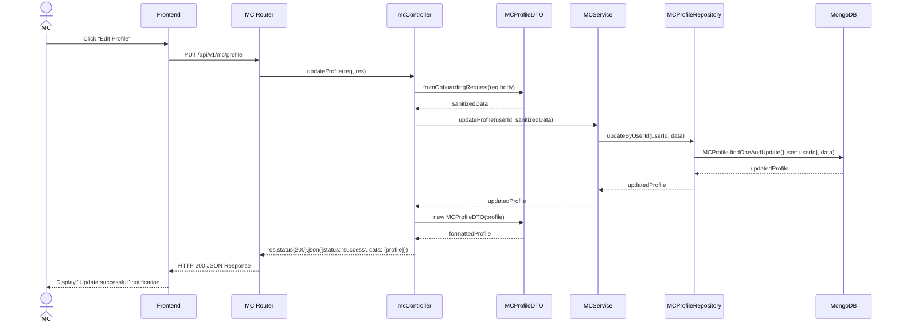

## 4. State Diagram

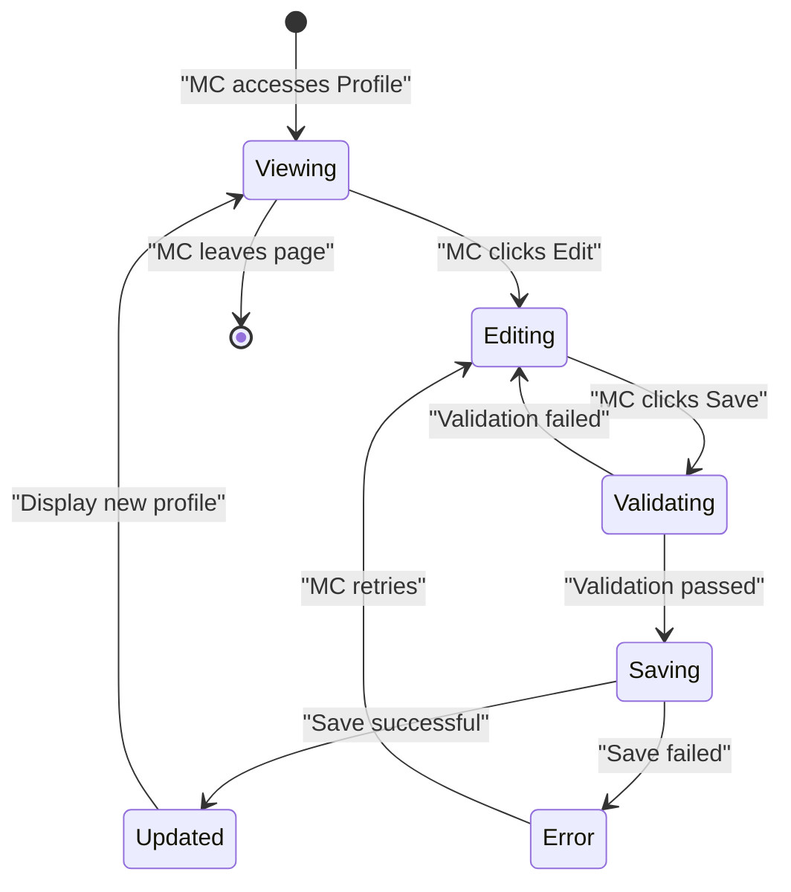

## 5. Integrated Communication Diagram

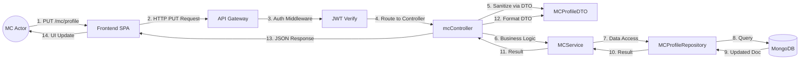

## 6. Detail Design

### API Endpoint
- **Method:** PUT
- **URL:** `/api/v1/mc/profile`
- **Auth:** JWT Bearer Token (role: mc)

### Request Body
```json
{
  "regions": ["HCM", "Hanoi"],
  "experience": 5,
  "styles": ["Event MC", "Wedding MC"],
  "rates": { "min": 2000000, "max": 10000000 },
  "eventTypes": ["Wedding", "Corporate", "Birthday"]
}
```

### Response (200 OK)
```json
{
  "status": "success",
  "data": {
    "profile": {
      "regions": ["HCM", "Hanoi"],
      "experience": 5,
      "styles": ["Event MC", "Wedding MC"],
      "rates": { "min": 2000000, "max": 10000000 },
      "eventTypes": ["Wedding", "Corporate", "Birthday"],
      "status": "Available",
      "rating": 4.5,
      "reviewsCount": 23
    }
  }
}
```

### Classes Involved
| Class | Responsibility |
|---|---|
| `mcController.updateProfile` | Receives request, calls DTO sanitize, calls service |
| `MCProfileDTO.fromOnboardingRequest` | Maps niche -> eventTypes, media -> showreels, and sanitizes |
| `MCService.updateProfile` | Business logic layer |
| `MCProfileRepository.updateByUserId` | Data access layer |
| `MCProfile` (Model) | Mongoose schema definition |

## 7. System High-Level Design

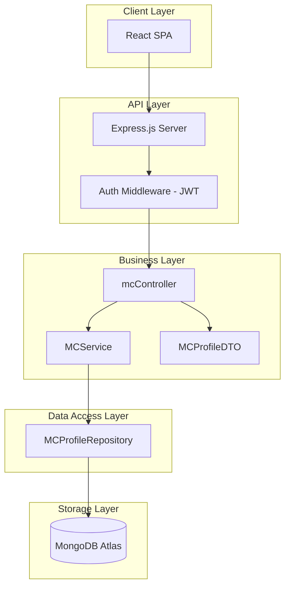

---

# UC20 - Upload Media

## 1. Use Case Description

| Attribute | Description |
|---|---|
| **Use Case ID** | UC20 |
| **Name** | Upload Media |
| **Actor** | MC |
| **Description** | MC uploads images and video clips of past hosted events for promotional purposes (showreel) |
| **Preconditions** | MC is logged in, has an MCProfile |
| **Postconditions** | Media file is uploaded to cloud storage and the URL is saved in MCProfile.showreels |
| **Main Flow** | 1. MC navigates to the Portfolio/Media page<br>2. MC selects a file<br>3. Frontend uploads to Cloud Storage<br>4. Cloud Storage returns URL<br>5. Frontend sends Media URL via PUT /api/v1/mc/profile<br>6. New media is displayed |
| **Alternative Flows** | 3a. Invalid file (wrong format, too large) → Display error<br>4a. Cloud upload fails → Retry or display error |
| **Business Rules** | - Image: max 10MB, formats: jpg, png, webp<br>- Video: max 100MB, formats: mp4, mov<br>- Max 20 showreels per MC |

## 2. Activity Diagram

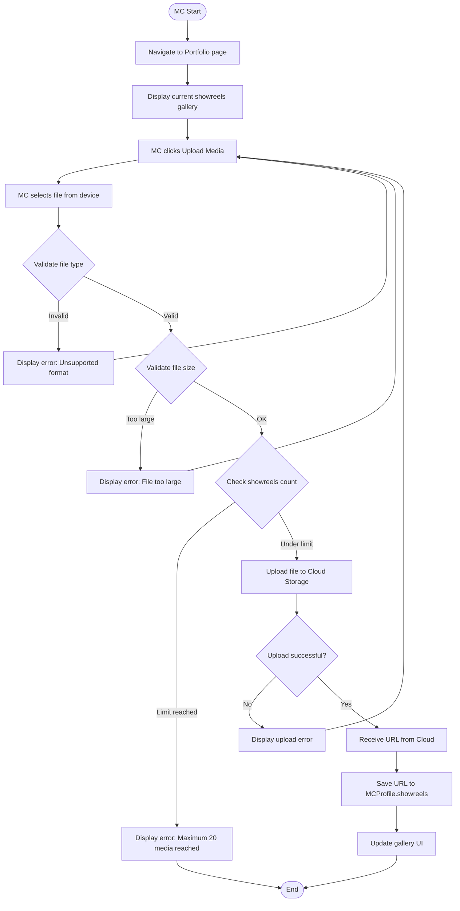

## 3. Sequence Diagram

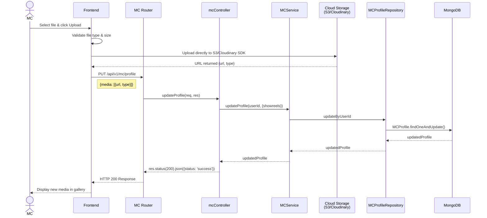

## 4. State Diagram

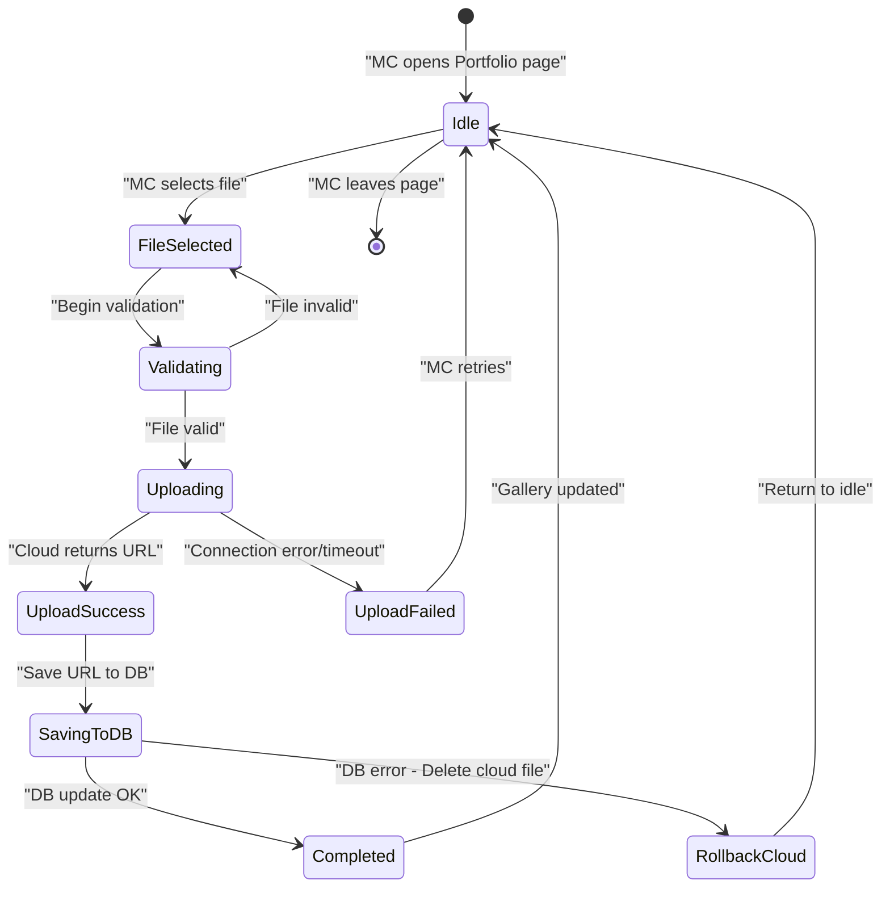

## 5. Integrated Communication Diagram

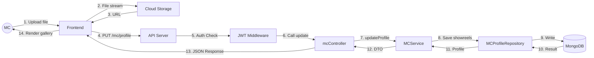

## 6. Detail Design

### API Endpoint
- **Method:** PUT
- **URL:** `/api/v1/mc/profile` (Frontend handles cloud upload and sends URL via profile update)
- **Auth:** JWT Bearer Token (role: mc)
- **Content-Type:** multipart/form-data

### Request Body (FormData)
| Field | Type | Description |
|---|---|---|
| `file` | File | Image or Video file |
| `type` | String | `"image"` or `"video"` |

### Response (201 Created)
```json
{
  "status": "success",
  "data": {
    "showreel": {
      "url": "https://cloudinary.com/mc-hub/showreel_abc123.mp4",
      "type": "video"
    }
  }
}
```

### Data Model (MCProfile.showreels)
```javascript
showreels: [
    {
        url: { type: String, required: true },
        type: { type: String, enum: ['image', 'video'], required: true }
    }
]
```

## 7. System High-Level Design

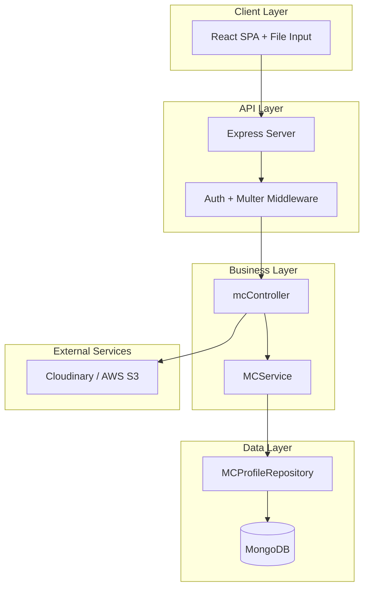

---

# UC21 - View Schedule

## 1. Use Case Description

| Attribute | Description |
|---|---|
| **Use Case ID** | UC21 |
| **Name** | View Schedule |
| **Actor** | MC |
| **Description** | MC views their personal work schedule by day/week/month, including confirmed bookings and self-marked busy dates |
| **Preconditions** | MC is logged in |
| **Postconditions** | Schedule is displayed accurately |
| **Main Flow** | 1. MC navigates to the Calendar page<br>2. System retrieves all Schedule entries by MC ID<br>3. System returns list with statuses: Available / Booked / Busy<br>4. Frontend renders calendar view (day/week/month) |
| **Alternative Flows** | 2a. No schedule entries → Display empty calendar |
| **Business Rules** | - Display 3 statuses: Available (green), Booked (yellow), Busy (red)<br>- Booking entries link to booking details |

## 2. Activity Diagram

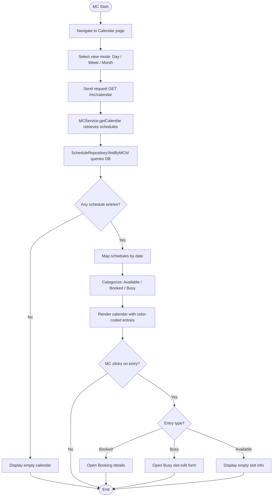

## 3. Sequence Diagram

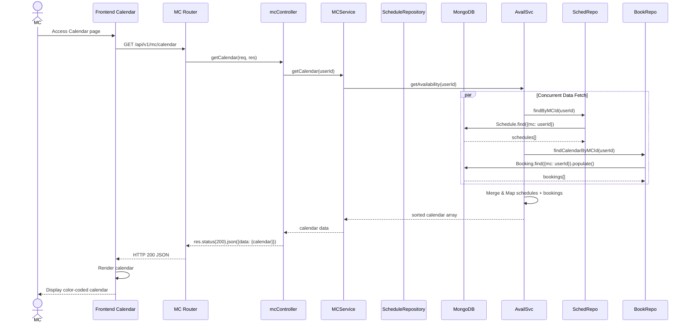

## 4. State Diagram

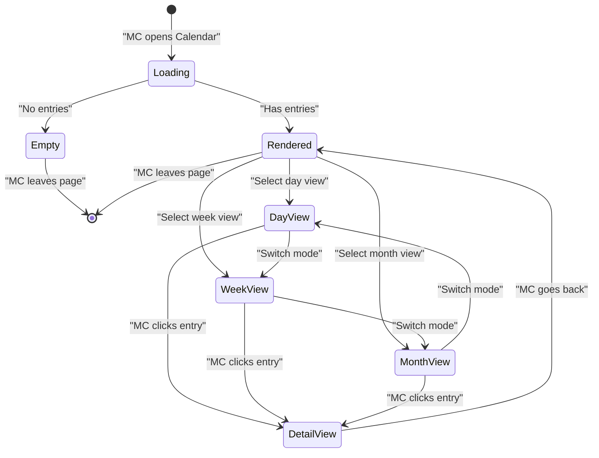

## 5. Integrated Communication Diagram

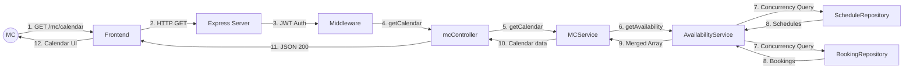

## 6. Detail Design

### API Endpoint
- **Method:** GET
- **URL:** `/api/v1/mc/calendar`
- **Auth:** JWT Bearer Token (role: mc)
- **Query Params (optional):** `?month=2026-03&view=month`

### Response (200 OK)
```json
{
  "status": "success",
  "data": {
    "calendar": [
      {
        "_id": "...",
        "mc": "userId",
        "date": "2026-03-15T00:00:00.000Z",
        "startTime": "08:00",
        "endTime": "12:00",
        "status": "Booked",
        "bookingId": {
          "_id": "bookingId",
          "client": { "name": "Nguyen Van A" },
          "eventType": "Wedding",
          "location": "HCMC"
        }
      },
      {
        "_id": "...",
        "date": "2026-03-16T00:00:00.000Z",
        "status": "Busy",
        "bookingId": null
      }
    ]
  }
}
```

### Schedule Model
```javascript
{
    mc: ObjectId (ref: User),
    date: Date,
    startTime: String,  // "08:00"
    endTime: String,     // "12:00"
    status: 'Available' | 'Booked' | 'Busy',
    bookingId: ObjectId (ref: Booking) | null
}
```

## 7. System High-Level Design

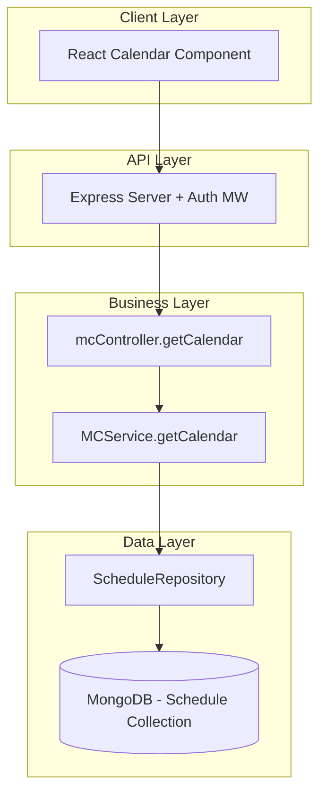

---

# UC22 - Update Busy Schedule

## 1. Use Case Description

| Attribute | Description |
|---|---|
| **Use Case ID** | UC22 |
| **Name** | Update Busy Schedule |
| **Actor** | MC |
| **Description** | MC marks specific time periods as busy so that clients cannot book during those times |
| **Preconditions** | MC is logged in, slot is not already Booked |
| **Postconditions** | Schedule entry is created with status = 'Busy' |
| **Main Flow** | 1. MC navigates to Calendar<br>2. MC selects the date/time to block<br>3. MC clicks "Block Date"<br>4. System creates Schedule entry {status: 'Busy'}<br>6. Calendar updates to display the busy slot (red) |
| **Alternative Flows** | 4a. Date in the past → Display error (client-side handling) |
| **Business Rules** | - Cannot block a slot that already has a Booking<br>- Cannot select a date in the past<br>- endTime must be after startTime |

## 2. Activity Diagram

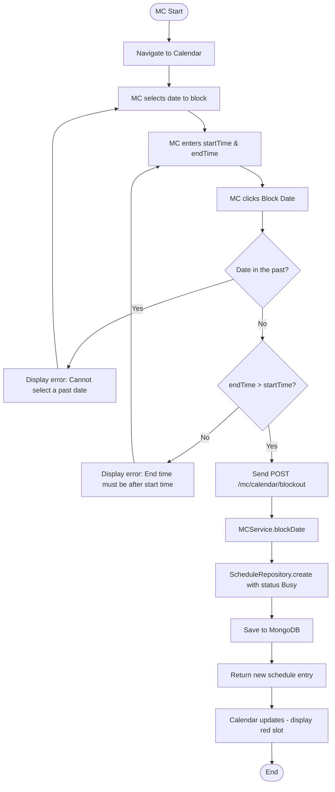

## 3. Sequence Diagram

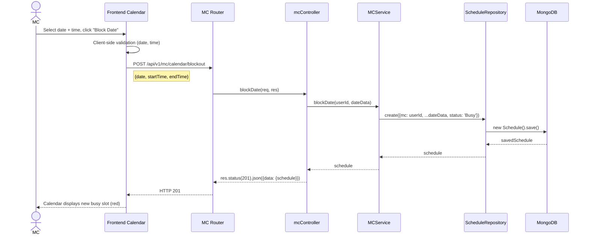

## 4. State Diagram

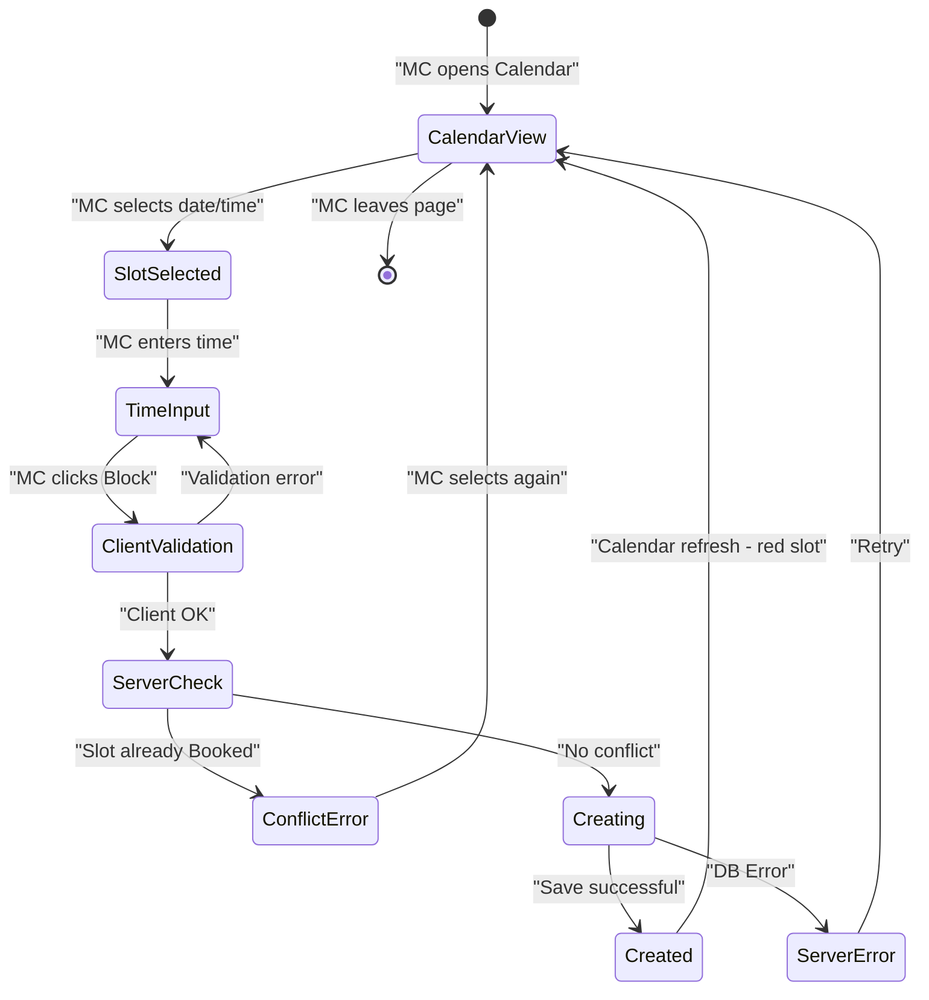

## 5. Integrated Communication Diagram

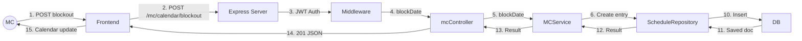

## 6. Detail Design

### API Endpoint
- **Method:** PUT
- **URL:** `/api/v1/mc/calendar/blockout`
- **Auth:** JWT Bearer Token (role: mc)

### Request Body
```json
{
  "date": "2026-03-20",
  "startTime": "08:00",
  "endTime": "17:00"
}
```

### Response (201 Created)
```json
{
  "status": "success",
  "data": {
    "schedule": {
      "_id": "...",
      "mc": "userId",
      "date": "2026-03-20T00:00:00.000Z",
      "startTime": "08:00",
      "endTime": "17:00",
      "status": "Busy",
      "bookingId": null
    }
  }
}
```

### Error Response (409 Conflict)
```json
{
  "status": "fail",
  "message": "This slot already has a booking and cannot be marked as busy"
}
```

## 7. System High-Level Design

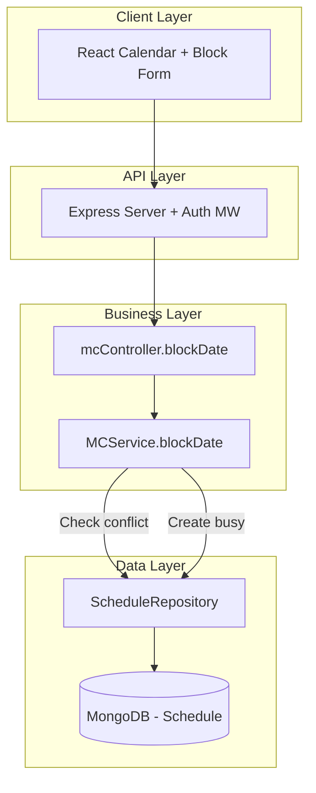

---

# UC23 - Set Availability Status

## 1. Use Case Description

| Attribute | Description |
|---|---|
| **Use Case ID** | UC23 |
| **Name** | Set Availability Status |
| **Actor** | MC |
| **Description** | MC sets their overall status: ready to accept shows (Available) or temporarily on break (Busy). When status = Busy, clients cannot book this MC |
| **Preconditions** | MC is logged in, has an MCProfile |
| **Postconditions** | MCProfile.status is updated |
| **Main Flow** | 1. MC navigates to Dashboard/Profile<br>2. MC toggles status Available ↔ Busy<br>3. System updates MCProfile.status<br>4. If Busy → MC does not appear in public search results |
| **Alternative Flows** | 3a. Has pending bookings → Warn MC before switching to Busy |
| **Business Rules** | - Available: MC appears in search, can accept bookings<br>- Busy: MC hidden from search, automatically rejects new bookings |

## 2. Activity Diagram

```mermaid
flowchart TD
    A([MC Start]) --> B[Navigate to Dashboard/Profile]
    B --> C[Display current status toggle]
    C --> D[MC clicks status toggle]
    D --> E{New status?}
    E -- Available to Busy --> F{Has pending bookings?}
    F -- Yes --> G[Display warning: You have X pending bookings]
    G --> H{MC confirms?}
    H -- No --> C
    H -- Yes --> I[Send request to update status = Busy]
    F -- No --> I
    E -- Busy to Available --> J[Send request to update status = Available]
    I --> K[MCService.updateProfile - status]
    J --> K
    K --> L[MCProfileRepository.updateByUserId]
    L --> M{Update OK?}
    M -- No --> N[Display error]
    N --> C
    M -- Yes --> O[Update UI toggle]
    O --> P{Status = Busy?}
    P -- Yes --> Q[MC hidden from Public Search]
    P -- No --> R[MC visible in Public Search]
    Q --> Z([End])
    R --> Z
```

## 3. Sequence Diagram

```mermaid
sequenceDiagram
    actor MC
    participant FE as Frontend Dashboard
    participant Router as MC Router
    participant Ctrl as mcController
    participant DTO as MCProfileDTO
    participant Svc as MCService
    participant BookRepo as BookingRepository
    participant McRepo as MCProfileRepository
    participant DB as MongoDB

    MC->>FE: Toggle status (Available ↔ Busy)
    FE->>Router: PUT /api/v1/mc/profile
    Note right of FE: { "status": "Busy" }
    Router->>Ctrl: updateProfile(req, res)
    Ctrl->>DTO: fromOnboardingRequest(req.body)
    DTO-->>Ctrl: { status: "Busy" }
    Ctrl->>Svc: updateProfile(userId, { status: "Busy" })
    Svc->>McRepo: updateByUserId(userId, {status: "Busy"})
    McRepo->>DB: MCProfile.findOneAndUpdate()
    DB-->>McRepo: updatedProfile
    McRepo-->>Svc: updatedProfile
    Svc-->>Ctrl: updatedProfile
    Ctrl->>DTO: new MCProfileDTO(profile)
    Ctrl-->>Router: res.status(200).json({data: {profile}})
    Router-->>FE: HTTP 200
    FE-->>MC: Toggle updated - badge "Busy" / "Available"
```

## 4. State Diagram

```mermaid
stateDiagram-v2
    [*] --> Available : "MCProfile initialized"
    Available --> PendingBusy : "MC toggles to Busy"
    PendingBusy --> ConfirmBusy : "Has pending bookings - MC confirms"
    PendingBusy --> Busy : "No pending bookings"
    ConfirmBusy --> Busy : "MC agrees"
    ConfirmBusy --> Available : "MC cancels"
    Busy --> Available : "MC toggles to Available"

    state Available {
        [*] --> VisibleInSearch
        VisibleInSearch: MC appears in search
        VisibleInSearch: Can accept new bookings
    }
    state Busy {
        [*] --> HiddenFromSearch
        HiddenFromSearch: MC hidden from search
        HiddenFromSearch: Automatically rejects new bookings
    }
```

## 5. Integrated Communication Diagram

```mermaid
flowchart LR
    MC((MC)) -->|1. Toggle status| FE[Frontend]
    FE -->|2. PUT /mc/profile| API[Express Server]
    API -->|3. JWT Auth| AUTH[Middleware]
    AUTH -->|4. updateProfile| CTRL[mcController]
    CTRL -->|5. Sanitize| DTO[MCProfileDTO]
    CTRL -->|6. updateProfile| SVC[MCService]
    SVC -->|7. Check pending| BREPO[BookingRepository]
    BREPO -->|8. Query| DB[(MongoDB)]
    SVC -->|9. Update status| MREPO[MCProfileRepository]
    MREPO -->|10. Update| DB
    DB -->|11. Confirm| MREPO
    MREPO -->|12. Result| SVC
    SVC -->|13. Result| CTRL
    CTRL -->|14. JSON| FE
    FE -->|15. UI toggle| MC
```

## 6. Detail Design

### API Endpoint
- **Method:** PUT
- **URL:** `/api/v1/mc/profile`
- **Auth:** JWT Bearer Token (role: mc)

### Request Body
```json
{
  "status": "Busy"
}
```

### Response (200 OK)
```json
{
  "status": "success",
  "data": {
    "profile": {
      "status": "Busy",
      "regions": ["HCM"],
      "experience": 5,
      "rating": 4.5
    }
  }
}
```

### Impact on Public API
When `MCProfile.status = 'Busy'`:
- `GET /api/v1/public/mcs` → MC is filtered out of search results
- `POST /api/v1/bookings` → Returns error if mc.status === 'Busy'

## 7. System High-Level Design

```mermaid
flowchart TB
    subgraph Client["Client Layer"]
        Toggle[Toggle Status Component]
    end
    subgraph API["API Layer"]
        GW[Express + Auth]
    end
    subgraph Business["Business Layer"]
        CTRL[mcController]
        SVC[MCService]
        DTO[MCProfileDTO]
    end
    subgraph Data["Data Layer"]
        MREPO[MCProfileRepository]
        BREPO[BookingRepository]
        DB[(MongoDB)]
    end
    subgraph PublicImpact["Side Effects"]
        SEARCH[Public Search Filter]
        BOOKING[Booking Validation]
    end

    Toggle --> GW --> CTRL
    CTRL --> DTO
    CTRL --> SVC
    SVC --> MREPO --> DB
    SVC --> BREPO --> DB
    SVC -.->|status change| SEARCH
    SVC -.->|status change| BOOKING
```

---

# UC32 - View Users Lists

## 1. Use Case Description

| Attribute | Description |
|---|---|
| **Use Case ID** | UC32 |
| **Name** | View Users Lists |
| **Actor** | Admin |
| **Description** | Admin views and manages the complete list of users (Customer & MC), including account information, status, and role |
| **Preconditions** | Admin is logged in with role = 'admin' |
| **Postconditions** | User list is displayed |
| **Main Flow** | 1. Admin navigates to the User Management page<br>2. System retrieves all users from DB<br>3. Display list as a table (name, email, role, isActive, isVerified, createdAt)<br>4. Admin can filter by role, search by name/email<br>5. Admin can sort by columns |
| **Alternative Flows** | 2a. No users → Display empty list |
| **Business Rules** | - Only admin can access<br>- Pagination: 20 users/page<br>- Supports search, filter, sort |

## 2. Activity Diagram

```mermaid
flowchart TD
    A([Admin Start]) --> B[Navigate to User Management]
    B --> C{Check Admin permission}
    C -- Not Admin --> D[Redirect 403 Forbidden]
    D --> Z([End])
    C -- Is Admin --> E[Send GET /admin/users]
    E --> F[adminController.getAllUsers]
    F --> G[User.find queries all users]
    G --> H{Has results?}
    H -- No --> I[Display empty table]
    I --> Z
    H -- Yes --> J[Return user list]
    J --> K[Frontend renders table]
    K --> L{Admin action?}
    L -- Search --> M[Filter by name/email]
    M --> K
    L -- Filter role --> N[Filter by client/mc/admin]
    N --> K
    L -- Sort --> O[Sort by column]
    O --> K
    L -- Pagination --> P[Load next page]
    P --> K
    L -- Select user --> Q[Open user details]
    Q --> Z
    L -- None --> Z([End])
```

## 3. Sequence Diagram

```mermaid
sequenceDiagram
    actor Admin
    participant FE as Admin Dashboard
    participant Router as Admin Router
    participant MW as Auth Middleware
    participant Ctrl as adminController
    participant Model as User Model
    participant DB as MongoDB

    Admin->>FE: Navigate to User Management
    FE->>Router: GET /api/v1/admin/users?page=1&role=mc&search=keyword
    Router->>MW: protect() + restrictTo('admin')
    MW->>MW: Verify JWT + Check role
    MW-->>Router: Authorized
    Router->>Ctrl: getAllUsers(req, res)
    Ctrl->>Model: User.find(filters).skip().limit().sort()
    Model->>DB: Aggregate query
    DB-->>Model: users[]
    Model-->>Ctrl: users[]
    Ctrl-->>Router: res.status(200).json({results: users.length, data: {users}})
    Router-->>FE: HTTP 200 JSON
    FE->>FE: Render DataTable component
    FE-->>Admin: Display user list
```

## 4. State Diagram

```mermaid
stateDiagram-v2
    [*] --> AuthCheck : "Admin accesses page"
    AuthCheck --> Forbidden : "Not Admin"
    Forbidden --> [*]
    AuthCheck --> Loading : "Authentication OK"
    Loading --> EmptyList : "No users"
    Loading --> DisplayList : "Has users"
    EmptyList --> [*]
    DisplayList --> Filtering : "Admin searches/filters"
    Filtering --> DisplayList : "New results"
    DisplayList --> Sorting : "Admin sorts"
    Sorting --> DisplayList : "Sorted list"
    DisplayList --> Paginating : "Admin changes page"
    Paginating --> DisplayList : "New page"
    DisplayList --> UserDetail : "Admin clicks user"
    UserDetail --> DisplayList : "Go back"
    DisplayList --> [*] : "Admin leaves page"
```

## 5. Integrated Communication Diagram

```mermaid
flowchart LR
    ADMIN((Admin)) -->|1. GET /admin/users| FE[Admin Dashboard]
    FE -->|2. HTTP GET| API[Express Server]
    API -->|3. JWT + Role check| AUTH[Auth Middleware]
    AUTH -->|4. getAllUsers| CTRL[adminController]
    CTRL -->|5. Query| MODEL[User Model]
    MODEL -->|6. find + populate| DB[(MongoDB)]
    DB -->|7. User docs| MODEL
    MODEL -->|8. users[]| CTRL
    CTRL -->|9. JSON Response| FE
    FE -->|10. DataTable UI| ADMIN
```

## 6. Detail Design

### API Endpoint
- **Method:** GET
- **URL:** `/api/v1/admin/users`
- **Auth:** JWT Bearer Token (role: admin)
- **Query Params:**

| Param | Type | Description |
|---|---|---|
| `page` | Number | Page number (default: 1) |
| `limit` | Number | Users per page (default: 20) |
| `role` | String | Filter by role: client, mc, admin |
| `search` | String | Search by name or email |
| `sortBy` | String | Sort column (default: createdAt) |
| `order` | String | asc / desc (default: desc) |

### Response (200 OK)
```json
{
  "status": "success",
  "results": 150,
  "data": {
    "users": [
      {
        "_id": "...",
        "name": "Tran Van B",
        "email": "tranvanb@example.com",
        "role": "mc",
        "phoneNumber": "0901234567",
        "isVerified": true,
        "isActive": true,
        "createdAt": "2026-01-15T10:30:00.000Z"
      }
    ],
    "pagination": {
      "currentPage": 1,
      "totalPages": 8,
      "totalUsers": 150
    }
  }
}
```

## 7. System High-Level Design

```mermaid
flowchart TB
    subgraph Client["Client Layer"]
        Dashboard[Admin Dashboard + DataTable]
    end
    subgraph API["API Layer"]
        GW[Express Server]
        MW[Auth + Admin Role MW]
    end
    subgraph Business["Business Layer"]
        CTRL[adminController.getAllUsers]
    end
    subgraph Data["Data Layer"]
        MODEL[User Model - Mongoose]
        DB[(MongoDB - Users Collection)]
    end

    Dashboard --> GW
    GW --> MW
    MW --> CTRL
    CTRL --> MODEL
    MODEL --> DB
```

---

# UC33 - Lock/Unlock Account

## 1. Use Case Description

| Attribute | Description |
|---|---|
| **Use Case ID** | UC33 |
| **Name** | Lock/Unlock Account |
| **Actor** | Admin |
| **Description** | Admin manages user accounts by locking or unlocking access. A locked user cannot log in |
| **Preconditions** | Admin is logged in, target user exists |
| **Postconditions** | User.isActive is toggled (true ↔ false) |
| **Main Flow** | 1. Admin views user list (UC32)<br>2. Admin selects user to Lock/Unlock<br>3. Admin clicks Lock (or Unlock) button<br>4. System confirms the action<br>5. System updates User.isActive<br>6. If Lock → force logout that user |
| **Alternative Flows** | 3a. Admin tries to lock themselves → Denied<br>5a. User not found → 404 |
| **Business Rules** | - Admin cannot lock themselves<br>- Cannot lock another admin<br>- Lock = isActive: false → User cannot log in<br>- Send email notification on Lock/Unlock |

## 2. Activity Diagram

```mermaid
flowchart TD
    A([Admin Start]) --> B[View Users List - UC32]
    B --> C[Select user to Lock/Unlock]
    C --> D{User = self Admin?}
    D -- Yes --> E[Display error: Cannot lock yourself]
    E --> B
    D -- No --> F{User is another Admin?}
    F -- Yes --> G[Display error: Cannot lock Admin]
    G --> B
    F -- No --> H{Current status?}
    H -- isActive = true --> I[Show dialog: Confirm LOCK user?]
    H -- isActive = false --> J[Show dialog: Confirm UNLOCK user?]
    I --> K{Admin confirms?}
    J --> K
    K -- No --> B
    K -- Yes --> L[Send PATCH /admin/users/:id]
    L --> M[adminController.updateUserStatus]
    M --> N[User.findByIdAndUpdate isActive toggle]
    N --> O{Update OK?}
    O -- No --> P[Display error]
    P --> B
    O -- Yes --> Q{isActive = false - Locked?}
    Q -- Yes --> R[Force logout user + Send Lock email]
    Q -- No --> S[Send Unlock email]
    R --> T[Update UI - status badge]
    S --> T
    T --> Z([End])
```

## 3. Sequence Diagram

```mermaid
sequenceDiagram
    actor Admin
    participant FE as Admin Dashboard
    participant Router as Admin Router
    participant MW as Auth Middleware
    participant Ctrl as adminController
    participant Model as User Model
    participant DB as MongoDB
    participant Email as Email Service
    participant Notif as Notification Service

    Admin->>FE: Click Lock/Unlock on user row
    FE->>FE: Show confirmation dialog
    Admin->>FE: Confirm
    FE->>Router: PATCH /api/v1/admin/users/:id
    Note right of FE: { "isActive": false }
    Router->>MW: protect() + restrictTo('admin')
    MW-->>Router: Authorized
    Router->>Ctrl: updateUserStatus(req, res)
    Ctrl->>Ctrl: Validate: cannot lock self / other admin
    Ctrl->>Model: User.findByIdAndUpdate(id, {isActive: false})
    Model->>DB: updateOne
    DB-->>Model: updatedUser
    Model-->>Ctrl: user
    
    Ctrl-->>Router: res.status(200).json({data: {user}})
    Router-->>FE: HTTP 200
    FE-->>Admin: Update badge: Locked
```

## 4. State Diagram

```mermaid
stateDiagram-v2
    [*] --> Active : "User registration successful"
    
    Active --> LockRequested : "Admin clicks Lock"
    LockRequested --> LockConfirm : "Show confirmation dialog"
    LockConfirm --> Active : "Admin cancels"
    LockConfirm --> Locked : "Admin confirms"
    
    Locked --> UnlockRequested : "Admin clicks Unlock"
    UnlockRequested --> UnlockConfirm : "Show confirmation dialog"
    UnlockConfirm --> Locked : "Admin cancels"
    UnlockConfirm --> Active : "Admin confirms"

    state Active {
        [*] --> CanLogin
        CanLogin: isActive = true
        CanLogin: User can log in normally
    }
    state Locked {
        [*] --> CannotLogin
        CannotLogin: isActive = false
        CannotLogin: Login denied
        CannotLogin: Hidden from public search
    }
```

## 5. Integrated Communication Diagram

```mermaid
flowchart LR
    ADMIN((Admin)) -->|1. PATCH /admin/users/:id| FE[Admin Dashboard]
    FE -->|2. HTTP PATCH| API[Express Server]
    API -->|3. Auth + Admin role| MW[Middleware]
    MW -->|4. updateUserStatus| CTRL[adminController]
    CTRL -->|5. Validate rules| CTRL
    CTRL -->|6. findByIdAndUpdate| MODEL[User Model]
    MODEL -->|7. Update| DB[(MongoDB)]
    DB -->|8. Updated doc| MODEL
    MODEL -->|9. User| CTRL
    CTRL -->|10. Send notification| EMAIL[Email Service]
    CTRL -->|11. Create notification| NOTIF[Notification Model]
    NOTIF -->|12. Save| DB
    CTRL -->|13. JSON Response| FE
    FE -->|14. UI Update| ADMIN
```

## 6. Detail Design

### API Endpoint
- **Method:** PATCH
- **URL:** `/api/v1/admin/users/:id`
- **Auth:** JWT Bearer Token (role: admin)

### Request Body
```json
{
  "isActive": false
}
```

### Response (200 OK)
```json
{
  "status": "success",
  "data": {
    "user": {
      "_id": "userId",
      "name": "Nguyen Van A",
      "email": "nguyenvana@example.com",
      "role": "mc",
      "isActive": false,
      "isVerified": true
    }
  }
}
```

### Error Cases
| Status | Message |
|---|---|
| 403 | Cannot lock an admin account |
| 403 | Cannot lock yourself |
| 404 | User not found |

### User Model Fields Affected
```javascript
{
    isActive: Boolean  // true → false (Lock) | false → true (Unlock)
}
```

## 7. System High-Level Design

```mermaid
flowchart TB
    subgraph Client["Client Layer"]
        Dashboard[Admin Dashboard + Confirm Dialog]
    end
    subgraph API["API Layer"]
        GW[Express Server]
        MW[Auth + Admin MW]
    end
    subgraph Business["Business Layer"]
        CTRL[adminController.updateUserStatus]
        VALID[Validation Rules]
    end
    subgraph Data["Data Layer"]
        MODEL[User Model]
        DB[(MongoDB)]
    end
    subgraph SideEffects["Side Effects"]
        EMAIL[Email Service]
        NOTIF[Notification]
        SESSION[Session Invalidation]
    end

    Dashboard --> GW --> MW --> CTRL
    CTRL --> VALID
    CTRL --> MODEL --> DB
    CTRL -.-> EMAIL
    CTRL -.-> NOTIF
    CTRL -.-> SESSION
```

---

# UC34 - Verify MC

## 1. Use Case Description

| Attribute | Description |
|---|---|
| **Use Case ID** | UC34 |
| **Name** | Verify MC |
| **Actor** | Admin |
| **Description** | Admin reviews and verifies MC certificates and professional profiles. A verified MC receives a Verified Badge and gets priority in rankings |
| **Preconditions** | Admin is logged in, MC has submitted KYC documents |
| **Postconditions** | User.isVerified = true, MC receives Verified Badge |
| **Main Flow** | 1. Admin views list of unverified MCs<br>2. Admin selects MC to review<br>3. System displays MC profile: profile, KYC docs, showreels<br>4. Admin reviews each document<br>5. Admin clicks "Verify" or "Reject"<br>6. System updates isVerified<br>7. Send notification to MC |
| **Alternative Flows** | 5a. Admin rejects → Must provide a reason<br>3a. MC has not uploaded KYC → Cannot verify |
| **Business Rules** | - Verified MC has a gold badge on profile<br>- Verified MC gets boosted in Smart Ranking<br>- Rejection must include a reason<br>- MC can resubmit after rejection |

## 2. Activity Diagram

```mermaid
flowchart TD
    A([Admin Start]) --> B[Navigate to MC Verification Queue]
    B --> C[Display list of MCs pending verification]
    C --> D{Any MC pending?}
    D -- No --> E[Display: No MCs require verification]
    E --> Z([End])
    D -- Yes --> F[Admin selects MC to review]
    F --> G[Display detailed MC profile]
    G --> H[Admin reviews: MCProfile + KYC docs + Showreels]
    H --> I{Admin decision?}
    I -- Verify --> J[Admin clicks Approve/Verify]
    J --> K[Update User.isVerified = true]
    K --> L[Send notification + email to MC: Verified]
    L --> M[MC receives Verified Badge]
    M --> Z
    I -- Reject --> N[Admin clicks Reject]
    N --> O[Admin enters rejection reason]
    O --> P{Reason valid?}
    P -- No --> O
    P -- Yes --> Q[Keep User.isVerified = false]
    Q --> R[Send notification + email to MC: Rejected with reason]
    R --> S[MC can resubmit]
    S --> Z([End])
```

## 3. Sequence Diagram

```mermaid
sequenceDiagram
    actor Admin
    participant FE as Admin Dashboard
    participant Router as Admin Router
    participant MW as Auth Middleware
    participant Ctrl as adminController
    participant UserModel as User Model
    participant McModel as MCProfile Model
    participant DB as MongoDB
    participant Notif as Notification Service
    participant Email as Email Service

    Admin->>FE: Open Verification Queue
    FE->>Router: GET /api/v1/admin/users?role=mc&isVerified=false
    Router->>MW: protect() + restrictTo('admin')
    MW-->>Router: OK
    Router->>Ctrl: getAllUsers (filtered)
    Ctrl->>UserModel: User.find({role:'mc', isVerified:false}).populate('mcProfile')
    UserModel->>DB: Query
    DB-->>UserModel: unverifiedMCs[]
    UserModel-->>Ctrl: users
    Ctrl-->>FE: HTTP 200 - List of unverified MCs
    FE-->>Admin: Display list

    Admin->>FE: Select MC, review profile
    Admin->>FE: Click "Verify" (or "Reject" + reason)
    FE->>Router: PATCH /api/v1/admin/users/:mcId
    Note right of FE: { "isVerified": true }
    Router->>MW: Auth check
    MW-->>Router: OK
    Router->>Ctrl: updateUserStatus(req, res)
    Ctrl->>UserModel: User.findByIdAndUpdate(mcId, {isVerified: true})
    UserModel->>DB: Update
    DB-->>UserModel: updatedUser
    UserModel-->>Ctrl: user

    Ctrl-->>FE: HTTP 200
    FE-->>Admin: MC has been verified
```

## 4. State Diagram

```mermaid
stateDiagram-v2
    [*] --> Unverified : "MC registers account"
    
    Unverified --> KYCSubmitted : "MC submits KYC documents"
    KYCSubmitted --> UnderReview : "Admin begins review"
    UnderReview --> Verified : "Admin Approves"
    UnderReview --> Rejected : "Admin Rejects (with reason)"
    Rejected --> KYCSubmitted : "MC resubmits documents"
    
    state Unverified {
        [*] --> NoVerifiedBadge
        NoVerifiedBadge: isVerified = false
        NoVerifiedBadge: No badge
        NoVerifiedBadge: Normal ranking
    }
    
    state Verified {
        [*] --> HasVerifiedBadge
        HasVerifiedBadge: isVerified = true
        HasVerifiedBadge: Verified Badge displayed
        HasVerifiedBadge: Ranking boost
    }
    
    state Rejected {
        [*] --> NeedResubmit
        NeedResubmit: isVerified = false
        NeedResubmit: Has rejection reason
        NeedResubmit: MC needs to fix and resubmit
    }
```

## 5. Integrated Communication Diagram

```mermaid
flowchart LR
    ADMIN((Admin)) -->|1. Review & Approve| FE[Admin Dashboard]
    FE -->|2. PATCH /admin/users/:id| API[Express Server]
    API -->|3. Auth + Admin| MW[Middleware]
    MW -->|4. updateUserStatus| CTRL[adminController]
    CTRL -->|5. Update isVerified| USER[User Model]
    USER -->|6. Update| DB[(MongoDB)]
    CTRL -->|7. Get MC Profile| MC[MCProfile Model]
    MC -->|8. Query| DB
    CTRL -->|9. Create notification| NOTIF[Notification Model]
    NOTIF -->|10. Save| DB
    CTRL -->|11. Send email| EMAIL[Email Service]
    DB -->|12. Confirm all| CTRL
    CTRL -->|13. JSON Response| FE
    FE -->|14. Verified badge UI| ADMIN
```

## 6. Detail Design

### API Endpoints

#### Get list of MCs pending verification
- **Method:** GET
- **URL:** `/api/v1/admin/users?role=mc&isVerified=false`
- **Auth:** JWT (admin)

#### Verify/Reject MC
- **Method:** PATCH
- **URL:** `/api/v1/admin/users/:mcId`
- **Auth:** JWT (admin)

### Request Body - Verify
```json
{
  "isVerified": true
}
```

### Request Body - Reject
```json
{
  "isVerified": false,
  "rejectReason": "Certificates are unclear, please re-upload with higher quality images"
}
```

### Response (200 OK)
```json
{
  "status": "success",
  "data": {
    "user": {
      "_id": "mcUserId",
      "name": "MC Phuong Anh",
      "email": "phuonganh@example.com",
      "role": "mc",
      "isVerified": true,
      "isActive": true,
      "mcProfile": {
        "rating": 4.8,
        "reviewsCount": 15,
        "status": "Available"
      }
    }
  }
}
```

### Notification Created
```javascript
{
    user: mcUserId,
    title: "Profile has been verified!",
    body: "Congratulations! Your MC profile has been verified. You have received the Verified Badge.",
    type: "System",
    linkAction: "/mc/profile"
}
```

## 7. System High-Level Design

```mermaid
flowchart TB
    subgraph Client["Client Layer"]
        AdminUI[Admin Verification Panel]
    end
    subgraph API["API Layer"]
        GW[Express Server]
        MW[Auth + Admin MW]
    end
    subgraph Business["Business Layer"]
        CTRL[adminController]
        RANKING[Smart Ranking Boost Logic]
    end
    subgraph Data["Data Layer"]
        USER[User Model]
        MCPROFILE[MCProfile Model]
        NOTIFM[Notification Model]
        DB[(MongoDB)]
    end
    subgraph External["External"]
        EMAIL[Email Service]
    end

    AdminUI --> GW --> MW --> CTRL
    CTRL --> USER --> DB
    CTRL --> MCPROFILE --> DB
    CTRL --> NOTIFM --> DB
    CTRL --> EMAIL
    CTRL -.->|Trigger| RANKING
```

---

# UC36 - View All Bookings

## 1. Use Case Description

| Attribute | Description |
|---|---|
| **Use Case ID** | UC36 |
| **Name** | View All Bookings |
| **Actor** | Admin |
| **Description** | Admin manages all booking transactions occurring on the platform, views details, and monitors statuses |
| **Preconditions** | Admin is logged in |
| **Postconditions** | Booking list is fully displayed |
| **Main Flow** | 1. Admin navigates to Booking Management<br>2. System retrieves all bookings + populates MC & Client info<br>3. Display list as a table<br>4. Admin filters by status, date range, MC, payment status<br>5. Admin can view details of each booking |
| **Alternative Flows** | 2a. No bookings → Empty list |
| **Business Rules** | - Display: client, mc, eventDate, eventType, price, status, paymentStatus<br>- Filter: status, paymentStatus, dateRange<br>- Export reports as CSV/Excel |

## 2. Activity Diagram

```mermaid
flowchart TD
    A([Admin Start]) --> B[Navigate to Booking Management]
    B --> C{Admin permission?}
    C -- No --> D[403 Forbidden]
    D --> Z([End])
    C -- Yes --> E[Send GET /admin/bookings]
    E --> F[adminController.getAllBookings]
    F --> G[Booking.find.populate mc and client]
    G --> H{Any bookings?}
    H -- No --> I[Display empty list]
    I --> Z
    H -- Yes --> J[Render DataTable bookings]
    J --> K{Admin action?}
    K -- Filter status --> L[Filter: Pending/Accepted/Completed/Cancelled]
    L --> J
    K -- Filter date --> M[Select date range]
    M --> J
    K -- Filter payment --> N[Filter: Pending/DepositPaid/FullyPaid/Refunded]
    N --> J
    K -- View details --> O[Open booking detail panel]
    O --> P[Display: Client + MC + Event info + Payment + Timeline]
    P --> J
    K -- Export --> Q[Export report CSV/Excel]
    Q --> Z
    K -- None --> Z([End])
```

## 3. Sequence Diagram

```mermaid
sequenceDiagram
    actor Admin
    participant FE as Admin Dashboard
    participant Router as Admin Router
    participant MW as Auth Middleware
    participant Ctrl as adminController
    participant Model as Booking Model
    participant DB as MongoDB

    Admin->>FE: Navigate to Booking Management
    FE->>Router: GET /api/v1/admin/bookings?status=Pending&page=1
    Router->>MW: protect() + restrictTo('admin')
    MW-->>Router: Authorized
    Router->>Ctrl: getAllBookings(req, res)
    Ctrl->>Model: Booking.find(filters).populate('mc').populate('client').sort('-createdAt')
    Model->>DB: Aggregate + lookup
    DB-->>Model: bookings[] with populated refs
    Model-->>Ctrl: bookings[]
    Ctrl-->>Router: res.status(200).json({results, data: {bookings}})
    Router-->>FE: HTTP 200
    FE->>FE: Render DataTable
    FE-->>Admin: Display bookings table

    opt View details
        Admin->>FE: Click booking row
        FE->>Router: GET /api/v1/admin/bookings/:id
        Router->>Ctrl: getBookingDetail(req, res)
        Ctrl->>Model: Booking.findById(id).populate('mc client')
        Model->>DB: findById + lookup
        DB-->>Model: booking detail
        Model-->>Ctrl: booking
        Ctrl-->>FE: HTTP 200
        FE-->>Admin: Display booking details
    end
```

## 4. State Diagram

```mermaid
stateDiagram-v2
    [*] --> Loading : "Admin opens Booking Management"
    Loading --> EmptyList : "No bookings"
    Loading --> DisplayTable : "Has bookings"
    EmptyList --> [*]
    
    DisplayTable --> FilterActive : "Admin applies filter"
    FilterActive --> DisplayTable : "New results"
    DisplayTable --> DetailView : "Click booking"
    DetailView --> DisplayTable : "Go back"
    DisplayTable --> Exporting : "Admin exports report"
    Exporting --> DisplayTable : "Download complete"
    DisplayTable --> [*] : "Admin leaves page"
    
    state DisplayTable {
        [*] --> ShowAll
        ShowAll --> FilteredByStatus: Filter status
        ShowAll --> FilteredByDate: Filter date
        ShowAll --> FilteredByPayment: Filter payment
        FilteredByStatus --> ShowAll: Clear filter
        FilteredByDate --> ShowAll: Clear filter
        FilteredByPayment --> ShowAll: Clear filter
    }
```

## 5. Integrated Communication Diagram

```mermaid
flowchart LR
    ADMIN((Admin)) -->|1. GET /admin/bookings| FE[Admin Dashboard]
    FE -->|2. HTTP GET + filters| API[Express Server]
    API -->|3. JWT + Admin Auth| MW[Middleware]
    MW -->|4. getAllBookings| CTRL[adminController]
    CTRL -->|5. find + populate| MODEL[Booking Model]
    MODEL -->|6. Aggregate query| DB[(MongoDB)]
    DB -->|7. Booking docs with MC & Client| MODEL
    MODEL -->|8. bookings[]| CTRL
    CTRL -->|9. JSON Response| FE
    FE -->|10. DataTable render| ADMIN
```

## 6. Detail Design

### API Endpoint
- **Method:** GET
- **URL:** `/api/v1/admin/bookings`
- **Auth:** JWT Bearer Token (role: admin)
- **Query Params:**

| Param | Type | Description |
|---|---|---|
| `status` | String | Pending, Accepted, Completed, Cancelled, Rejected |
| `paymentStatus` | String | Pending, DepositPaid, FullyPaid, Refunded |
| `fromDate` | Date | Filter from date |
| `toDate` | Date | Filter to date |
| `mcId` | ObjectId | Filter by MC |
| `page` | Number | Pagination |
| `limit` | Number | Bookings per page |

### Response (200 OK)
```json
{
  "status": "success",
  "results": 85,
  "data": {
    "bookings": [
      {
        "_id": "bookingId",
        "client": {
          "_id": "clientId",
          "name": "Le Thi C",
          "email": "lethic@example.com"
        },
        "mc": {
          "_id": "mcId",
          "name": "MC Tuan Anh",
          "email": "tuananh@example.com"
        },
        "eventDate": "2026-04-10T00:00:00.000Z",
        "location": "Gem Center, D1, HCMC",
        "eventType": "Wedding",
        "price": 5000000,
        "status": "Accepted",
        "paymentStatus": "DepositPaid",
        "createdAt": "2026-03-01T08:30:00.000Z"
      }
    ],
    "pagination": {
      "currentPage": 1,
      "totalPages": 5,
      "totalBookings": 85
    }
  }
}
```

### Booking Model Schema
```javascript
{
    client: ObjectId → User,
    mc: ObjectId → User,
    eventDate: Date,
    location: String,
    eventType: String,
    specialRequests: String,
    price: Number,
    status: 'Pending' | 'Accepted' | 'Completed' | 'Cancelled' | 'Rejected',
    paymentStatus: 'Pending' | 'DepositPaid' | 'FullyPaid' | 'Refunded'
}
```

## 7. System High-Level Design

```mermaid
flowchart TB
    subgraph Client["Client Layer"]
        Table[Admin DataTable + Filters + Detail Panel]
    end
    subgraph API["API Layer"]
        GW[Express Server]
        MW[Auth + Admin MW]
    end
    subgraph Business["Business Layer"]
        CTRL[adminController.getAllBookings]
    end
    subgraph Data["Data Layer"]
        BOOKING[Booking Model]
        USER[User Model - populate]
        DB[(MongoDB)]
    end
    subgraph Export["Export"]
        CSV[CSV/Excel Generator]
    end

    Table --> GW --> MW --> CTRL
    CTRL --> BOOKING --> DB
    BOOKING --> USER
    CTRL -.-> CSV
```

---

# UC37 - Resolve Disputes

## 1. Use Case Description

| Attribute | Description |
|---|---|
| **Use Case ID** | UC37 (Note: Requires separate microservice/module expansion) |
| **Name** | Resolve Disputes |
| **Actor** | Admin |
| **Description** | Admin mediates and resolves conflicts between MC and client (e.g., MC no-show, poor quality, refund requests, etc.) |
| **Preconditions** | Admin is logged in, a dispute/complaint has been created |
| **Postconditions** | Dispute is resolved with a resolution, booking status and payment status are updated accordingly |
| **Main Flow** | 1. Admin views list of disputes/complaints<br>2. Admin selects dispute to handle<br>3. System displays: booking info, messages between both parties, evidence<br>4. Admin reviews all information<br>5. Admin makes a decision: Favor Client / Favor MC / Compromise<br>6. System executes actions based on decision (refund, cancel, etc.)<br>7. Send notifications to both parties |
| **Alternative Flows** | 5a. More information needed → Admin requests additional info from MC/Customer<br>6a. Refund fails → Admin handles manually |
| **Business Rules** | - Favor Client: Full refund + Cancel booking<br>- Favor MC: Disburse to MC + Complete booking<br>- Compromise: Partial refund + adjust payment<br>- All decisions must include a detailed reason<br>- Dispute timeline must not exceed 7 days |

## 2. Activity Diagram

```mermaid
flowchart TD
    A([Admin Start]) --> B[Navigate to Dispute Resolution Center]
    B --> C[Display disputes list]
    C --> D{Any disputes?}
    D -- No --> E[No disputes to resolve]
    E --> Z([End])
    D -- Yes --> F[Admin selects dispute]
    F --> G[Display dispute details]
    G --> H[View: Booking info + Chat history + Evidence]
    H --> I{Sufficient information?}
    I -- No --> J[Admin requests additional info from MC/Client]
    J --> K[Send notification requesting evidence]
    K --> L[Wait for response]
    L --> H
    I -- Yes --> M{Admin decision?}
    M -- Favor Client --> N[Refund client]
    N --> O[Update: Booking.status = Cancelled]
    O --> P[Update: paymentStatus = Refunded]
    P --> Q[Create refund Transaction]
    Q --> AA[Send notification to both parties]
    M -- Favor MC --> R[Disburse to MC]
    R --> S[Update: Booking.status = Completed]
    S --> T[Update: paymentStatus = FullyPaid]
    T --> U[Create payment Transaction]
    U --> AA
    M -- Compromise --> V[Partial refund to Client]
    V --> W[Partial disbursement to MC]
    W --> X[Update booking & payment accordingly]
    X --> Y[Create 2 Transactions]
    Y --> AA
    AA --> AB[Save resolution notes]
    AB --> AC[Mark dispute as Resolved]
    AC --> Z([End])
```

## 3. Sequence Diagram

```mermaid
sequenceDiagram
    actor Admin
    participant FE as Admin Dashboard
    participant Router as Admin Router
    participant MW as Auth Middleware
    participant Ctrl as adminController
    participant BookModel as Booking Model
    participant TxModel as Transaction Model
    participant MsgModel as Message Model
    participant NotifModel as Notification Model
    participant DB as MongoDB
    participant Payment as Payment Gateway

    Admin->>FE: Open Dispute Resolution Center
    FE->>Router: GET /api/v1/admin/bookings?status=Disputed
    Router->>MW: Auth check
    MW-->>Router: OK
    Router->>Ctrl: getDisputedBookings(req, res)
    Ctrl->>BookModel: Booking.find({status: 'Disputed'}).populate('mc client')
    BookModel->>DB: Query
    DB-->>BookModel: disputes[]
    BookModel-->>Ctrl: disputes
    Ctrl-->>FE: HTTP 200 - Disputes list
    FE-->>Admin: Display list

    Admin->>FE: Select dispute, review details
    FE->>Router: GET /api/v1/messages/:bookingId
    Router->>Ctrl: getDisputeMessages
    Ctrl->>MsgModel: Message.find({booking: bookingId})
    MsgModel->>DB: Query
    DB-->>MsgModel: messages[]
    MsgModel-->>Ctrl: chat history
    Ctrl-->>FE: Messages + Evidence
    FE-->>Admin: Display chat history & evidence

    Admin->>FE: Decision: Favor Client (Refund)
    FE->>Router: POST /api/v1/admin/disputes/:bookingId/resolve
    Note right of FE: { decision: "favor_client", reason: "MC no-show", refundAmount: 5000000 }
    Router->>MW: Auth
    MW-->>Router: OK
    Router->>Ctrl: resolveDispute(req, res)
    
    Ctrl->>BookModel: Booking.findByIdAndUpdate({status: 'Cancelled', paymentStatus: 'Refunded'})
    BookModel->>DB: Update booking
    DB-->>BookModel: updated

    Ctrl->>Payment: processRefund(bookingId, amount)
    Payment-->>Ctrl: refundSuccess

    Ctrl->>TxModel: Transaction.create({type: 'Refund', amount, status: 'Completed'})
    TxModel->>DB: Insert
    DB-->>TxModel: saved

    par Notify both parties
        Ctrl->>NotifModel: createNotification(client, "Dispute resolved - Refund")
        NotifModel->>DB: Save
        Ctrl->>NotifModel: createNotification(mc, "Dispute resolved - Booking cancelled")
        NotifModel->>DB: Save
    end

    Ctrl-->>FE: HTTP 200 - Dispute resolved
    FE-->>Admin: Dispute marked as Resolved
```

## 4. State Diagram

```mermaid
stateDiagram-v2
    [*] --> Open : "Client/MC creates dispute"
    
    Open --> UnderReview : "Admin begins review"
    UnderReview --> NeedMoreInfo : "More information needed"
    NeedMoreInfo --> UnderReview : "Additional evidence received"
    
    UnderReview --> Resolving : "Admin makes decision"
    
    Resolving --> ResolvedFavorClient: Favor Client
    Resolving --> ResolvedFavorMC: Favor MC
    Resolving --> ResolvedCompromise: Compromise

    state ResolvedFavorClient {
        [*] --> RefundClient
        RefundClient --> BookingCancelled
        BookingCancelled --> NotifyBothParties1
    }
    
    state ResolvedFavorMC {
        [*] --> PayMC
        PayMC --> BookingCompleted
        BookingCompleted --> NotifyBothParties2
    }
    
    state ResolvedCompromise {
        [*] --> PartialRefund
        PartialRefund --> PartialPayMC
        PartialPayMC --> NotifyBothParties3
    }

    ResolvedFavorClient --> Closed: Completed
    ResolvedFavorMC --> Closed: Completed
    ResolvedCompromise --> Closed: Completed
    Closed --> [*]
```

## 5. Integrated Communication Diagram

```mermaid
flowchart LR
    ADMIN((Admin)) -->|1. Review & Decide| FE[Admin Dashboard]
    FE -->|2. POST /disputes/:id/resolve| API[Express Server]
    API -->|3. Auth + Admin| MW[Middleware]
    MW -->|4. resolveDispute| CTRL[adminController]
    CTRL -->|5. Update booking| BOOK[Booking Model]
    BOOK -->|6. Update| DB[(MongoDB)]
    CTRL -->|7. Process refund/payment| PAY[Payment Gateway]
    PAY -->|8. Confirm| CTRL
    CTRL -->|9. Create transaction| TX[Transaction Model]
    TX -->|10. Save| DB
    CTRL -->|11. Get chat evidence| MSG[Message Model]
    MSG -->|12. Query| DB
    CTRL -->|13. Notify client| NOTIF1[Notification - Client]
    CTRL -->|14. Notify MC| NOTIF2[Notification - MC]
    NOTIF1 -->|15. Save| DB
    NOTIF2 -->|16. Save| DB
    CTRL -->|17. JSON Response| FE
    FE -->|18. Resolution UI| ADMIN
```

## 6. Detail Design

### API Endpoints

#### Get disputes list
- **Method:** GET
- **URL:** `/api/v1/admin/bookings?status=Disputed`
- **Auth:** JWT (admin)

#### View evidence / chat history
- **Method:** GET
- **URL:** `/api/v1/messages/:bookingId`
- **Auth:** JWT (admin)

#### Resolve dispute
- **Method:** PUT
- **URL:** `/api/v1/admin/disputes/:bookingId/resolve`
- **Auth:** JWT (admin)

### Request Body - Resolve
```json
{
  "decision": "favor_client",
  "reason": "MC did not appear at the event without a valid reason",
  "refundAmount": 5000000,
  "adminNote": "Contacted MC, MC did not respond within 48 hours"
}
```

### Decision Options
| Decision | Action | Booking Status | Payment Status |
|---|---|---|---|
| `favor_client` | Full refund | Cancelled | Refunded |
| `favor_mc` | Disburse to MC | Completed | FullyPaid |
| `compromise` | Partial refund, partial payment | Completed | FullyPaid (adjusted) |

### Response (200 OK)
```json
{
  "status": "success",
  "data": {
    "resolution": {
      "bookingId": "...",
      "decision": "favor_client",
      "reason": "MC did not appear at the event",
      "refundAmount": 5000000,
      "booking": {
        "status": "Cancelled",
        "paymentStatus": "Refunded"
      },
      "transaction": {
        "type": "Refund",
        "amount": 5000000,
        "status": "Completed"
      },
      "resolvedAt": "2026-03-11T14:30:00.000Z",
      "resolvedBy": "adminId"
    }
  }
}
```

### Notifications Created
```javascript
// For Client
{
    user: clientId,
    title: "Dispute has been resolved",
    body: "Admin has ruled in your favor. The amount of 5,000,000 VND will be refunded.",
    type: "System",
    linkAction: "/bookings/:bookingId"
}

// For MC
{
    user: mcId,
    title: "Dispute has been resolved",
    body: "Admin has made a ruling. Booking #xyz has been cancelled. Contact support if needed.",
    type: "System",
    linkAction: "/bookings/:bookingId"
}
```

## 7. System High-Level Design

```mermaid
flowchart TB
    subgraph Client["Client Layer"]
        Panel[Admin Dispute Resolution Panel]
    end
    subgraph API["API Layer"]
        GW[Express Server]
        MW[Auth + Admin MW]
    end
    subgraph Business["Business Layer"]
        CTRL[adminController.resolveDispute]
        LOGIC[Dispute Resolution Logic]
    end
    subgraph Data["Data Layer"]
        BOOKING[Booking Model]
        TX[Transaction Model]
        MSG[Message Model]
        NOTIF[Notification Model]
        DB[(MongoDB)]
    end
    subgraph External["External Services"]
        PAY[Payment Gateway - VNPay/Momo]
        EMAIL[Email Service]
    end

    Panel --> GW --> MW --> CTRL
    CTRL --> LOGIC
    LOGIC --> BOOKING --> DB
    LOGIC --> TX --> DB
    LOGIC --> MSG --> DB
    LOGIC --> NOTIF --> DB
    LOGIC --> PAY
    LOGIC --> EMAIL
```

---

## Overall System Architecture

```mermaid
flowchart TB
    subgraph Actors["Actors"]
        CLIENT((Customer))
        MC_ACTOR((MC))
        ADMIN((Admin))
    end

    subgraph Frontend["Frontend - React SPA"]
        PUBLIC[Public Pages]
        MC_DASH[MC Dashboard]
        ADMIN_DASH[Admin Dashboard]
        CALENDAR[Calendar Component]
        MEDIA[Media Gallery]
    end

    subgraph APIGateway["API Gateway - Express.js"]
        AUTH_MW[Auth Middleware - JWT]
        ROLE_MW[Role-based Access Control]
        UPLOAD_MW[Multer - File Upload]
    end

    subgraph Controllers["Controller Layer"]
        MC_CTRL[mcController]
        ADMIN_CTRL[adminController]
        BOOK_CTRL[bookingController]
        AUTH_CTRL[authController]
    end

    subgraph Services["Service Layer"]
        MC_SVC[MCService]
        BOOK_SVC[BookingService]
        AUTH_SVC[AuthService]
    end

    subgraph DTOs["DTO Layer"]
        MC_DTO[MCProfileDTO]
        BOOK_DTO[BookingDTO]
        TX_DTO[TransactionDTO]
    end

    subgraph Repositories["Repository Layer"]
        MC_REPO[MCProfileRepository]
        BOOK_REPO[BookingRepository]
        SCHED_REPO[ScheduleRepository]
        TX_REPO[TransactionRepository]
        USER_REPO[UserRepository]
    end

    subgraph Database["MongoDB Atlas"]
        USERS[(Users)]
        MCPROFILES[(MCProfiles)]
        SCHEDULES[(Schedules)]
        BOOKINGS[(Bookings)]
        TRANSACTIONS[(Transactions)]
        NOTIFICATIONS[(Notifications)]
        MESSAGES[(Messages)]
        REVIEWS[(Reviews)]
    end

    subgraph External["External Services"]
        CLOUD[Cloud Storage]
        PAYMENT[Payment Gateway]
        EMAIL_SVC[Email Service]
    end

    CLIENT --> PUBLIC
    MC_ACTOR --> MC_DASH
    MC_ACTOR --> CALENDAR
    MC_ACTOR --> MEDIA
    ADMIN --> ADMIN_DASH

    PUBLIC --> APIGateway
    MC_DASH --> APIGateway
    ADMIN_DASH --> APIGateway
    CALENDAR --> APIGateway
    MEDIA --> APIGateway

    APIGateway --> Controllers
    Controllers --> DTOs
    Controllers --> Services
    Services --> Repositories
    Repositories --> Database

    Controllers --> External
```

---

## Use Case vs Diagram Matrix

| Use Case | Activity | Sequence | State | Communication | Detail Design | High-Level | UC Description |
|---|---|---|---|---|---|---|---|
| **UC19** - Update MC Profile | ✅ | ✅ | ✅ | ✅ | ✅ | ✅ | ✅ |
| **UC20** - Upload Media | ✅ | ✅ | ✅ | ✅ | ✅ | ✅ | ✅ |
| **UC21** - View Schedule | ✅ | ✅ | ✅ | ✅ | ✅ | ✅ | ✅ |
| **UC22** - Update Busy Schedule | ✅ | ✅ | ✅ | ✅ | ✅ | ✅ | ✅ |
| **UC23** - Set Availability Status | ✅ | ✅ | ✅ | ✅ | ✅ | ✅ | ✅ |
| **UC32** - View Users Lists | ✅ | ✅ | ✅ | ✅ | ✅ | ✅ | ✅ |
| **UC33** - Lock/Unlock Account | ✅ | ✅ | ✅ | ✅ | ✅ | ✅ | ✅ |
| **UC34** - Verify MC | ✅ | ✅ | ✅ | ✅ | ✅ | ✅ | ✅ |
| **UC36** - View All Bookings | ✅ | ✅ | ✅ | ✅ | ✅ | ✅ | ✅ |
| **UC37** - Resolve Disputes | ✅ | ✅ | ✅ | ✅ | ✅ | ✅ | ✅ |
